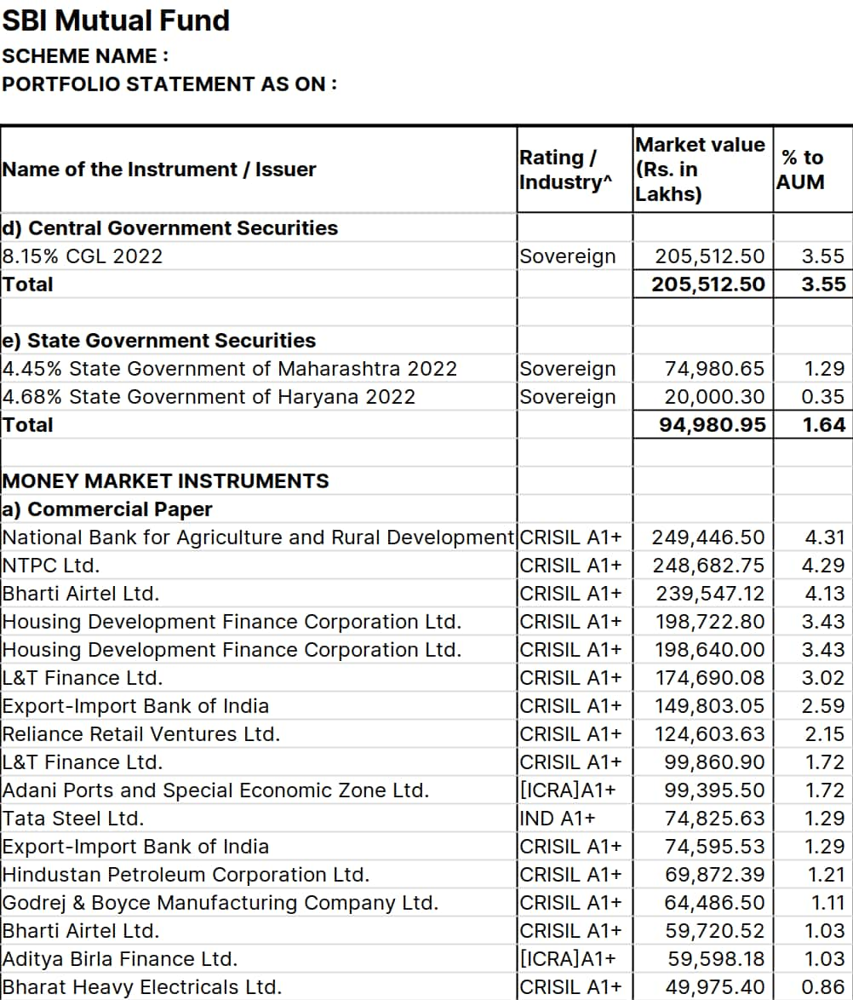

# The Final Step - Mutual Funds

It might sound strange to see a series on how to invest money starting with defensive steps like building an emergency fund, getting a term insurance, and getting a health insurance. However, without these defensive steps, any investment you make will be highly susceptible to unforeseen events. If you want your investing journey to be somewhat "shock proof", you'll need to complete the 3 steps mentioned before in this series.

### Getting Started

Let's assume that you can invest `₹50,000` per month at this point in time. If we go back to the question posed in the first step, _why should I invest money?_, the answers can usually be classified into three categories:

* expenses that you might incur within the next 5 years
* expenses that you might incur after 5 years
* building wealth and preparing for the unknown

If you're a bachelor and you've recently started earning money, you may not be able to think of any significant expenses for the foreseeable future. Even so, you should still invest money to build wealth and prepare for the unknown.

At this point, you should divide you investment amount into two equal parts, `₹25,000` each. The first `₹25,000` is meant for short term expenses that you might incur within the next 5 years. The second `₹25,000` is meant for long term expenses that you might incur after 5 years. For simplicity, we'll call the first part as **Basket 1** and the second part as **Basket 2**.

### Basket 1 - Short Term

The investment in this category should be made into relatively risk-free assets. The list of such assets that you can choose from and that we advise investing money in at this point are

* bank fixed deposits
* bank recurring deposits
* debt overnight mutual funds direct growth plan
* debt liquid mutual funds direct growth plan
* debt money market funds direct growth plan

We have talked about bank fixed deposits and recurring deposits in the [first part of the zero to investing series](the-first-step-emergency-fund.md). You can create more bank fixed deposits and recurring deposits to invest money in the first basket. Go ahead and start a recurring deposit for `₹12,500` per month for an year and when that recurring deposit matures, use the maturity amount to create a fixed deposit. You can keep renewing that fixed deposit.

We have `₹12,500` left to invest in this basket and we're going to do that in the debt mutual funds that we've mentioned above. What are debt mutual funds and why should you invest in them?

In (extremely) simple terms, when you invest money in bank fixed deposit or a recurring deposit, you are lending you money to your bank. Yes, in effect, you are giving a loan to your bank. The bank gives you some compensation, which is the interest rate returns you receive. When creating a fixed deposit, you're lending your money directly only to your bank. A debt mutual fund allows you to lend your money to multiple major corporations like Reliance and government organizations like Reserve Bank of India. For example, here's a snapshot of some companies in which SBI Liquid Fund Direct Growth Plan was invested in in the month of May 2022.

