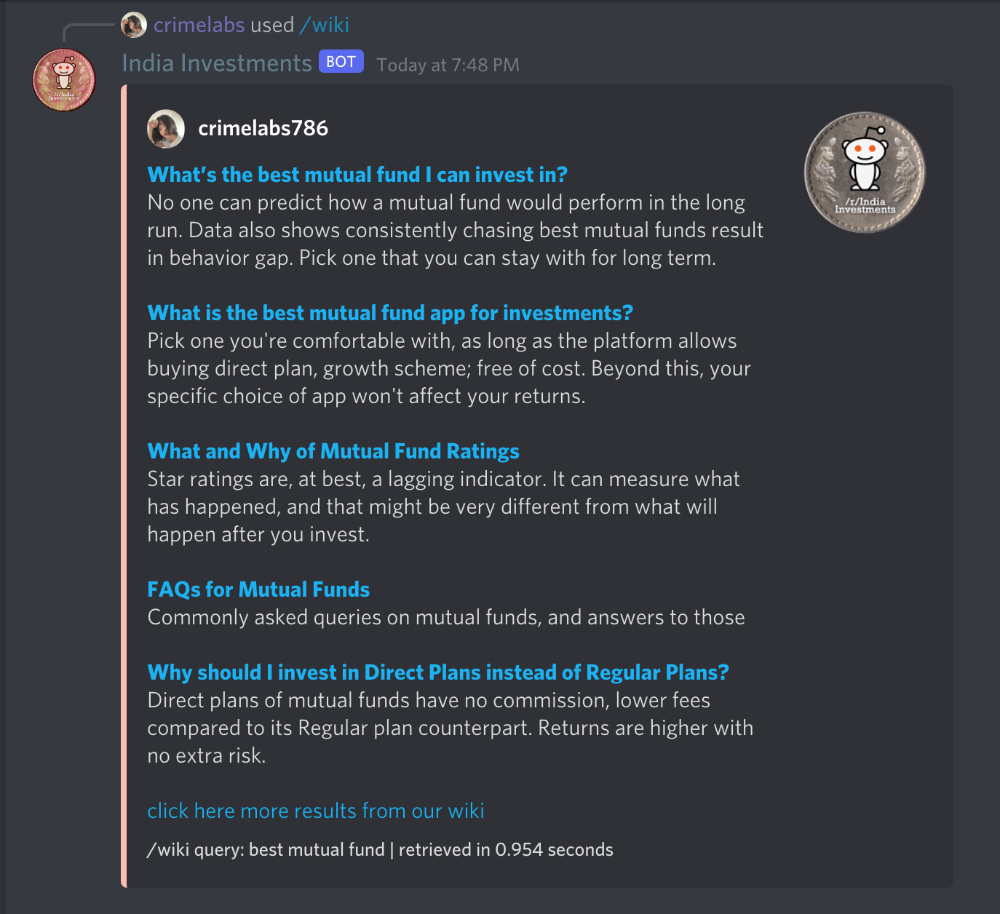

# How to Search the Wiki From Discord

You can search this wiki from our Discord itself, using India Investments bot's slash command.



## Steps

* On your Discord app, either on phone / tablet, or on web / desktop app; visit \#testing channel on our Discord. 
* Type `/` \(front-slash\), then start typing `wiki`  It should auto-prompt the right slash command you've been looking for. 
* Now enter your search query \(2-3 words are more than enough\) in the `query` field. 
* Hit `return` or `Enter` in your keyboard. 
* Wait for result\(s\) to arrive. 
* Depending on your query, the bot might return one or more than one result. If that doesn't match your expectation, bot would also give you a link, that would directly take you to our wiki.

## How it'd look

Depending on your query, bot might return more than one or only a single result.

Here's how it'd probably look \(exact content would vary, depending on your query\).

## Wrapping Up

* We're hosting bot infrastructure on free hosting provided by [Deno Deploy](https://deno.com/deploy/).  It has some limitations on number of queries and throughput.  We ask that you use it judiciously for genuine need, and not spam the bot results in channel. It'd only make it harder for us to help others in our community. 
* To understand how to use the bot, kindly use our testing channel.  Just to be clear, the bot works in every channel. But testing in a dedicated channel means other conversations remain uninterrupted.

We hope you are able to use this bot, to solve a problem that you currently have.

For feedback on bot, please reach out to us on [Discord](https://discord.gg/hqBNg4u).

