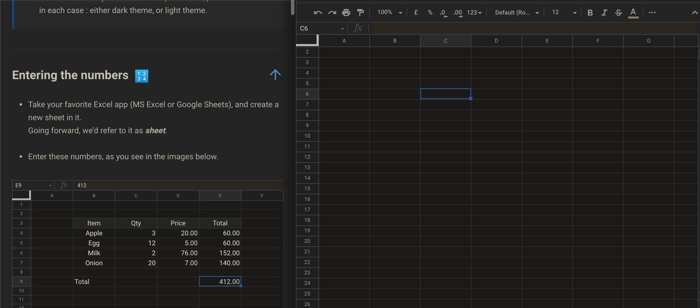
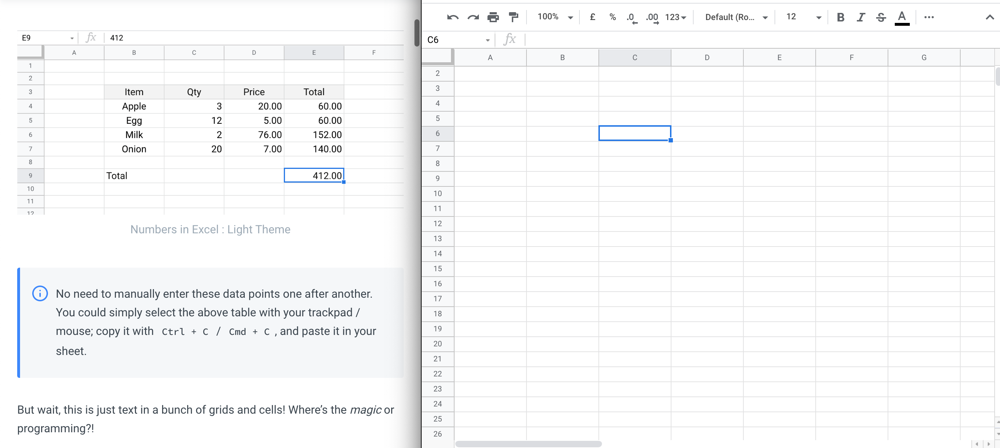
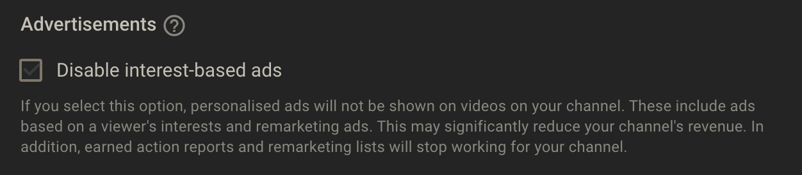

# Excel for Fun and Profit

## Prelude 

What’s the most popular programming / coding language in the world? 

Hint: It’s not Java or Python or JavaScript or C or C++ or whatever Tiobe index has it on top these days. Nor is it HTML, nor CSS, for that matter.

It’s Excel _formula_! Or simply, just excel. Per estimate, 99% of automation out there, have been written in Excel’s inbuilt programming paradigm.

Excel as a language gives you powerful primitives, that are easy to pick up, and one can start using on real world datasets, to address real needs every type of businesses face.

Most of you’ve guessed it already, but for the sake of clarity, we should explicitly mention it - Excel, the programming language; is **different from Microsoft’s MS Excel application**. Excel, the programming toolkit, is the core engine of [Microsoft Excel](https://www.microsoft.com/en-in/microsoft-365/excel).

But there happens to be other applications as well, which offer _Excel_ functionalities - [Google Sheets](https://docs.google.com/spreadsheets/), for instance.

In this series, we cover how you could harness this power for yourself.   
  
Before you hope to be a DIY investor, you need to be comfortable as a DIY excel user. 

No more asking others to share their pre-built excel calculator templates, to track your monthly budget or compute XIRR of your stock portfolio.

You’ll feel empowered to build these on your own, from scratch; and maintain or update the same.

## Pre-requisites 

* ➕➖ ✖️➗  

  You don’t need to be a programmer or software developer in your day job.  

  If you know some basic Math, like addition / subtraction / multiplication / division; it’s good enough.  

* Access to Google Sheets or MS Excel  

  Excel as a language is fantastic, and if you can afford an Office 365 license, great for you.  

  But most of us cannot or wouldn’t want to. Google Sheet supports most Excel functionalities as is, that we’d cover here.  

  If you’ve a Google account or G-Suite account; you can use [Google Sheets for free](https://docs.google.com/spreadsheets).  

  [LibreOffice](https://www.libreoffice.org/) and [OpenOffice](https://www.openoffice.org/) have their own implementations, called _Calc_. Most likely these would work as well; though we cannot say we’ve tried.  

  On Mac OS X and iPhone / iPad, [Apple Numbers app](https://www.apple.com/in/numbers/) should be fine too.  
  
  In this series on excel, we'd stick to using Google Sheets. There'd be some chapters where we'd explicitly call out how to do something specific, in MS Excel. But most of the series would focus on using one single tool - Google Sheets.  

* Access to a desktop / laptop / workstation is preferable  

  It’s not a hard requirement; that without it, you won’t be able to proceed at all.  

  But given this is a bit programmable in nature, having access to more real-estate on your screen is desirable.   

  It isn’t as if you cannot do without it, but you’d have a better time if you could get your hands on a laptop or desktop or even a workstation.

## How to make the most of it 

This corner of our wiki is bit different. It's much more hands-on, than other series and topics on our wiki.

It requires your active involvement and practice. Just like you cannot learn swimming reading a book on swimming, if you don't pause and practice, this series would be of no use to you.

Reading passively is comfortable consumption. Practicing and exploring is active assimilation.

We expect you to read small bits of text, and try that out in the excel sheet or spreadsheet at the same time. In fact most of your time should be spent playing around with formula and functions, compared to reading content from this series.

However, we're also mindful of the fact that it'd involve context switch. It's no mean task having to read, then switch to a spreadsheet, then come back again to read next paragraph or section.

Hence we recommend this setup as shown below

That is, split your screen in a way that the wiki is on your left, and your spreadsheet or excel window is on your right - both visible and accessible at the same time.

If you've a multi-monitor setup with external displays, even better.

You don't have to follow this exact setup. Maybe you've other preferences. But we do recommend giving it some thought, that you remove the constant frustration of switching between tabs.

## Images and Videos

As you progress throughout the series, you'd notice we've images and videos, to explain and guide you through each step; in addition to textual steps.  
  
For images, we provide both dark and light mode images, for same screenshots.  
  
Most blog posts / articles you'd read, would have either dark mode, or light mode images. It's optimized for the author of the piece \(i.e. if author is used to dark mode, you'd get dark mode; and vice versa\).

We provide both, because we believe this should be optimized for consumption. That is, if you prefer reading a piece in light mode, you should be able to zoom in and view the light mode version of the image. And if dark mode is your thing, the dark mode image is the one you can zoom in, to check closely; by clicking on the respective image.


We'd ideally want to make only the right image visible, depending on your screen's theme \(light or dark\), and not both. But our present content hosting service doesn't support dynamically hiding specific set of images, so we'll explore this only in the future.


Regarding videos, we'll be using our own YouTube channel to host these videos.

We've looked into various video hosting providers, and nothing comes close to YouTube in terms of richness of the offerings. YouTube is also optimized for low network consumption across the planet, and the de-facto video consumption platform that everyone is familiar with.

**We've disabled interest-based ads, also known as targeted or personalized advertising,** on our YouTube channel as we are a non-commercial project, and we've no plans of monetizing this content. 

All of our videos on YouTube for this series are unlisted at the moment, and not easily discoverable through a public search on YouTube.


Unfortunately, it looks like we cannot disable ads completely on our YouTube channel. This seems to be a limitation of YouTube. YouTube as a platform, reserves all the rights to display ads in our videos hosted on YouTube.


If you don't want to watch personalized ads on YouTube, we recommend changing your privacy settings on your Google Account. If you don't want to watch ads while browsing our videos, you may consider buying a YouTube Premium subscription.

## Disclaimer 

To be abundantly clear, this is **not a guided tutorial on MS Excel or Google Sheets**. There are plenty of those available, that have much more depth; if you just google or search in YouTube. 

This series is all about _learning enough excel to be dangerous_, and applying it to your finances. 

In addition to these, **we won't be providing ready-made excel sheets or spreadsheets**.

Why?!

To understand this, you must first understand how Egyptian pyramids look like to humans of this era.

We know when these were built, where these stand etc.

However, we don't know _how_ these were built many thousand years ago \(to put it in perspective, mammoths still roamed the earth when some of these were being built\).

Not knowing how something was built, only makes the end product feel more magical and complex. It'd feel daunting if we had to build one like that. And our immediate knee-jerk reaction would be to accept it's beyond us to achieve the same feat.

Some might even skip the lesson and just reach for the ready-made ones.

To avoid this exact problem, we'd strive our best to not provide ready-made excel sheets or spreadsheets. We're more interested in demonstrating with step-by-step guide how to build a useful spreadsheet or excel sheet yourself.

