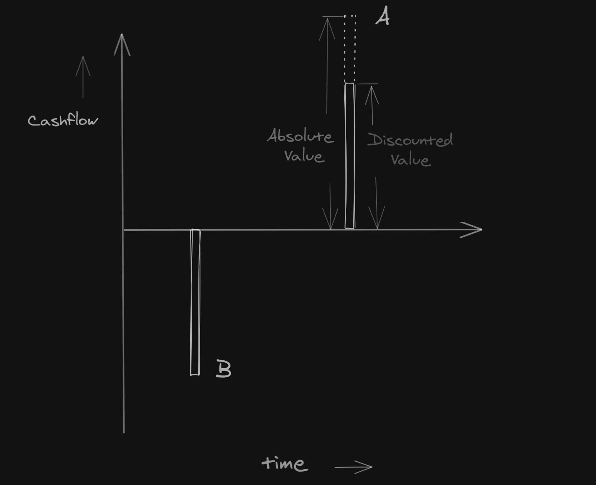
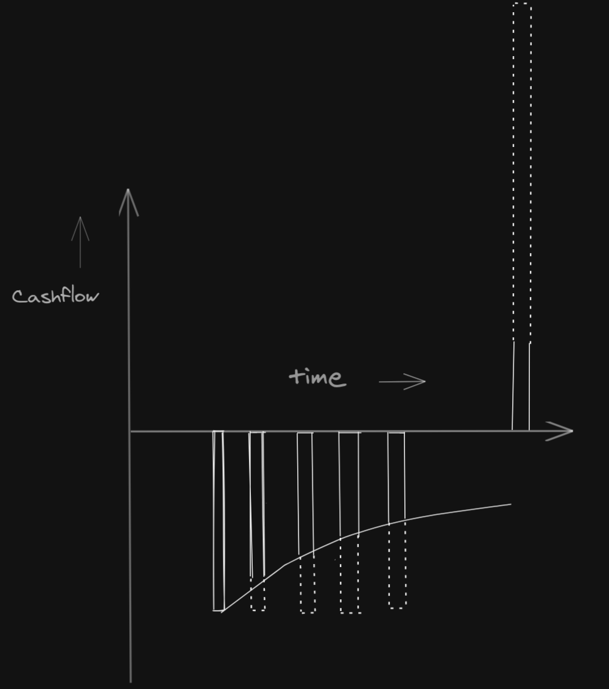
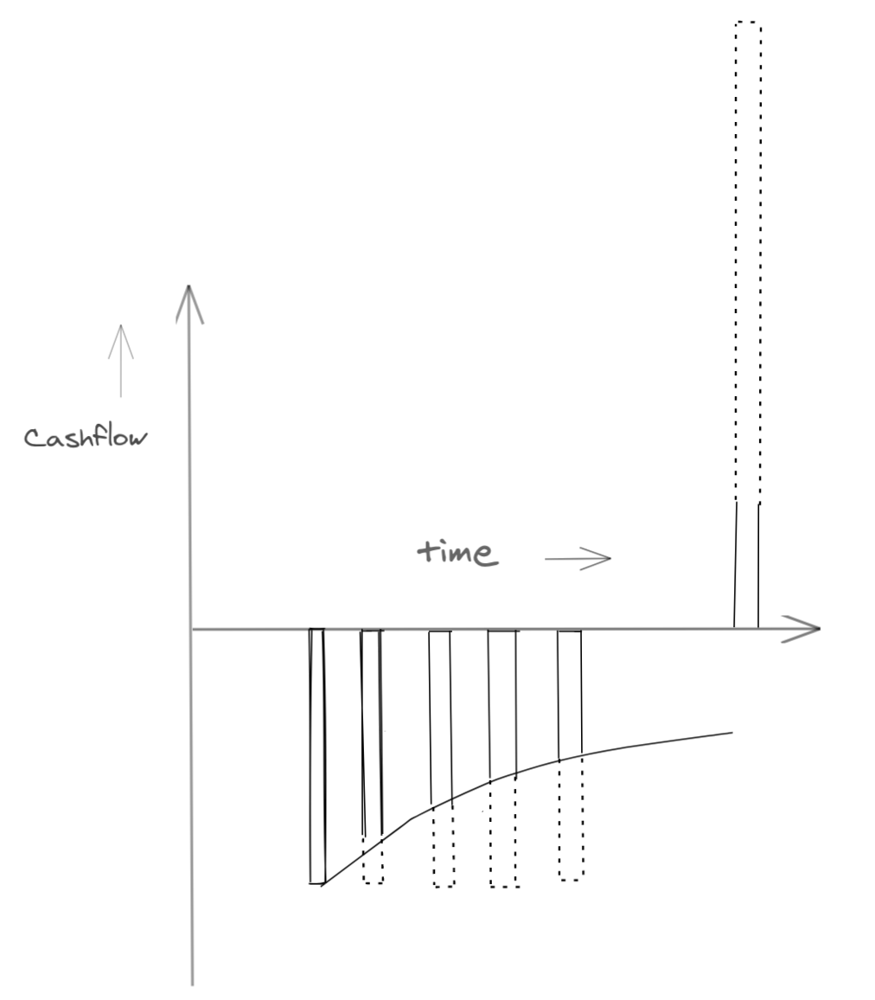

# A Rigorous Introduction to XIRR

## Intro <a id="Intro"></a>

Now that we’ve gained some ideas about XIRR \(e**X**tended **I**nternal **R**ate of **R**eturn\), it’s time to formally introduce XIRR.

XIRR is tightly coupled with concept of _discounting_.

Discounting can be thought of as the opposite of _compounding_.

## Discounting and XIRR <a id="Discounting-and-XIRR"></a>

Popularly, compounding formula is written as $$P\times(1+r)^t$$.

Instead of $$P\times(1+r)^t$$, where $$(1+r)^t$$ is being multiplied with the value of $$P$$; in _discounting_, we’d do the opposite, to denote **decay over time**.

Discounted value of PP after a time duration $$t$$, can be written as $$\frac{P}{(1 + r)^t}$$

In case of compounding, with time, the final value increases.

With discounting, as expected from the above formula, the decayed value gets lower as more time passes.

#### Sample Cashflow Table <a id="Sample-Cashflow-Table"></a>

Assume that we’ve a cashflow series, written like this:

| Date | Cashflow |
| :---: | :---: |
| $$t_0$$ | $$P_0$$ |
| $$t_1$$ | $$P_1$$ |
| $$t_2$$ | $$P_2$$ |
| $$t_3$$ | $$P_3$$ |
| ...... | ...... |
| $$t_{n−1}$$ | $$P_{n-1}$$ |

This format should be quite familiar. We’ve merely replaced the actual numbers with variables.

### Discounted Cashflow Table

We’d add one more column to, to add discounted values

| Date | Cashflow | Discounted Cashflow |
| :---: | :---: | :---: |
| $$t_0$$ | $$P_0$$ | $$P_0$$ |
| $$t_1$$ | $$P_1$$ | $$\displaystyle \frac{P_1}{(1 + r)^{[\frac{(t_1 - t_0)}{\Delta T}]}}$$ |
| $$t_2$$ | $$P_2$$ | $$\displaystyle\frac{P_2}{(1 + r)^{[\frac{(t_2 - t_0)}{\Delta T}]}}$$ |
| $$t_3$$ | $$P_3$$ | $$\displaystyle\frac{P_3}{(1 + r)^{[\frac{(t_3 - t_0)}{\Delta T}]}}$$ |
| ...... | ...... | ...... |
| $$t_{n−1}$$ | $$P_{n−1}$$ | $$\displaystyle\frac{P{n-1}}{(1 + r)^{[\frac{(t{n-1} - t_0)}{\Delta T}]}}$$ |

Third column entries might look a bit cumbersome at first, but we’ve basically expanded on $$(1 + r)^X$$, where $$X$$ is $$\displaystyle\frac{(t - t_0)}{\Delta T}$$.

This is effectively _normalized time_. Given two dates $$t$$ and $$t_0$$, $$(t - t_0)$$ is equivalent to number of days in between those two dates. And $$\Delta T$$ is a common factor \(commonly, 1 year or 365 days\).

Then $$X$$ is number of years, where fractional values are allowed.

Notice the first row of the above table, it’s just $$P_0$$. Because every discounting is being done corresponding to that date in first row, $$t_0$$, so trivially, the discounted value against itself same as the original value.


Remember from your school days, that _anything raised to the power of zero, is 1 in value_.


Mathematically, $$\displaystyle\frac{P_0}{(1 + r)^{[\frac{(t_0 - t_0)}{\Delta T}]}} = P_0$$

### Net Present Value

NPV \(**N**et **P**resent **V**alue\) of the above cashflow is sum of all discounted cashflows:

$$NPV = P_0 + \displaystyle\frac{P_1}{(1 + r)^{[\frac{(t_1 - t_0)}{\Delta T}]}} + \displaystyle\frac{P_2}{(1 + r)^{[\frac{(t_2 - t_0)}{\Delta T}]}} + \displaystyle\frac{P_3}{(1 + r)^{[\frac{(t_3 - t_0)}{\Delta T}]}} + ... + \displaystyle\frac{P_{n-1}}{(1 + r)^{[\frac{(t_{n-1} - t_0)}{\Delta T}]}}$$

Which can also be written as

$$NPV = \sum_{i = 0}^{n - 1} \displaystyle\frac{P_i}{(1 + r)^{[\frac{(t_i - t_0)}{\Delta T}]}}$$

This formula has _summation_ symbol $$\sum$$ , which allows us to write sum of a series of numbers in a succinct manner.

#### Definition of XIRR <a id="Definition-of-XIRR"></a>

XIRR of a given cashflow time-series data, is defined as value of $$r$$, the rate of discounting, such that **NPV is 0**.

Let’s see what this means.

As we’ve seen in the last chapter, in a cashflow, some entries would have positive and negative signs in front of those values; such that these values represent direction of cashflow.

If we take the cashflow from last chapter itself, it’s $$-$$₹100,000 \(1L INR\) for first 10 years, then after another 10 years, ₹200,000 \(2L INR\) for next 10 years.

Number of entries, is $$n=20$$.

We fill the table up, mapping cashflow variables to values.

| Date | Cashflow |
| :---: | :---: |
| $$t_0 = $$ 1st Jan 2021 | $$P_0=$$ $$-$$100,000 |
| $$t_1 = $$ 1st Jan 2022 | $$P_1=$$ $$-$$100,000 |
| $$t2=$$ 1st Jan 2023 | $$P_2 =$$ $$-$$100,000 |
| $$t_3 =$$ 1st Jan 2024 | $$P_3 =$$ $$-$$100,000 |
| $$t_4 =$$ 1st Jan 2025 | $$P_4=$$ $$-$$100,000 |
| $$t_5=$$ 1st Jan 2026 | $$P_5=$$ $$-$$100,000 |
| $$t_6=$$ 1st Jan 2027 | $$P_6=$$ $$-$$100,000 |
| $$t_7=$$ 1st Jan 2028 | $$P_7=$$$$-$$100,000 |
| $$t_8=$$ 1st Jan 2029 | $$P_8 =$$ $$-$$100,000 |
| $$t_9 =$$ 1st Jan 2030 | $$P_9=$$ $$-$$100,000 |
| $$t_{10} =$$ 1st Jan 2041 | $$P_{10} =$$ 200,000 |
| $$t_{11}=$$ 1st Jan 2042 | $$P_{11} =$$ 200,000 |
| $$t_{12}=$$ 1st Jan 2043 | $$P_{12} =$$ 200,000 |
| $$t_{13} =$$ 1st Jan 2044 | $$P_{13} =$$ 200,000 |
| $$t_{14} =$$ 1st Jan 2045 | $$P_{14}=$$ 200,000 |
| $$t_{15}=$$ 1st Jan 2046 | $$P_{15} =$$ 200,000 |
| $$t_{16} =$$ 1st Jan 2047 | $$P_{16}=$$ 200,000 |
| $$t_{17}=$$ 1st Jan 2048 | $$P_{17}=$$ 200,000 |
| $$t_{18}=$$ 1st Jan 2049 | $$P_{18}=$$ 200,000 |
| $$t_{19}=$$ 1st Jan 2050 | $$P_{19}=$$ 200,000 |

If we use the NPV formula, we’d need to settle the value for power index in the formula, $$\displaystyle\frac{(t - t_0)}{\Delta T}$$, where $$t$$can be $$t_0$$, $$t_1$$, $$t_2$$, $$...$$, $$t_{19}$$.

We could reasonably approximate these as whole numbers.

Plugging these in NPV formula, XIRR for this cashflow would be given by this equation:

$$0 = 100000 \times (-1 - \displaystyle\frac{1}{(1 + r)^1} - \frac{1}{(1 + r)^2} - ... - \frac{1}{(1 + r)^9} + \frac{2}{(1 + r)^{10}} + \frac{2}{(1 + r)^{11}} + ... + \frac{2}{(1 + r)^{19}}) $$

Then XIRR is solution for this equation, where $$r$$ is the unknown variable.

We can verify that for XIRR, this equation results in zero.

Another way to think of XIRR, is it’s a value of rate, that makes sum of discounted cash outflows, same as sum of discounted inflows.

### Verifying XIRR by Adding up Discounted Cashflows

We shall now go ahead and verify that this NPV equation indeed turns zero when we plug in the value of XIRR from in-built `xirr()` formula.  
  
We had already created a table and verified the XIRR to be $$3.52\%$$p.a.

**Steps**:

* Create a new column in your original calculation from last chapter, next to _Cashflow_ column.
* In the first row, fill out the formula as follows:

  ```text
  <cashflow_value> / POW((1 + XIRR_value), (<date_value> - <first row's date value> / 365))
  ```

  Make sure to _lock the cell_ with `$` notation, for cell ID pointing to  


  * XIRR value 
  * first row’s date value 

* Use _drag and auto-fill_ for other values of the discounted cashflow, though your spreadsheet might actually prompt the same with _smart fill_. 
* Finally, invoke `SUM()` to compute summation of all discounted cashflow values in last column.

This video should help with above steps:





Final result should resemble this:



You would be tempted to manually use 3.52% or 0.0352 instead of relying on output of `xirr()` formula. As you’d see, it would add up to a finite positive or negative value.

Due to formatting, we are only seeing two places after decimal point. But actual computed value is something slightly different from exact 3.52%.


### How to Solve the XIRR Equation

Given a value of XIRR, we can verify if it’s indeed satisfying the equation of NPV being zero.

But given an equation, as above, can we derive the value of $$r$$?

Turns out, even if it’s a single-variable equation; it’s not as simple as solving an algebraic equation.

In essence, we need to use advanced approaches such as Newton-Raphson _approximation_ to solve such equations, iteratively.

It starts with a _guess_ for the right value of XIRR. Then it plugs that value back into the NPV equation, to extract a new approximate value.

After repeating this and extracting newer approximate values, it only gets more and more precise, through hit and trial.

Eventually, the value stabilizes reaching correct answer for the problem at hand.

A full treatment of Newton-Raphson method is beyond scope for this wiki, but even a cursory search in popular search engines would reveal enough materials that cover it in some depth.


The third argument in `xirr()` function is `rate_guess`, which if you provide, can speed up XIRR computation by reducing number of iteration it takes to reach correct value of XIRR.

But it’s best avoided; because if you plug in a value as guess for rate, which is far removed, it would only serve as a means to increase number of iterations it takes to find the value of XIRR.


### Why is XIRR annualized growth rate?

Because the $$\Delta T$$ value is set to 1 year or 365 days.

We could, however, change that to 1 month or 1 decade; and get rates per month, or rates per decade.

## Visualization <a id="Visualization"></a>

Now that we’ve a formal mathematical understanding of what XIRR is; it’s instructive to understand XIRR visually.

This would help us build a mental model of XIRR, intuitively, because it might not always be possible to have enough information to invoke `xirr()` function and obtain exact value of it.

### Two Transactions - CAGR and XIRR

Let’s begin with a simple use-case, where a set of cashflows is basically only two transactions.

One purchase, and one sell or redeem-able account value.

It could be a lumpsum purchase transaction for a bond or a stock or even a mutual fund / ETF, and after the first purchase, there have been no transactions on that account.

Let’s consider an investor had purchased HDFC \(NSE: HDFC\) stock at a price of $$₹1113.40$$, on 1st April 2016, for quantity of 1 share.

Then total invested amount is same as share price at the time of purchase.

Also assume this investor has continued to hold on to this share of HDFC. As on today, it’d have a different value from its valuation at the time of purchase.

We can model it as one purchase transaction \(negative cashflow, because money is going away from end user\), and a potential redemption transaction of today’s value.

At the time of writing this, this value is $$₹2515.20$$ per share, as on 1st April 2021.

| Date | Cashflow |
| :---: | :---: |
| 01-Apr-2016 | $$-$$1113.40 |
| 01-Apr-2021 | 2515.20 |

It effectively means, if the investor were to sell the share when price is ₹2515.20, they’d receive ₹2515.20 in liquid cash in their account. We’re ignoring STT \(**S**ecurity **T**ransaction **T**ax\), brokerage, and other fees for now.

Then XIRR of these transactions can be computed easily, by inserting these numbers from the table into a spr**e**adsheet, invoking the `xirr()` formula.

We’d get XIRR as $$17.69\%$$ **p.a.**


At the same time, we could obtain CAGR of underlying asset, HDFC shares, over 5 years, which also comes out to be $$17.69\%$$ **p.a.**


**They are the same!**


You might have noticed that output of `RRI()` function is slightly different from output of XIRR function. This is because those two dates are not exactly 5 years apart, you’ve to also count the leap days in between.


**CAGR of an asset between two dates, can be computed using XIRR function, by creating a purchase transaction at the start date, and an imaginary sell transaction on the end date.**

This is why most spreadsheet or excel applications don’t include a dedicated CAGR function ****You only have to invert the sign of first row entry of value!




We can mathematically prove it as well.

Recall that formula of CAGR is:

$$V_{final} = V_{initial} \times (1 + CAGR)^n$$

$$n$$ is number of years, where we’re considering 1 year as unit of time.

Then equivalent transactions would be of values $$-V_{initial}$$ and $$V_{final}$$

Plugging these in the NPV equation for XIRR, we get

$$\displaystyle\frac{V_{final}}{(1 + XIRR)^n} - \frac{V_{initial}}{(1 + XIRR)^0} = 0$$

Rearranging, and keeping in mind that power raised to $$0$$ means $$1$$, we get

$$V_{final} = V_{initial} \times (1 + XIRR)^n$$

Therefore, CAGR and XIRR would have same values.


CAGR $$\neq$$ XIRR

We've simply found a case, where value of CAGR for an asset between two dates; can be same as XIRR of an imaginary portfolio of two transactions, on those two dates.

This would be true for all investible assets, for any two dates; as long as it can be modeled as two transactions \(one purchase, one sell\).

But _CAGR of a portfolio_, is  a meaningless metric to look for. Asset has CAGR, portfolios have XIRR.


This makes sense intuitively as well.

XIRR of a portfolio where investor has invested only once and redeemed once \(or can redeem full amount if they choose to\), is same as rate of growth of underlying asset over same period - which is CAGR.

### More than Two Transactions

What if an investor has more transactions, mix of buy / sell etc.?

This is usually how normal portfolios look like.

Even if one were to make a bank fixed deposit, there can be year-end TDS, resulting in cash outflow from the deposit account; which would end up having multiple transactions in that portfolio.





Dotted line shows actual numeric value, of each transaction’s cashflow.

While, solid lines indicate how these values would be after discounting using the decay formulation.

You can see the decay as a result of discounting.

To understand why the decay over time moves like that, we can plot similar graphs from our spreadsheets

**Steps**:

* Select the three columns of data on dates, cashflow, and discounted cashflow that we’d worked on earlier, to validate XIRR.
* Insert chart from menubar or toolbar
* Switch to bar chart

Here’s a short video to help you out, though it’s quite straight-forward, if you’ve followed along thus far:





Final plot should look like this:


While the blue lines in the above plot are of same heights for positive cashflow values and negative values; the red lines are where we see values being discounted more and more over time.

## **Recap and Wrapping Up**

We learned various aspects of XIRR in the last chapter, using an example and output of in-built `xirr()` function.

Now we can cross-validate these, how these follow from definition of XIRR naturally:

* **XIRR doesn’t depend on exact dates, rather relative differences between dates of transactions**  


  This is because in NPV equation, the power terms are normalized differences in time, and not absolute values of time points \($$t_0$$, $$t_1$$, $$t_2$$, $$t_3$$ etc.\).  

* **XIRR doesn’t depend on exact value of cashflow amounts, only relative scaling within those numbers**.  


  In other words, if every cashflow amounts were multiplied by some arbitrary number, it won’t change the value of XIRR.  


  This is readily verifiable; as in the NPV equation, the right hand side is $$0$$. Hence multiplying both sides by a constant co-efficient has no effect.  

* **Moving up payout schedule improves XIRR**  


  Moving up schedule of payout \(positive cashflows\) means the discounted value of those transactions become higher; as $$(t−t_0)$$ decrease.  


  To keep the equation at zero, now the base of the fraction would have to go up, which is $$(1+r)$$. In other words, XIRR would have to go up.

Similarly, we can refer to the NPV equation of XIRR formulation, and validate our erstwhile understanding of XIRR behavior.

You might have noticed that we didn’t do any semi-log plots with cashflow values.

This is because NPV equation is an equation that lists formulas as sum of decayed entities.

There’s no mathematical formula to simplify $$\log(A+B)$$, that relates to $$\log⁡A$$ or $$\log⁡B$$ in any way, in general.

Next chapter we would learn  about applying XIRR in financial decision-making, in the wild. We’d consider real-world scenarios, and approach decision-making on those, by computing their XIRR; and comparing with XIRR of alternative investment avenues.

