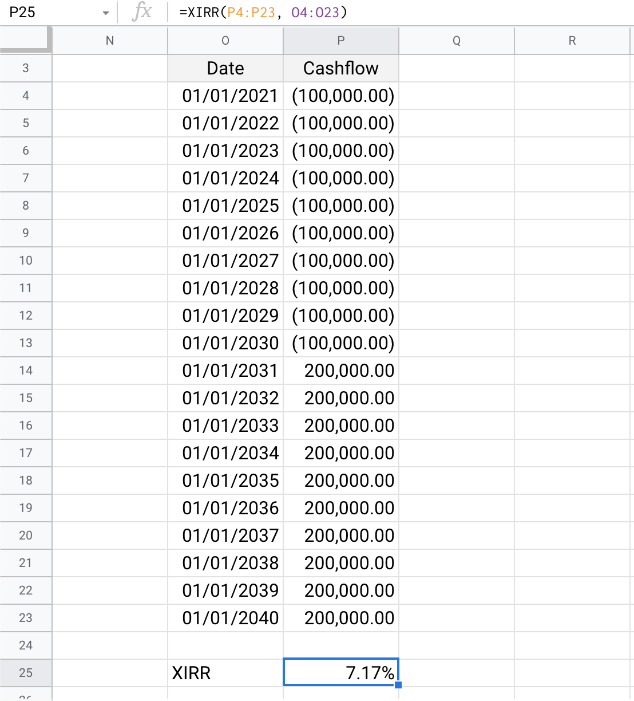

# A Gentle Introduction to XIRR

## Intro <a id="Intro"></a>

In the previous chapter, we’ve covered CAGR and how it can offer insights into rate of price growth of common listed securities.

In this chapter, we expand on this; and measure rate of growth of portfolios, which is consisted of set of articles.

For an investor, asset’s growth and portfolio growth are two different aspects; as we’re about to learn.

## XIRR <a id="XIRR"></a>

XIRR \(e**X**tended **I**nternal **R**ate of **R**eturn\) is a generalized form of **portfolio** return measurement, that takes into account both entry and exit transactions.

Why _internal_?

Because it excludes external factors \(asset class, risk, volatility etc.\); and includes only these information, that are internal to investors’ portfolios:

* Dates of transactions
* Cashflow of each transaction on those dates
* Final portfolio value \(if all investments are not yet fully redeemed\)

XIRR is quite broadly applicable, as long as one furnish these _internal_ informations correctly.

Why _extended_?

IRR \(**I**nternal **R**ate of **R**eturn\) was developed as a measure but it had some limiting underlying assumptions, such as regular intervals between transactions. We won’t cover IRR here, because XIRR is much broader and generalized.

XIRR is extended version of IRR, that works for arbitrary set of dates.

Unlike CAGR, most popular spreadsheet applications like MS Excel or Google Sheets, have an in-built `XIRR()` formula.

[Documentation of XIRR\(\)](https://support.google.com/docs/answer/3093266?hl=en) \| [archive.org link](https://web.archive.org/web/20210224100334/https://support.google.com/docs/answer/3093266?hl=en) \| [archive.is link](https://archive.is/quA3Y)

Before we gain deeper understanding of XIRR, it’d be better to see how we can use it in our day-to-day finances.

## Will you take this policy? <a id="Will-you-take-this-policy"></a>

Consider this endowment or _moneyback_ policy being offered by a popular private insurer:

> You have to pay a yearly premium of ₹100,000 \(1 Lakh INR\), for 10 years. From 20th year onward, you’d receive ₹200,000 \(2 Lakh INR\), every year, for next 10 years.

Let’s break this down in a table.

| Date | Cashflow |
| :--- | :--- |
| 01-Jan-2021 | -100,000 |
| 01-Jan-2022 | -100,000 |
| 01-Jan-2023 | -100,000 |
| 01-Jan-2024 | -100,000 |
| 01-Jan-2025 | -100,000 |
| 01-Jan-2026 | -100,000 |
| 01-Jan-2027 | -100,000 |
| 01-Jan-2028 | -100,000 |
| 01-Jan-2029 | -100,000 |
| 01-Jan-2030 | -100,000 |
| **01-Jan-2041** | 200,000 |
| 01-Jan-2042 | 200,000 |
| 01-Jan-2043 | 200,000 |
| 01-Jan-2044 | 200,000 |
| 01-Jan-2045 | 200,000 |
| 01-Jan-2046 | 200,000 |
| 01-Jan-2047 | 200,000 |
| 01-Jan-2048 | 200,000 |
| 01-Jan-2049 | 200,000 |
| 01-Jan-2050 | 200,000 |

In the above table, we’ve posted how much you’d receive every year. Cashflow is negative or less than zero, if you’re paying the other party \(insurer / bank\); while it’s positive or greater than zero when it’s you receiving the amount.


In XIRR estimation, it’s of paramount importance to set up the sign-convention just described above.


If _cash_ is going away from you, then from your perspective, it's a **negative cashflow**, and must be entered with a negative sign. For example, paying premium or investing in markets. These amounts should be entered with negative sign, to denote negative cashflow.  
  
If cash is coming towards you, or has the potential to come back to you; it's **positive cashflow**. Your bank deposit maturity amount, or your stock portfolio latest valuation \(this is the amount you'd receive as cash if you were to place a sell order\) etc. should be entered with positive sign in your spreadsheet, in context of XIRR calculation.

To the untrained eye, it looks _as if_ each 1L instalment or premium doubling up in 20 years or so.

These numbers in policy terms aren’t far-fetched. Plenty of banks and insurers would happily offer you policies with similar terms and conditions. These would have catchy names too.

Looking at just these numbers presented to you, you won’t have any way of finding reasons to accept or reject it objectively.

That’s where XIRR can be of help.

### Calculating XIRR of a policy.

Let’s calculate XIRR of this policy.

Steps to follow:

* Copy the above table, as shared before, and paste it into a new spreadsheet.
* At the bottom of the table, invoke the in-built `xirr()` function as follows:

  ```text
  xirr
  (
    <range for the cashflow, the second column>,
    <range for the dates, the first column>
  )
  ```

Here’s a video to guide you along:





The final results should resemble something like these screenshot\(s\):


While it might’ve seemed that _initial investment practically doubling means 100% return_, the computation would say otherwise.

In this case, it’s **3.52% p.a.** growth in investor’s hands, over a ~30 year period.


Whether 3.52% p.a. is great or terrible, would depend on other alternative avenues for investments, available to an investor.

In US / Canada / EU, a bank offering such policy is pretty amazing; given most banks offer much lower interests on deposits than this.

In a country like India where inflation is higher, there might be options available with potential for higher growth over 30 year period.


What we want to draw your attention upon, is the fact that you might’ve intuitively believed that 100% return over ~20 years would mean $$\frac{100\%}{20Y}$$ = 5% p.a. return.

It’s actually lower, 3.52% p.a.

**This is because compounded growth is non-linear**.

Alternatively, 5% p.a. compounded growth over 20 years would result in $$(1+\frac{5}{100})^{20}−1 = 165\%$$ absolute growth.

## Tweaking the Policy <a id="Tweaking-the-Policy"></a>

Now that we know this ~30 year policy has an effective rate of growth / return as 3.52% p.a.; we’d want to tweak various parameters of the policy wordings, and see how that affects XIRR of the policy.

### Change in Terms : Make Payouts Early

After first 10 years of payment, there’s some gap of ~10 years. Imagine if the payout schedule were changed, so that payout starts from 11th year onward.

| Date | Cashflow |
| :--- | :--- |
| 01-Jan-2021 | -100,000 |
| 01-Jan-2022 | -100,000 |
| 01-Jan-2023 | -100,000 |
| 01-Jan-2024 | -100,000 |
| 01-Jan-2025 | -100,000 |
| 01-Jan-2026 | -100,000 |
| 01-Jan-2027 | -100,000 |
| 01-Jan-2028 | -100,000 |
| 01-Jan-2029 | -100,000 |
| 01-Jan-2030 | -100,000 |
| **01-Jan-2031** | 200,000 |
| 01-Jan-2032 | 200,000 |
| 01-Jan-2033 | 200,000 |
| 01-Jan-2034 | 200,000 |
| 01-Jan-2035 | 200,000 |
| 01-Jan-2036 | 200,000 |
| 01-Jan-2037 | 200,000 |
| 01-Jan-2038 | 200,000 |
| 01-Jan-2039 | 200,000 |
| 01-Jan-2040 | 200,000 |
| 01-Jan-2041 | 200,000 |

Updating entries in our spreadsheet, and invoking XIRR function, we get **7.17% p.a.** as result.

Refer to these videos if you need help





When you're done, it should resemble something like these:




We find that moving the payouts ahead of original schedule has an effect on XIRR - **it improves it**.

This is consistent with what XIRR is supposed to capture. If your portfolio gains higher valuation earlier, XIRR computation is supposed to reflect that by returning a higher value for those set of transaction patterns.

### Other Changes to Policy Terms

Similarly, the following changes would also impact it:

* **Delaying the premium payments**

  
  Imagine if instead of paying 10L \(₹1,000,000\) over 10 years, in 10 instalments, the policy terms said the payment can be in 20 instalments, over 20 year periods, from 1st Jan 2021 to 1st Jan 2040, ₹50,000 per year.  


  This would also improve XIRR, because of delayed negative cashflow.  


  It’s left as an exercise to the reader, to verify the XIRR in this case, would be **4.55% p.a.**  

* **Increase payout amount**

  
  Imagine if instead of paying ₹200,000 per year from 1st Jan 2041 to 1st Jan 2050, the payout were actually of ₹250,000 \(2.5L INR\) every year, for 10 years.  


  This would improve XIRR, because of higher positive cashflow.  


  It’s left as an exercise to the reader, to verify the XIRR would be **4.68% p.a.**  

* **Both of the Above**

  
  If we did both of the above \(spread out premium payments over 20 years, and increased the payout to 2.5L INR per year\); it stands to reason the XIRR to be higher than both these scenarios individually.  


  It’s left as an exercise to the reader, to verify the XIRR would be **6.00% p.a.**  

* **Lumping the payout**

  
  Instead of paying ₹200,000 per year, for 10 years; what if the total amount of ₹2,000,000 \(20L INR\) was paid all at once at the beginning of payout period, i.e., 1st Jan 2041?  


  It stands to reason that since investor is receiving more value earlier, it’d improve XIRR from 3.52% p.a.  


  Verify that XIRR of this scheme would be **4.52% p.a.**  


  What if the lumpsum one-time payout of 20L INR was made at the end of tentative payout period, i.e., on 1st Jan 2050?  
  
  Since investor is not getting access to any payout \(positive cashflow\) until then, it should reduce the XIRR from 3.52% p.a.  


  Verify that XIRR of this scheme would be **2.85% p.a.**  

* **Adding more payouts**

  
  A common policy offering is to offer _annuity_, or some form of _pension_, for life.  


  Assume this policy was being offered to a person whose age is 25 years, and expected to live till the age of 80. By 2076, they’re supposed to reach this age.  


  Now we’d tweak the policy to offer payout of ₹100,000 every year \(same as premium payment\), **for life** \(which essentially means up to 1st Jan 2076\), starting on same schedule as before, i.e. 1st Jan 2041.  


  This can certainly improve the XIRR from original scenario of 3.52% p.a., but by how much? Notice that we’ve halved the payout amount as well.  


  It can be verified that XIRR of this policy is **4.22% p.a.**  


  What if this person lives up to age of 90, another 10 years, and collects annuity of ₹100,000 per year for 10 more years?  


  Verify that XIRR of this final updated policy would be **4.53% p.a.**

Here are a few changes **that won’t impact the XIRR**

* **Change absolute value of the dates, but keeping relative differences same between those**

  
  Imagine if instead of 1st January 2021; the policy was to begin in 25th June, 1899.  


  This policy would have a premium payment of ₹100,000 for every year on same date, for 10 years, from 25th June, 1899; till 25th June, 1908.  
  
  Then from 25th June, 1919 onward, it’d have started paying out ₹200,000 to investor, same date every year, till 25th June, 1928.  


  Validate that this has no effect on XIRR. XIRR is _rate of growth_, it cannot depend on absolute value of time in year.  

* **Scale up both premium payment and payout**

  
  Instead of ₹100,000 being premium amount, and ₹200,000 being payout amount; say we scale each value up by 10.  


  Insured person has to pay a yearly premium of ₹1,000,000 \(10 Lakh INR\), for 10 years. From 20th year onward, they’d receive ₹2,000,000 \(20 Lakh INR\), every year, for next 10 years.  


  Verify that this has same XIRR as before.  


  Just like XIRR doesn’t depend on the absolute value of time, only relative positioning of transaction dates with respect to one another; it doesn’t depend on exact value in each transaction - only relative valuation of purchased / redeemed amount in each transaction.

### Summary of Tweaks

| Changes on Policy Terms | XIRR \(p.a.\) | Change |
| :--- | :--- | :--- |
| Original Policy | 3.52% | NA |
| Early payouts, starting right after premium payment term ends | 7.17% | ▲ |
| Spreading premium payments over 20 years | 4.55% | ▲ |
| Increase policy payout from 2L to 2.5L per year | 4.68% | ▲ |
| Both spreading premium payments over 20 years and increase in policy payout amount from 2L to 2.5L | 6.00% | ▲ |
| Paying out all 20L at once on 01/01/2041 | 4.52% | ▲ |
| Paying out all 20L at once on 01/01/2050 | 2.85% | ▼ |
| Halve the payout, add more payout till 2076 | 4.22% | ▲ |
| Halve the payout, add more payout till 2086 | 4.53% | ▲ |
| Change exact dates, but keep date differences same between them | 3.52% | Same |
| Scale up exact premium, and payout, up to 10x | 3.52% | Same |

## Recap and Wrapping Up <a id="Recap-and-Wrappping-Up"></a>

We’ve seen how XIRR captures _time value of money_.

It rewards these factors:

* Earlier receipt or withdrawal / redemption of higher value from an investment.
* Delayed _negative cashflow_ \(outflow of money\) or investment, to achieve same final payout values.

  If you invest more later to achieve same final redeem-able portfolio value; XIRR value for that set of transaction history would be higher.

Corresponding reverse scenarios would result in lower XIRR values.

It’s highly instructive to calculate potential XIRR of an investment, by listing cashflows at different periods, before embarking on it.

This would give you a better objective measure on how good or bad this investment could be, in comparison to other available options whose XIRR has already been computed.


CAGR captures asset price compounded growth rate. XIRR captures annualized portfolio growth rate. As we've seen and will be seeing in coming chapters, these two are different, and this distinction would matter to investors.


We’ve built an intuitive understanding of what affects XIRR in positive or negative way.  
  
But we're yet to learn what XIRR mathematically is, because we haven't formally defined it. 

In the next chapter, we’d learn how to _visualize_ XIRR and model it with mathematical equations, to gain more insights on this incredibly useful metric.

