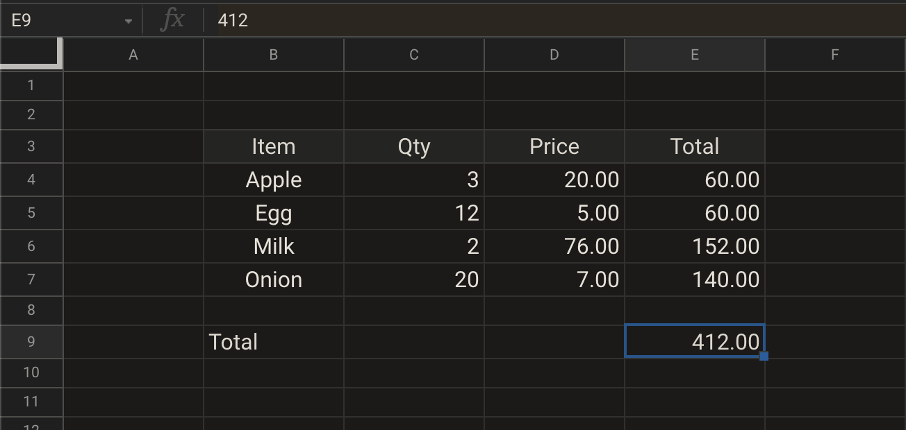
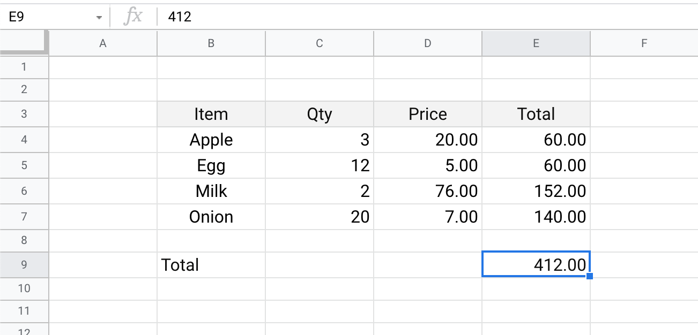
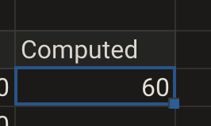
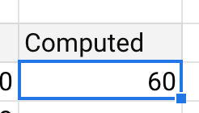
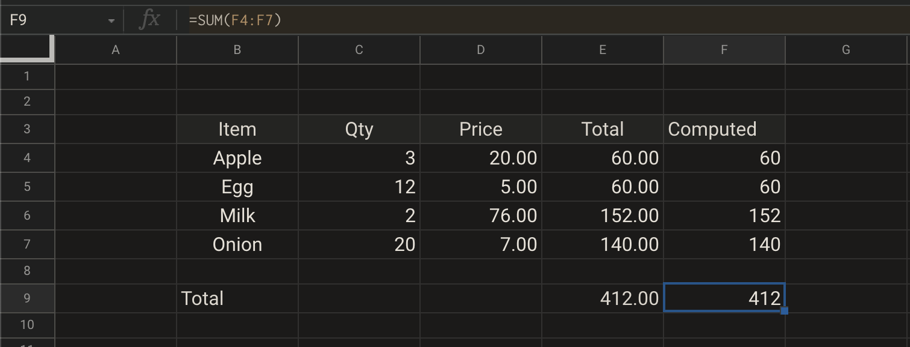
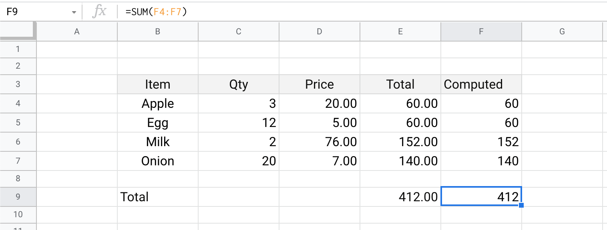

# Reactive UI & Updates

## Intro 

Consider a sample receipt from your local _kirana_ store, that looks like this

| Item | Qty | Price | Total |
| :--- | :--- | :--- | :--- |
| Apple | 3 | 20.00 | 60.00 |
| Egg | 12 | 5.00 | 60.00 |
| Milk | 2 | 76.00 | 152.00 |
| Onion | 20 | 7.00 | 140.00 |
| **Total** |  |  | **412.00** |

In real stores, they won’t issue receipts with four columns. But for the sake of this discussion; let’s assume they do provide such detailed tabulation.

Your task is to find out if the tally is correct.

We can use Excel for this.


In this chapter, you'd see images / videos in both dark and light theme. Based on your comfort and preference, pick one of these in each case : either dark theme, or light theme.


## Entering the numbers 

* Take your favorite Excel app \(MS Excel or Google Sheets\), and create a new sheet in it.

  Going forward, we’d refer to it as _**sheet**_.  

* Enter these numbers, as you see in the images below.


No need to manually enter these data points one after another. You could simply select the above table with your trackpad / mouse; copy it with `Ctrl + C` / `Cmd + C`, and paste it in your sheet.


But wait, this is just text in a bunch of grids and cells! Where’s the _magic_ or programming?!

Hold your horses, we’re getting there.

## Formula in Excel 

Now comes the part, where we sit back and let Excel formulas operate on the numbers, then cross-check the results for us.

If you notice carefully, **some of the numbers in the above table could be derived from other numbers**.

This is the starting point of an excel tracker: using excel formulas to _derive values from other values_.

Notice the 4th column, price of all items for a given item. It’s basically column 2, multiplied by column 3.

For example, in first row, for `Apple`, each apple costs 20, and there are 3 of these purchased - therefore, the 4th column has `20.00 x 3 = 60.00` as its value.

How to represent this relationship, `column 4 = column 3 x column 2` in Excel lingo?

In Excel, every cell can have either a static value, or a value derived from another relationship.

So far, we’ve used only the former, when we copy-pasted the table into our sheet. Now it’s time to do the second one.

* Click on the cell in 4th column / 1st row, that has total price for all the apples.

  In the above image, that’s cell E4 \(column E, row 4\); but can be a different cell in your sheet.  

* Hit `delete` or double-click on the cell and use `backspace` to delete the number. 
* Start by adding an equal-to symbol, or `=`. In Excel, an `=` starts a _formula_ or relationship.

  You’d notice how the color changes as soon as you type in that `=`.  

* Click on the third column value in the same first row, it should automatically populate the cell ID in the active cell which already had the `=`. 
* Type `*` in your keyboard. In coding, `*` stands for multiplication, and not `x`.

  You should see `=` followed by cell ID of third column in first row \(`D4` in our above image\), and then `*`.  

* Now click on the second column, first row.

  It’d also add cell ID of that cell after `*` in the active cell. Based on our above image, it would look like `=D4*C4`.  

  Exact cell ID might be different for your sheet; but you should see these three things after `=`, in your cell.

Here’s a video to guide you along \(both in dark and light theme\)





If you’ve done everything as demonstrated / instructed above, you should have same exact value of 60 in that cell, as you’d earlier.

This validates the number was correct, your local _kirana_ store didn’t have a broken calculator or tried to stiff you.

## Collections and Lists 

So far, you’ve validated that **only one number entry was correct**.

There are three more entries to validate for each item. And one final total, of amount 412.

But what if this list was bigger? A typical visit to the store, for weekly groceries, can bring home 20-30 items of various quantities.

It’d be quite tedious to validate each of those entries, and then validating the final tally.

Well, fear not, this is where Excel’s famous _drag operation_ comes in 

Idea is that if you know what happens to one entry, and you’ve a list, it’s easy to convey to Excel _hey, do what you did for that one row, to all the rows_. Similarly, can be done for columns as well.

Follow these steps to validate each price computation row:

* Hit `Ctrl + Z` / `Cmd + Z` to undo your changes. 
* Create a column next to the last column _Total_, and name it _Computed_.  

  We’d leave the _Total_ column untouched, and keep our computed results from Excel formula in this newly created column.  

* In the first row of this new column, enter the same formula, as you’d done it earlier - start with `=` symbol, then select the two columns and separate the cell IDs with `*`. 
* Go to the bottom right end of this newly created cell, there’s a small square.  

  

  Click on that, and while it remains clicked / pressed, drag it down to cover the other rows. You’d notice how the formula gets copied on the cells in other rows, but somehow magically Excel keeps selecting right cells from that row \(and not from the first row\).  

  For example, if your first row’s relationship was `=D4*C4`, then second row would get `=D5*C5`, third row would get `=D6*C6`, and so on and so forth.  

  Excel would keep incrementing row numbers in cell ID as you drag vertically down.

Here’s a video to help guide you alone with the above steps:  





Assuming you’ve done everything right up to this point; the numbers in the newly created column, for a given row, should be exactly same as the penultimate \(last but one\) column.

## In-built formulas 

If you notice, we still haven’t validated the final total - summing up all totals from each of the rows.

One way to go about it, would be to start adding up each number from the _Total_ column, or _Computed_ column.

Which would be feasible when there are only 4-5 rows. How would that work if there were 40-50 rows? Manually clicking on each of these cells, after typing `+` would be troublesome, and prone to human error. What if you miss one?

Enter _in-built formula_.

Excel has lot of in-built formulas, that operate on a range of data.

In this case, `sum` function comes in handy.

We just need to invoke `sum` function and provide it range, it’d process the numbers and return the value adding up these numbers.

Follow these steps:

* In the _Computed_ column, select the cell next to the cell which has total value of 412. 
* Enter `=`, then type `sum` and open `(`.  

  It’d open up some tooltips that explains what `SUM` \(yes, all capitalized, but when you type it in, you can use lower-case, Excel would pick it up\) function does.  

* Select the range \(in this case, rows\) from the computed column, dragging your mouse / trackpad over that range.  

  In the above image / videos, that’d be `F4` to `F7`.  

  You could alternatively, manually type these ranges in. It’d be in the format `StartID:EndID`. For example, `=sum(F4:F7)`.  

  Since addition is order-independent \(that’s a fancy way of saying, 2 + 3 + 4 and 4 + 3 + 2 are same\), you can also write it as `sum(F7:F4)`, the order doesn’t matter.  

  Hit `Enter` or `Return` on your keyboard after you’ve entered the formula.

Here’s a video to help guide you along \(available in both dark & light themes\)





If you’ve done everything as instructed, up to this point, it should look as shown below

## Reactive UI 

We started this note with a fancy title, _**Reactive UI**_**.**

Reactive UI means a user interface \(UI\) that _reacts_ to “changes”, and updates itself.

Idea of what Excel does at its core, has been around since Visicalc \(the OG Excel app\) came out in 1969. But in the history of computing, function-driven updates go back to the early days of functional programming / lambda calculus, 1930s.

If these terms scare you, then know that you have no reason to learn these to get efficient with Excel.

But it helps to put the history in context. That _reactivity_ is important, and computer scientists have been after this for decades, and it keeps getting better and better.

Excel is as mainstream as esoteric mathy concepts of functional reactive programming has ever been.

**Excel helps you build apps, with Reactive UI paradigm**.

Yes, you just built a mini invoice application \(AKA app\), without writing any complex pieces of code. You didn't have to boot up your code editor or IDE, run debuggers, compile some pieces of it, fight with error messages - none of these were needed.

To see how it _reacts_, change any of the values in the column:

* Update quantity of Apple, to be `4`.  

  Notice that cells containing formula immediately propagates the update to other cells. Total price of all apples change to 80, and total price of all items go up from `412` to `432`.  

  The total sum does not directly depend on the quantity of apples, it was dependent on total price of apples, but Excel correctly inferred that needs to update as well because of _chaining dependency_.  

  Also note, other cells that are not affected by this update won’t change their values.

Here’s a video to help demonstrate this:





## Recap 

Let’s reflect on what we’ve learned so far, and how to practice more!

* `=` starts a formula or function in Excel, where you can refer to other cells, and describe a relationship.  

  This lets Excel compute values based on other cells.  

  Due to in-built _reactivity_, when one value changes, all functions or formulas that use that value \(or any value that’s derived from that value\), would update automatically.  

* In Excel, `*` stands for multiplication. And not `x`. 
* Dragging allows Excel to infer a pattern and create formulas on-the-fly, to apply on other rows / columns.  

  Excel updates row IDs in cell IDs, if dragging is vertical. It updates column IDs in cell IDs, if dragging is horizontal.  

  Since dragging in any direction can be some combination of horizontal and vertical moves, Excel can always deduce the patten and update row / column IDs accordingly in formulas.  

* Excel has ton of in-built formulas / functions, and would automatically prompt what inputs these functions would accept.  

  These can be used in a case-insensitive way.  

  `SUM` is one such function, that sums up all values in range.  
  
  [List of functions in MS Excel](https://support.microsoft.com/en-us/office/excel-functions-alphabetical-b3944572-255d-4efb-bb96-c6d90033e188)  
  [List of functions in Google Sheets](https://support.google.com/docs/table/25273?hl=en)

