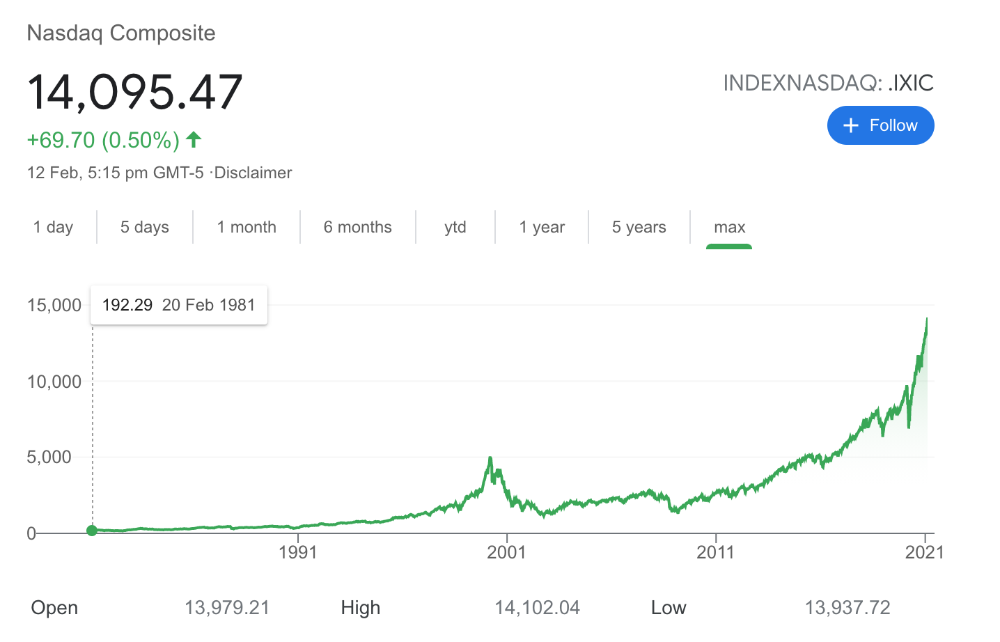
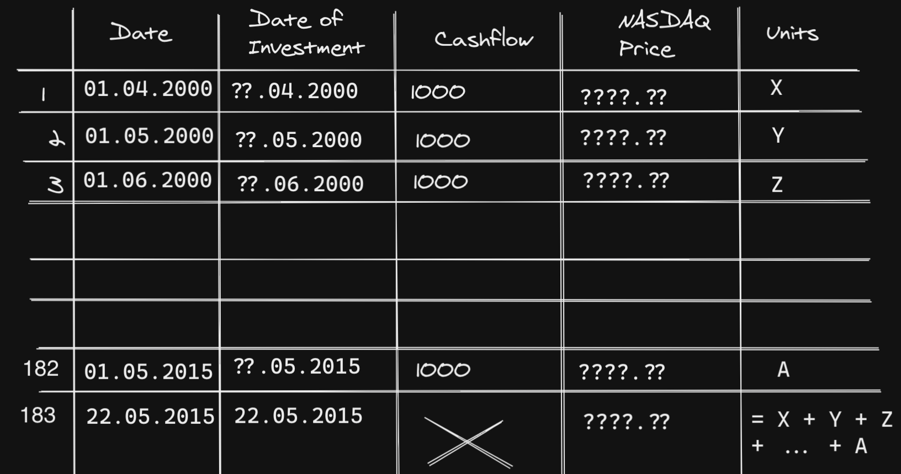
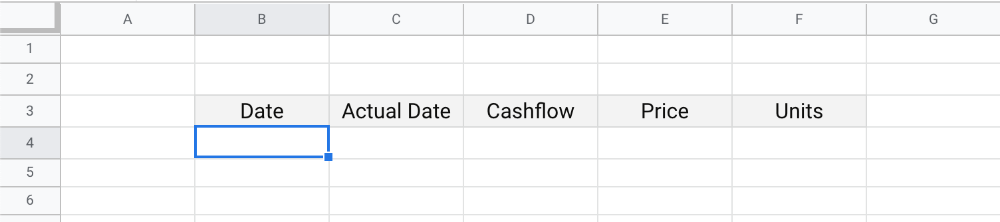
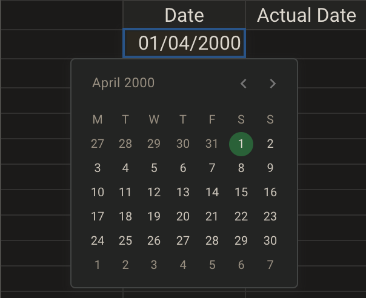
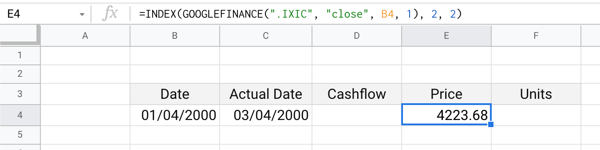
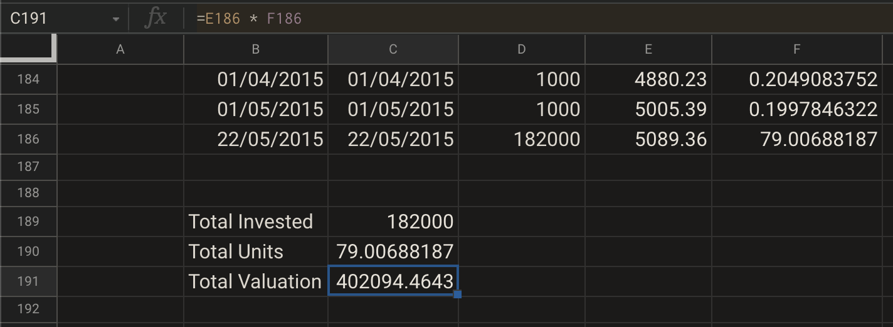

# Using External Data : Google Finance

## Intro

Almost all popular Excel-compatible applications, such as MS Excel or Google Sheets etc., allow _programmatically_ fetching data from external sources.

What are external sources, in this context?

Anything external to your Excel sheet, is an external resource. It can be a database, another excel workbook, a file with data in it \(CSV format\), or an API endpoint out there on the internet.

[MS Excel offers in-built _Get Data_ tool](https://support.microsoft.com/en-us/office/import-data-from-external-data-sources-power-query-be4330b3-5356-486c-a168-b68e9e616f5a) to just copy-paste an endpoint URL, and fetch data from that. 

With Google Sheets, one might need to write some [Google Apps javascript](https://developers.google.com/apps-script) to fetch and process data from a remote endpoint, before feeding that back to the sheet.

There are even dedicated tools and services, like IFTTT, RapiAPI, Mixpanel etc., which offer a way to integrate lot of service endpoints with your excel sheet.

In this section, we’d keep ourselves limited to `GOOGLEFINANCE` function, that fetches financial data from [Google Finance](https://www.google.com/finance). And preferably, use [Google Sheets](https://docs.google.com/spreadsheets); because most likely, your MS Excel application doesn't come with this in-built function.


©️ 🔒 Do go through usage restriction section in `GOOGLEFINANCE()` [documentation by Google](https://support.google.com/docs/answer/3093281?hl=en), to make sure you using this in your spreadsheets, is compliant with Google's terms of usage.


## Problem Statement

Plenty of economists point out how NASDAQ has stayed below its ATH \(**A**ll **T**ime **H**igh, i.e. a price value in time-series chart that's higher than all past values\) of 2000s, for the next ~15 years, before reaching the same high around 2015-16.




In the above chart\(s\) / screenshot\(s\), if you check the horizontal line for 5000, it touches NASDAQ twice - once in 2000, again in 2015.

NASDAQ reached its peak value of approximately 5048.62 \(closing price\), on 10th March 2000; only to re-attain this same previous ATH again on 22nd May 2015.

However, people don’t invest once then wait 15 years for returns to materialize.  
  
In this section, we’d look at how it’d have been like for the average retail investor, who had been investing with DCA \(**D**ollar **C**ost **A**veraging, similar to SIP or **S**ystematic **I**nvesting **P**lan, in Indian context\).


This is a reasonable assumption to make. It's common for people to get monthly paychecks, and invest their savings via some automated process through their banks or brokers.


  
For the purpose of this exercise, we’d assume the following:

* Purchase transactions for investments, are processed on 1st of month - from 1st April 2000, to 1st May 2015
* We check investment corpus valuation as on the date of next time NASDAQ crosses its previous peak, i.e., 22nd May, 2015
* Investor invests $1000 / month \(exact amount would scale up or down, with this, so actual amount is not that important\)

Our goal is to estimate if investor would've been in losses, or if they had made gains. And if so, how much in losses or gains.

## Planning

It is instructive to plan a bit ahead, before we start modeling this problem with a spreadsheet. Whenever you find yourself in a position having to create an excel sheet, start with planning first.

In planning phase, we’d think of what we ideally need to model this problem.

Based on preliminary analysis, it’s obvious we’d be getting NASDAQ data from Google Finance, using `GOOGLEFINANCE` function.

But how much data? If we are simulating the transactions over 15 years, do we need data for everyday markets were open, for 15 years!?

Turns out, an investor would invest \(15 x 12 + 1\) = 181 times, both start date of 1st April 2000 and end date of 1st April 2015 included. In this particular case, one extra transaction for month of May in 2015; therefore 182 total transactions.

On top of this, we’d need to know NASDAQ price of 22nd May 2015, adding one more data point / row in the sheet - total 183 rows.

Which price should we consider? Generally, a ticker like NASDAQ can have data every second, but since we’re trying to simulate the situation for an average investor, let’s consider closing price of NASDAQ on each day.

Now comes an interesting impediment we should consider - what if 1st of the month was a public holiday / non-business day / weekend? Markets weren’t open, hence data won’t be available for such a day.

In this case, the transaction would be processed on the next available business day. How do we find out if a given day, say 1st November 2004, was a business day or not? More importantly, if it wasn’t a business day, what was the next business day? 2nd Nov, or 3rd Nov, or 4th Nov?

Fortunately, there’s an in-built solution for this, which we’d discuss in some detail later.

Our approach:

* Get data for NASDAQ ticker from Google Finance, starting from 1st April 2000, up to 22nd May 2015, 182 data points.  


  It’d create 182 rows.  

* We would need 5 columns for the following purposes:  


  * `date`
  * `actual date of investment`
  * `cashflow / amount` \($1000 every month\)
  * `nasdaq closing price that day`
  * `units purchased`  

* Finally, in one last row, we’d invoke the in-built `SUM` formula,  to add up all units purchased over the years. Then multiply it by NASDAQ closing price, as on 22nd May 2015, to get corpus value as on that date. 




## Implementation

Follow these steps, to execute the plan that we've just made above.

* Create a new sheet in Google Sheet. We’d refer to it as the _**sheet**_ , going forward.
* Start with creating five column headers:

  * Date
  * Actual Date
  * Cashflow
  * Price
  * Units

  Reason to create an extra date column as the second column, is to also list actual date of investment. It can be 1st of month, or first working day after 1st of month, if 1st of month is a holiday.




### Date Formatting

Before we proceed any further, we’d like to figure out how date formatting works in Google Sheet, and get a taste of what fetched data from `GOOGLEFINANCE` looks like.

Follow these steps:

* Try adding a date in your sheet: 1st April, 2000. In this example, we’re writing it as `01/04/2000` \(in `DD/MM/YYYY` format\). But you’re free to use any format that’s commonly used. 
* Double tap or double-click on this.  If the date entry is correct, Google Sheets should realize that it’s pointing to April 1st, 2000. 




Chances are, it might detect it as 4th January, 2000. Or might not even detect it as a date at all!

A good way to inform your sheet that this entry be treated like a date, is to use formatting, and providing the date format.

Use `Format` -&gt; `Number` -&gt; `Date` for that. If `DD/MM/YYYY` is not listed as a format, you’d have to add it with custom format, under `Format` -&gt; `Number` -&gt; `More Formats` -&gt; `More Date and Time Formats`.

Alternatively, you can use the calendar pop-up widget to select April 1st, 2000. It might not be in desired format, but we can easily work around that.

### Using GOOGLEFINANCE\(\)

Once we’ve entered a valid date and it’s been recognized by Excel to be a valid calendar date, we can invoke in-built `GOOGLEFINANCE` function.

`=GOOGLEFINANCE(".IXIC", "close", <date>, 1)`  
  
`".IXIC"` is the indicator / ticker for NASDAQ on Google Finance. You can replace this with other tickers, like `"GOOG"`, or `"MSFT"`, or `"TSLA"`; to fetch data for these tickers.

`"close"` means closing market price. Other values can be `"low"` \(lowest price of that day\), `"high"` \(highest price of that day\) etc.

Here, `<date>` means referring to the cell which has the date in. Since we’ve made sure it’s by system as a valid date, the Google Finance API would be able to use it.


Notice the usage of `""` to wrap various texts inside the function. We could have also used single quotes \(`''`\) to wrap these texts.


The last argument, `1` , is interesting, and takes care of our issue from earlier, about knowing working date on or after 1st of month.

It basically tells Google Finance to return one single data entry. Check what happens if you switch this to `7` or any other higher number.

If a date is not a business day, Google Finance won’t have data for NASDAQ closing price on that date. Instead, it’d look for 1 dataset for next available working day, which is exactly what we want!


Once you enter these in a cell, link to the date from the other cell; and hit `Enter` or `Return` on your keyboard; the cell would switch to display `Loading...`, then print a small sub-table that looks like this:

| Date | Close |
| :--- | :--- |
| 03/04/2000 16:00:00 | 4223.68 |





### Using INDEX\(\)

Since `GOOGLEFINANCE` returns a table, and not just a single data, we need to find a way to extract right data from these and put these in two cells.

In particular, we need two data points from this table: 

* the actual date \(in this example, 1st April 2000 was an off-day for the market, markets opened again on 3rd April 2000\)
* price on that date

Enter another popular in-built formula, that extracts value from table & sub-tables - `INDEX`

We’re receiving data for only a single trading day, as confirmed by 4th argument to the `GOOGLEFINANCE` function.  This is how the sub-table returned by `GOOGLEFINANCE()` function would look like.

| Date | Close |
| :--- | :--- |
| 03/04/2000 16:00:00 | 4223.68 |

We're interested in the closing price, 4223.68 on 3rd April 2000.  
  
Therefore, this table returned by Google Finance would always have closing price at \(2,2\) position.


Here \(2, 2\) means 2nd row, 2nd column.


We can take the result of `GOOGLEFINANCE` call, and pass it into `INDEX` function, like this  


```text
result = GOOGLEFINANCE(".IXIC", "close", <date cell>, 1)
price = INDEX(result, 2, 2) # extract value in (2,2)
```

But instead of two calls, spread over two cells, we can also inline it

```text
INDEX(GOOGLEFINANCE(".IXIC", "close", <date cell>, 1), 2, 2)
```

Similarly, for the `actual date` column, we use \(2,1\) with `INDEX`:  
`=INDEX(GOOGLEFINANCE(".IXIC", "close", <date cell>, 1), 2, 1)`  




Also refer to following video





### Repeating Patterns

Now that we’ve figured out how to get the necessary data for one single row, we can get the same for all our other rows / dates.

Excel is good at detecting patterns and if you use the drag option, it fills the rows with closest value it can deduce.

Here, we want to create dates that are one month apart.

To help Excel understand this pattern, one needs to enter the date of next month; i.e., 1st May, 2000; and then let Excel drag do its thing.

Presently, this is how the table looks in Excel:

| Date | Actual Date | Cashflow | Price | Units |
| :--- | :--- | :--- | :--- | :--- |
| 01/04/2000 | 03/04/2000 |  | 4223.68 |  |

We can add one more entry in the first column, below current row.

| Date | Actual Date | Cashflow | Price | Units |
| :--- | :--- | :--- | :--- | :--- |
| 01/04/2000 | 03/04/2000 |  | 4223.68 |  |
| 01/05/2000 |  |  |  |  |

* Now select these two dates, drag by the swollen rectangle at the bottom right border.  Since we’d have 182 data points that follow the pattern of being one month apart; if the starting row is 4, where we have to stop dragging for auto-filling is \(182 + 4 - 1\) = 185.  Basically, keep dragging and auto-filling until you reach 1st May 2015.  If you exceed this exact date while dragging and auto-filling; after releasing the mouse / trackpad pointer, you can select the extra date entries, and delete those. 
* Once this is done, we are about to make Google Finance fetch us all data of all these 182 days \(or nearest trading days\).  


  Go to first entry in `Actual Date` column, drag the small square till you get to the end of it, so that there’s a `Date` entry for each of the entry in `Actual Date`.






⚠️ 🚨 Some cells might have `#NA` and say that there’s an error in getting data from Google Finance. This is a quirk of the `GOOGLEFINANCE()` query. This can be fixed easily, but would require some manual intervention.


### Fixing Broken Cells ⛏️

Notice that we’re wrapping the result of Google Finance query, in `INDEX`, and extracting the entry from cell \(2,1\) for actual date.

It actually doesn't matter how many rows of data we request from Google finance, we would still find closing price nearest trading day on or after the provided date.

Double-click on one such cell, change `1` to `2` in last argument in `GOOGLEFINANCE()`. In one case, we had to change that to `3`.

The formula would now read like:

`=INDEX(GOOGLEFINANCE(".IXIC", "close", <date cell>, 2), 2, 1)`

Similarly, drag and auto-fill the price column. Fix `#NA` cells by tweaking the `GOOGLEFINANCE()` query.

Here’s how it could look like now \(a section from the sheet\)

| Date | Actual Date | Cashflow | Price | Units |
| :--- | :--- | :--- | :--- | :--- |
| 01/12/2004 | 01/12/2004 |  | 2138.23 |  |
| 01/01/2005 | 03/01/2005 |  | 2152.15 |  |
| 01/02/2005 | 01/02/2005 |  | 2068.7 |  |
| 01/03/2005 | 01/03/2005 |  | 2071.25 |  |
| 01/04/2005 | 01/04/2005 |  | 1984.81 |  |
| 01/05/2005 | 02/05/2005 |  | 1928.65 |  |
| 01/06/2005 | 01/06/2005 |  | 2087.86 |  |
| 01/07/2005 | 01/07/2005 |  | 2057.37 |  |
| 01/08/2005 | 01/08/2005 |  | 2195.38 |  |






This is a common problem with this spreadsheet function, and others have solved it with different approaches.  
  
For example, this following _stackoverflow_ answer suggests using `IFERROR()` function to re-run same query multiple times, until the `#NA` is resolved.

[Original StackOverflow discussion ](https://stackoverflow.com/questions/59860596/googlefinance-often-returns-n-a-and-internal-error-messages-while-getting-stock)\| [archive.org link](https://web.archive.org/web/20210310154252/https://stackoverflow.com/questions/59860596/googlefinance-often-returns-n-a-and-internal-error-messages-while-getting-stock) \| [archive.is link](https://archive.is/yILjU)

### Adding Cashflow Values

In the `Cashflow` column, enter `1000` in first row. Enter same `1000` again in second row.

Select both of these, so Excel can understand the pattern \(in this case, the value of 1000\), and drag the small square at the bottom right to fill all the cells.

This is how the table should look like now \(a small section from the sheet\)

| Date | Actual Date | Cashflow | Price | Units |
| :--- | :--- | :--- | :--- | :--- |
| 01/12/2004 | 01/12/2004 | 1000 | 2138.23 |  |
| 01/01/2005 | 03/01/2005 | 1000 | 2152.15 |  |
| 01/02/2005 | 01/02/2005 | 1000 | 2068.7 |  |
| 01/03/2005 | 01/03/2005 | 1000 | 2071.25 |  |
| 01/04/2005 | 01/04/2005 | 1000 | 1984.81 |  |
| 01/05/2005 | 02/05/2005 | 1000 | 1928.65 |  |
| 01/06/2005 | 01/06/2005 | 1000 | 2087.86 |  |
| 01/07/2005 | 01/07/2005 | 1000 | 2057.37 |  |
| 01/08/2005 | 01/08/2005 | 1000 | 2195.38 |  |


We've avoided using any units for currency, such as `$`. Just plain 1000, with no units.


### Units Column

Now we just need to fill out the last column

Number of units purchased would be same as cashflow divided by price.

Note that just like multiplication is not `x`, rather denoted by `*` \(asterisk\); division is denoted by `/` \(front slash\), and not any division symbol.

In the first row, add formula starting with `=`, then `D4 / E4` \(E4 is the cell with price, D4 is the cell with cashflow\).

After dragging and filling all cells against each date, this is how the table should look like \(a section from the table\)

| Date | Actual Date | Cashflow | Price | Units |
| :--- | :--- | :--- | :--- | :--- |
| 01/12/2004 | 01/12/2004 | 1000 | 2138.23 | 0.4676765362 |
| 01/01/2005 | 03/01/2005 | 1000 | 2152.15 | 0.4646516274 |
| 01/02/2005 | 01/02/2005 | 1000 | 2068.7 | 0.4833953691 |
| 01/03/2005 | 01/03/2005 | 1000 | 2071.25 | 0.4828002414 |
| 01/04/2005 | 01/04/2005 | 1000 | 1984.81 | 0.5038265627 |
| 01/05/2005 | 02/05/2005 | 1000 | 1928.65 | 0.5184973946 |
| 01/06/2005 | 01/06/2005 | 1000 | 2087.86 | 0.4789593172 |
| 01/07/2005 | 01/07/2005 | 1000 | 2057.37 | 0.4860574423 |
| 01/08/2005 | 01/08/2005 | 1000 | 2195.38 | 0.4555020088 |

At this point, all five columns should be filled, for all 182 rows

### Final Tally

Finally, we need to tally the values as on 22nd May 2015

At the bottom of the sheet, where the last row has ended for date `01/05/2015` - below that, in a new row, add an entry for 22nd May 2015.

If you run into issues with date formatting, just copy a date, then use the calendar widget to navigate to 22nd May, 2015.

This value should be in the first column, `Date`.

In second column, we’d invoke the Google Finance formula as we did earlier. You could also just drag from the previous cell above it.

Similarly, drag the price column value to update the price value for 22nd May 2015.

Keep the cashflow column empty \(no investment on that day\).

In the units column, for this last row, invoke the `=SUM` function to add up all units, listed above that cell.

It should sum up as `79.00688187` units.

We are almost there.

Total valuation would be total number of units, multiplied by price as on 22nd May 2015.

| Total Invested | 182000 |
| :--- | :--- |
| Total Units | 79.00688187 |
| Total Valuation | 402094.4643 |

Refer to below image\(s\)




Overall, total invested amount would’ve been **182,000 USD**. And the valuation of corpus as on 22nd May 2015, would have been **402,095 USD**.

Investor would've made ~1.2x of original invested corpus in gain [😊](https://emojipedia.org/smiling-face-with-smiling-eyes/)

## Wrapping Up

* We had _hardcoded_ `".IXIC"` ticker everywhere in the `GOOGLEFINANCE` call.

  This would limit us from analyzing other similar scenarios.

  A good option would be to keep the ticker in a cell, then refer to it directly in the formula.  


  We know Excel reacts to changes and updates the interface, hence we can also repeat the same with index funds \(VTI, VOO etc.\), or other tickers like `"NASDAQ:MSFT"` \(Microsoft Corp.\) or `"NASDAQ:GOOG"` \(Google\) etc. - just by updating the ticker.  


  You might want to re-do the whole sheet with this change. With the power of drag and auto-fill, it shouldn’t take you more than a few mins to tweak it this way!  

* The goal of this exercise was to learn how to fetch data in Excel, and use that to evaluate statements such as _NASDAQ traded below its 2000 peak for 15 years_.  


  Here’s the **wrong** takeaway: _DCA / SIP is better than lumpsum investments, always_.  


  Here’s the **right** takeaway: _Returns in the investor’s portfolio from same asset, over same time period, can be very different from point-to-point return of that asset_.  

* We learned how to _compose_ Excel functions, because we wrapped output of `GOOGLEFINANCE` in `INDEX`. This is effectively `f(g(x))`.  


  It can help you build powerful primitives. Towards the end, getting an extra data point for NASDAQ on 22nd May 2015, was as simple as just dragging a cell - that’s how powerful Excel can be!  


  However, be cautious in using this pattern. If you’re building excel trackers, such complex expressions can be hard to read and maintain.  


  You yourself would be afraid of touching and changing the Excel file months down the road.  


  There’s no harm in breaking it into an intermediate expression. It might make it more easily readable.

