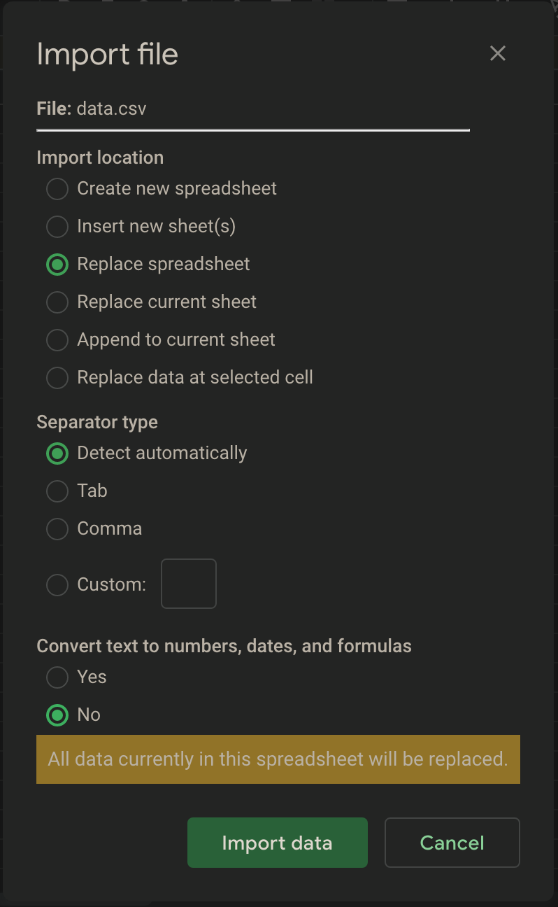
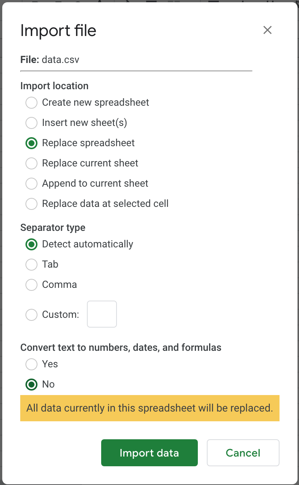
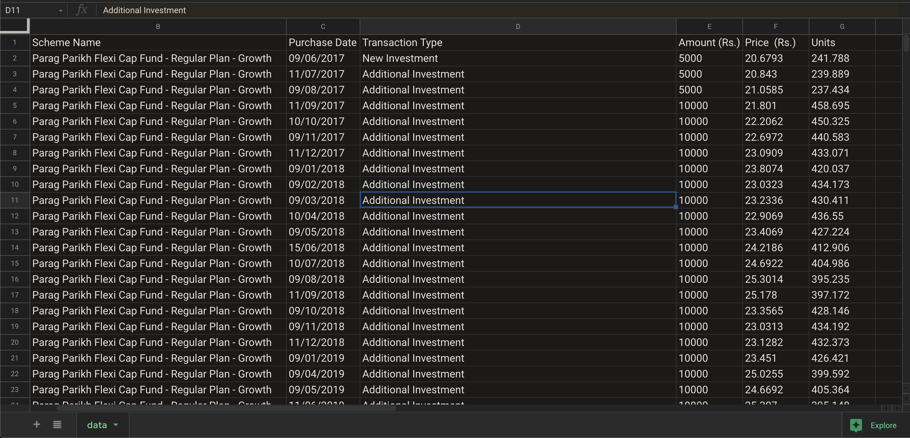
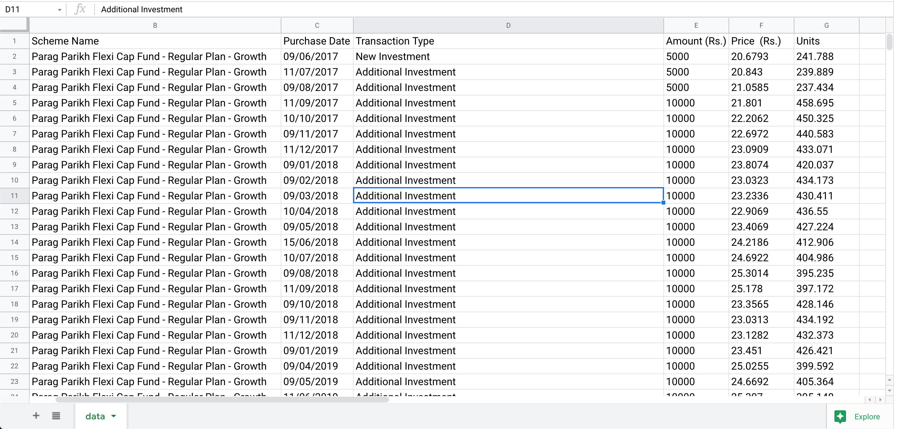
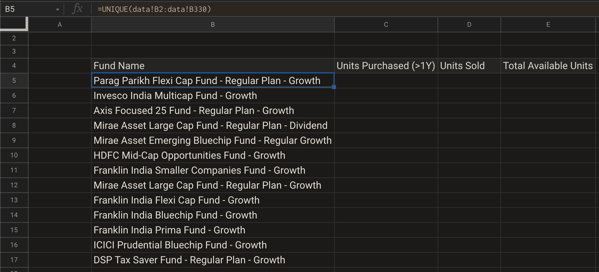
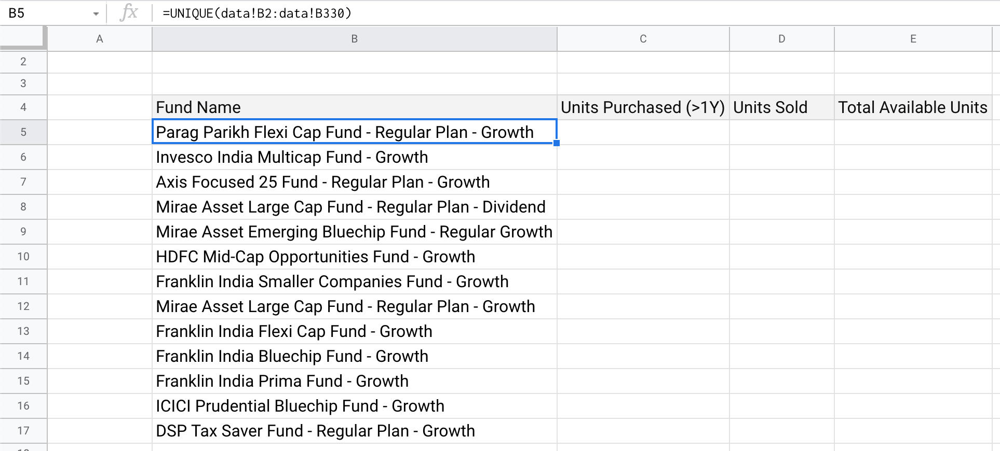
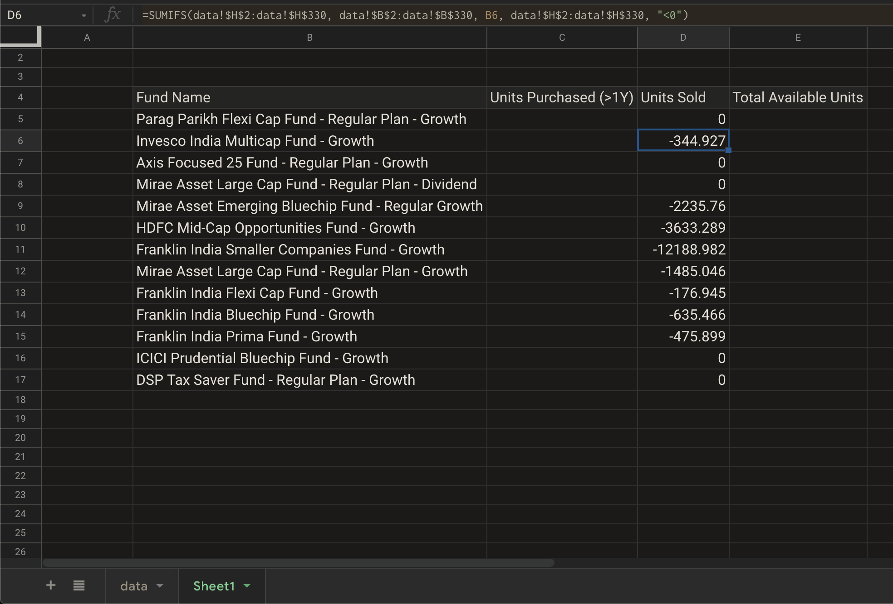
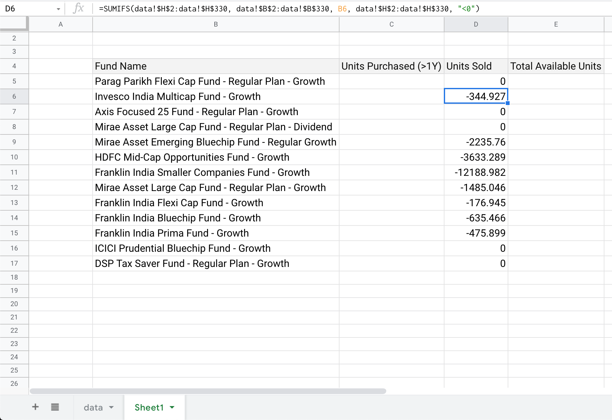
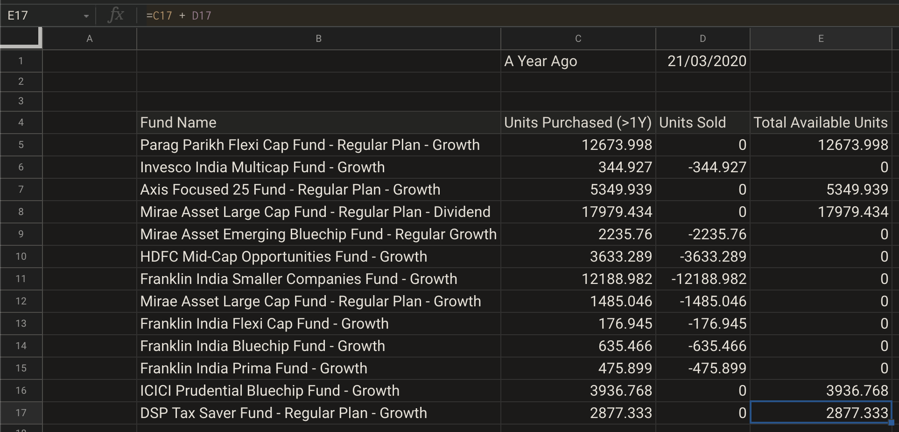

# Computing LTCG Eligible Equity Units

## Problem Statement

Now that we’ve seen how to import CSV data, and more importantly, how to _massage_ that data for further use; we need to put this skill to use.

As an investor, you might have a portfolio of equity funds, and you’d want to know how many units you can sell without exceeding **L**ong **T**erm **C**apital **G**ain of ₹100,000 \(1L INR, in colloquial terms\).

Let’s back up a bit.

When you redeem units in equity-linked assets, you’ve gains or losses, depending on price of purchase / acquisition; and your selling price on the day of selling.

Here, we’re dealing with equity mutual funds, that invests in equity markets.

If holding period of your equity units exceed 1 year \(365 days\), then it is long term capital gain or loss.

In 2018 Union Budget, the taxation rules were changed in a way, that an investor doesn’t have to pay tax on long term capital gains, up to ₹100,000 or ₹1L.

If an investor is looking to exit some positions by selling some of their holdings, it might be beneficial for them to know

* how many units are older than 1 year of holding period
* total number of units older than 1 year, that they can sell

Consider a sample transaction history, plotted against time, for an investor who’s been investing for a few years \(figures not to scale\)


The Y-axis represents units purchased in every transaction. It’s positive for purchase transactions, and negative offshoots are for sell / redemption transactions.

X-axis is for time, in years.

Now, let’s assume today’s date is somewhere in 2021-22. Say, it’s 3rd July 2021.

Then any units purchased in last 1 year before that, from 4th July 2020 to 3rd July 2021; are less than 1 year old.

And all units purchased on or before 3rd July 2020, are older than 1 year.


Our task is to use excel / spreadsheet find these two:

* number of units older than 1 year old \(to avoid STCG tax or **S**hort **T**erm **C**apital **G**ain\)
* number of units, that are older than 1 year old, which has net gain of 100,000 INR or less.

This is a CSV of transactions from one of our community members. We’ve changed around a few data points, and removed PII \(**P**ersonally **I**dentifying **I**nformation\).



```text
,Scheme Name ,Purchase Date,Transaction Type,Amount (Rs.),Price  (Rs.),Units
,Parag Parikh Flexi Cap Fund - Regular Plan - Growth,09/06/2017,New Investment ,5000,20.6793,241.788
,Parag Parikh Flexi Cap Fund - Regular Plan - Growth,11/07/2017,Additional Investment ,5000,20.843,239.889
,Parag Parikh Flexi Cap Fund - Regular Plan - Growth,09/08/2017,Additional Investment ,5000,21.0585,237.434
,Parag Parikh Flexi Cap Fund - Regular Plan - Growth,11/09/2017,Additional Investment ,10000,21.801,458.695
,Parag Parikh Flexi Cap Fund - Regular Plan - Growth,10/10/2017,Additional Investment ,10000,22.2062,450.325
,Parag Parikh Flexi Cap Fund - Regular Plan - Growth,09/11/2017,Additional Investment ,10000,22.6972,440.583
,Parag Parikh Flexi Cap Fund - Regular Plan - Growth,11/12/2017,Additional Investment ,10000,23.0909,433.071
,Parag Parikh Flexi Cap Fund - Regular Plan - Growth,09/01/2018,Additional Investment ,10000,23.8074,420.037
,Parag Parikh Flexi Cap Fund - Regular Plan - Growth,09/02/2018,Additional Investment ,10000,23.0323,434.173
,Parag Parikh Flexi Cap Fund - Regular Plan - Growth,09/03/2018,Additional Investment ,10000,23.2336,430.411
,Parag Parikh Flexi Cap Fund - Regular Plan - Growth,10/04/2018,Additional Investment ,10000,22.9069,436.55
,Parag Parikh Flexi Cap Fund - Regular Plan - Growth,09/05/2018,Additional Investment ,10000,23.4069,427.224
,Parag Parikh Flexi Cap Fund - Regular Plan - Growth,15/06/2018,Additional Investment ,10000,24.2186,412.906
,Parag Parikh Flexi Cap Fund - Regular Plan - Growth,10/07/2018,Additional Investment ,10000,24.6922,404.986
,Parag Parikh Flexi Cap Fund - Regular Plan - Growth,09/08/2018,Additional Investment ,10000,25.3014,395.235
,Parag Parikh Flexi Cap Fund - Regular Plan - Growth,11/09/2018,Additional Investment ,10000,25.178,397.172
,Parag Parikh Flexi Cap Fund - Regular Plan - Growth,09/10/2018,Additional Investment ,10000,23.3565,428.146
,Parag Parikh Flexi Cap Fund - Regular Plan - Growth,09/11/2018,Additional Investment ,10000,23.0313,434.192
,Parag Parikh Flexi Cap Fund - Regular Plan - Growth,11/12/2018,Additional Investment ,10000,23.1282,432.373
,Parag Parikh Flexi Cap Fund - Regular Plan - Growth,09/01/2019,Additional Investment ,10000,23.451,426.421
,Parag Parikh Flexi Cap Fund - Regular Plan - Growth,09/04/2019,Additional Investment ,10000,25.0255,399.592
,Parag Parikh Flexi Cap Fund - Regular Plan - Growth,09/05/2019,Additional Investment ,10000,24.6692,405.364
,Parag Parikh Flexi Cap Fund - Regular Plan - Growth,11/06/2019,Additional Investment ,10000,25.307,395.148
,Parag Parikh Flexi Cap Fund - Regular Plan - Growth,09/07/2019,Additional Investment ,10000,25.0506,399.192
,Parag Parikh Flexi Cap Fund - Regular Plan - Growth,09/08/2019,Additional Investment ,10000,24.7311,404.349
,Parag Parikh Flexi Cap Fund - Regular Plan - Growth,11/09/2019,Additional Investment ,10000,25.0192,399.693
,Parag Parikh Flexi Cap Fund - Regular Plan - Growth,10/10/2019,Additional Investment ,10000,24.9239,401.221
,Parag Parikh Flexi Cap Fund - Regular Plan - Growth,11/11/2019,Additional Investment ,10000,26.4092,378.656
,Parag Parikh Flexi Cap Fund - Regular Plan - Growth,10/12/2019,Additional Investment ,10000,26.1356,382.62
,Parag Parikh Flexi Cap Fund - Regular Plan - Growth,09/01/2020,Additional Investment ,10000,26.9707,370.773
,Parag Parikh Flexi Cap Fund - Regular Plan - Growth,11/02/2020,Additional Investment ,10000,28.1105,355.739
,Parag Parikh Flexi Cap Fund - Regular Plan - Growth,11/03/2020,Additional Investment ,10000,24.9975,400.04
,Parag Parikh Flexi Cap Fund - Regular Plan - Growth,13/04/2020,Additional Investment ,10000,22.6226,442.036
,Parag Parikh Flexi Cap Fund - Regular Plan - Growth,11/05/2020,Additional Investment ,10000,23.6931,422.064
,Parag Parikh Flexi Cap Fund - Regular Plan - Growth,09/06/2020,Additional Investment ,10000,26.2705,380.655
,Parag Parikh Flexi Cap Fund - Regular Plan - Growth,09/07/2020,Additional Investment ,10000,28.3438,352.793
,Parag Parikh Flexi Cap Fund - Regular Plan - Growth,11/08/2020,Additional Investment ,10000,30.2264,330.82
,Parag Parikh Flexi Cap Fund - Regular Plan - Growth,09/09/2020,Additional Investment ,10000,30.0601,332.65
,Parag Parikh Flexi Cap Fund - Regular Plan - Growth,09/10/2020,Additional Investment ,10000,31.8137,314.314
,Parag Parikh Flexi Cap Fund - Regular Plan - Growth,10/11/2020,Additional Investment ,10000,32.4878,307.792
,Parag Parikh Flexi Cap Fund - Regular Plan - Growth,09/12/2020,Additional Investment ,10000,34.5138,289.725
,Parag Parikh Flexi Cap Fund - Regular Plan - Growth,11/01/2021,Additional Investment ,10000,35.9973,277.785
,Parag Parikh Flexi Cap Fund - Regular Plan - Growth,12/02/2021,Additional Investment ,10000,38.2601,261.356
,Invesco India Multicap Fund - Growth,11/03/2015,New Investment ,1000,36.2,27.624
,Invesco India Multicap Fund - Growth,13/04/2015,Additional Investment ,1000,37.12,26.94
,Invesco India Multicap Fund - Growth,12/05/2015,Additional Investment ,1000,33.7,29.674
,Invesco India Multicap Fund - Growth,11/06/2015,Additional Investment ,1000,34.1,29.326
,Invesco India Multicap Fund - Growth,13/07/2015,Additional Investment ,1000,36.13,27.678
,Invesco India Multicap Fund - Growth,11/08/2015,Additional Investment ,1000,37.28,26.824
,Invesco India Multicap Fund - Growth,11/09/2015,Additional Investment ,1000,34.1,29.326
,Invesco India Multicap Fund - Growth,13/10/2015,Additional Investment ,1000,35.32,28.313
,Invesco India Multicap Fund - Growth,13/11/2015,Additional Investment ,1000,34.46,29.019
,Invesco India Multicap Fund - Growth,11/12/2015,Additional Investment ,1000,34.1,29.326
,Invesco India Multicap Fund - Growth,12/01/2016,Additional Investment ,1000,34.98,28.588
,Invesco India Multicap Fund - Growth,11/02/2016,Additional Investment ,1000,30.97,32.289
,Invesco India Multicap Fund - Growth,02/03/2020,Redemption ,-16808.13,48.73,-344.927
,Axis Focused 25 Fund - Regular Plan - Growth,05/11/2018,New Investment ,10000,25.6,390.625
,Axis Focused 25 Fund - Regular Plan - Growth,04/12/2018,Additional Investment ,10000,26.45,378.072
,Axis Focused 25 Fund - Regular Plan - Growth,04/01/2019,Additional Investment ,10000,26.33,379.795
,Axis Focused 25 Fund - Regular Plan - Growth,05/03/2019,Additional Investment ,10000,25.98,384.911
,Axis Focused 25 Fund - Regular Plan - Growth,04/04/2019,Additional Investment ,10000,27.28,366.569
,Axis Focused 25 Fund - Regular Plan - Growth,06/05/2019,Additional Investment ,10000,27.32,366.032
,Axis Focused 25 Fund - Regular Plan - Growth,04/06/2019,Additional Investment ,10000,28.92,345.781
,Axis Focused 25 Fund - Regular Plan - Growth,04/07/2019,Additional Investment ,10000,28.91,345.901
,Axis Focused 25 Fund - Regular Plan - Growth,05/08/2019,Additional Investment ,10000,26.98,370.645
,Axis Focused 25 Fund - Regular Plan - Growth,04/09/2019,Additional Investment ,10000,27.05,369.686
,Axis Focused 25 Fund - Regular Plan - Growth,04/10/2019,Additional Investment ,10000,28.82,346.981
,Axis Focused 25 Fund - Regular Plan - Growth,04/12/2019,Additional Investment ,10000,30.33,329.707
,Axis Focused 25 Fund - Regular Plan - Growth,06/01/2020,Additional Investment ,10000,30.19,331.236
,Axis Focused 25 Fund - Regular Plan - Growth,04/02/2020,Additional Investment ,10000,31.73,315.159
,Axis Focused 25 Fund - Regular Plan - Growth,04/03/2020,Additional Investment ,10000,30.41,328.839
,Axis Focused 25 Fund - Regular Plan - Growth,07/04/2020,Additional Investment ,10000,23.36,428.082
,Axis Focused 25 Fund - Regular Plan - Growth,05/05/2020,Additional Investment ,5000,24.31,205.677
,Axis Focused 25 Fund - Regular Plan - Growth,04/06/2020,Additional Investment ,5000,26.14,191.278
,Axis Focused 25 Fund - Regular Plan - Growth,06/07/2020,Additional Investment ,5000,28.01,178.499
,Axis Focused 25 Fund - Regular Plan - Growth,04/08/2020,Additional Investment ,5000,28.44,175.8
,Axis Focused 25 Fund - Regular Plan - Growth,04/09/2020,Additional Investment ,5000,29.49,169.541
,Axis Focused 25 Fund - Regular Plan - Growth,05/10/2020,Additional Investment ,5000,29.66,168.569
,Axis Focused 25 Fund - Regular Plan - Growth,04/11/2020,Additional Investment ,5000,31.02,161.178
,Axis Focused 25 Fund - Regular Plan - Growth,04/12/2020,Additional Investment ,10000,35.11,284.805
,Axis Focused 25 Fund - Regular Plan - Growth,05/01/2021,Additional Investment ,10000,38.12,262.316
,Axis Focused 25 Fund - Regular Plan - Growth,05/02/2021,Additional Investment ,10000,38.47,259.93
,Mirae Asset Large Cap Fund - Regular Plan - Dividend,01/04/2019,Switch In  -  Mirae Asset Emerging Bluechip Fund - Regular Growth ,118472.37,18.226,6500.185
,Mirae Asset Large Cap Fund - Regular Plan - Dividend,10/04/2019,New Investment ,10000,18.061,553.679
,Mirae Asset Large Cap Fund - Regular Plan - Dividend,10/05/2019,Additional Investment ,10000,17.602,568.117
,Mirae Asset Large Cap Fund - Regular Plan - Dividend,11/06/2019,Additional Investment ,10000,18.655,536.049
,Mirae Asset Large Cap Fund - Regular Plan - Dividend,10/07/2019,Additional Investment ,10000,18.049,554.047
,Mirae Asset Large Cap Fund - Regular Plan - Dividend,13/08/2019,Additional Investment ,10000,17.196,581.531
,Mirae Asset Large Cap Fund - Regular Plan - Dividend,11/09/2019,Additional Investment ,10000,17.516,570.907
,Mirae Asset Large Cap Fund - Regular Plan - Dividend,13/11/2019,Additional Investment ,10000,18.717,534.274
,Mirae Asset Large Cap Fund - Regular Plan - Dividend,10/12/2019,Additional Investment ,10000,18.761,533.021
,Mirae Asset Large Cap Fund - Regular Plan - Dividend,16/12/2019,Dividend Reinvestment  @ Rs. 1.3281 P/U,14518.68,17.615,824.223
,Mirae Asset Large Cap Fund - Regular Plan - Dividend,10/01/2020,Additional Investment ,10000,17.876,559.409
,Mirae Asset Large Cap Fund - Regular Plan - Dividend,11/02/2020,Additional Investment ,10000,17.746,563.507
,Mirae Asset Large Cap Fund - Regular Plan - Dividend,11/03/2020,Additional Investment ,10000,15.535,643.708
,Mirae Asset Large Cap Fund - Regular Plan - Dividend,13/04/2020,Additional Investment ,5000,13.32,375.375
,Mirae Asset Large Cap Fund - Regular Plan - Dividend,12/05/2020,Additional Investment ,5000,13.496,370.48
,Mirae Asset Large Cap Fund - Regular Plan - Dividend,10/06/2020,Additional Investment ,5000,14.8,337.838
,Mirae Asset Large Cap Fund - Regular Plan - Dividend,10/07/2020,Additional Investment ,5000,15.835,315.74
,Mirae Asset Large Cap Fund - Regular Plan - Dividend,11/08/2020,Additional Investment ,5000,16.785,297.87
,Mirae Asset Large Cap Fund - Regular Plan - Dividend,10/09/2020,Additional Investment ,5000,17.042,293.378
,Mirae Asset Large Cap Fund - Regular Plan - Dividend,12/10/2020,Additional Investment ,5000,17.545,284.967
,Mirae Asset Large Cap Fund - Regular Plan - Dividend,10/11/2020,Additional Investment ,5000,18.495,270.33
,Mirae Asset Large Cap Fund - Regular Plan - Dividend,10/12/2020,Additional Investment ,10000,19.642,509.088
,Mirae Asset Large Cap Fund - Regular Plan - Dividend,12/01/2021,Additional Investment ,10000,21.186,471.986
,Mirae Asset Large Cap Fund - Regular Plan - Dividend,10/02/2021,Additional Investment ,10000,21.963,455.288
,Mirae Asset Emerging Bluechip Fund - Regular Growth,12/03/2018,New Investment ,10000,48.56,205.931
,Mirae Asset Emerging Bluechip Fund - Regular Growth,10/04/2018,Additional Investment ,10000,49.532,201.89
,Mirae Asset Emerging Bluechip Fund - Regular Growth,10/05/2018,Additional Investment ,10000,49.978,200.088
,Mirae Asset Emerging Bluechip Fund - Regular Growth,11/06/2018,Additional Investment ,10000,49.185,203.314
,Mirae Asset Emerging Bluechip Fund - Regular Growth,10/07/2018,Additional Investment ,10000,48.706,205.314
,Mirae Asset Emerging Bluechip Fund - Regular Growth,10/09/2018,Additional Investment ,10000,51.373,194.655
,Mirae Asset Emerging Bluechip Fund - Regular Growth,10/10/2018,Additional Investment ,10000,46.757,213.872
,Mirae Asset Emerging Bluechip Fund - Regular Growth,12/11/2018,Additional Investment ,10000,48.201,207.465
,Mirae Asset Emerging Bluechip Fund - Regular Growth,10/12/2018,Additional Investment ,10000,47.717,209.569
,Mirae Asset Emerging Bluechip Fund - Regular Growth,10/01/2019,Additional Investment ,10000,50.069,199.724
,Mirae Asset Emerging Bluechip Fund - Regular Growth,11/03/2019,Additional Investment ,10000,51.563,193.938
,Mirae Asset Emerging Bluechip Fund - Regular Growth,01/04/2019,Switch Out  -  Mirae Asset Large Cap Fund - Regular Plan - Dividend ,-118472.37,52.99,-2235.76
,HDFC Mid-Cap Opportunities Fund - Growth,11/03/2015,New Investment ,1000,37.603,26.594
,HDFC Mid-Cap Opportunities Fund - Growth,13/04/2015,Additional Investment ,1000,38.728,25.821
,HDFC Mid-Cap Opportunities Fund - Growth,12/05/2015,Additional Investment ,1000,35.892,27.861
,HDFC Mid-Cap Opportunities Fund - Growth,11/06/2015,Additional Investment ,1000,36.095,27.705
,HDFC Mid-Cap Opportunities Fund - Growth,13/07/2015,Additional Investment ,1000,37.917,26.373
,HDFC Mid-Cap Opportunities Fund - Growth,11/08/2015,Additional Investment ,1000,39.696,25.191
,HDFC Mid-Cap Opportunities Fund - Growth,11/09/2015,Additional Investment ,1000,36.662,27.276
,HDFC Mid-Cap Opportunities Fund - Growth,13/10/2015,Additional Investment ,1000,37.649,26.561
,HDFC Mid-Cap Opportunities Fund - Growth,13/11/2015,Additional Investment ,1000,36.915,27.089
,HDFC Mid-Cap Opportunities Fund - Growth,11/12/2015,Additional Investment ,1000,36.611,27.314
,HDFC Mid-Cap Opportunities Fund - Growth,12/01/2016,Additional Investment ,1000,36.829,27.153
,HDFC Mid-Cap Opportunities Fund - Growth,11/02/2016,Additional Investment ,1000,33.233,30.091
,HDFC Mid-Cap Opportunities Fund - Growth,14/02/2017,New Investment ,10000,46.795,213.698
,HDFC Mid-Cap Opportunities Fund - Growth,14/03/2017,Additional Investment ,10000,47.445,210.77
,HDFC Mid-Cap Opportunities Fund - Growth,12/04/2017,Additional Investment ,10000,50.719,197.165
,HDFC Mid-Cap Opportunities Fund - Growth,12/05/2017,Additional Investment ,10000,52.274,191.3
,HDFC Mid-Cap Opportunities Fund - Growth,13/06/2017,Additional Investment ,10000,52.017,192.245
,HDFC Mid-Cap Opportunities Fund - Growth,12/07/2017,Additional Investment ,10000,53.096,188.338
,HDFC Mid-Cap Opportunities Fund - Growth,14/08/2017,Additional Investment ,10000,52.539,190.335
,HDFC Mid-Cap Opportunities Fund - Growth,12/09/2017,Additional Investment ,10000,54.472,183.581
,HDFC Mid-Cap Opportunities Fund - Growth,12/10/2017,Additional Investment ,10000,54.584,183.204
,HDFC Mid-Cap Opportunities Fund - Growth,14/11/2017,Additional Investment ,10000,56.603,176.669
,HDFC Mid-Cap Opportunities Fund - Growth,12/12/2017,Additional Investment ,10000,57.413,174.177
,HDFC Mid-Cap Opportunities Fund - Growth,12/01/2018,Additional Investment ,10000,61.258,163.244
,HDFC Mid-Cap Opportunities Fund - Growth,14/02/2018,Additional Investment ,10000,57.766,173.112
,HDFC Mid-Cap Opportunities Fund - Growth,13/03/2018,Additional Investment ,10000,56.725,176.289
,HDFC Mid-Cap Opportunities Fund - Growth,12/04/2018,Additional Investment ,10000,58.372,171.315
,HDFC Mid-Cap Opportunities Fund - Growth,14/05/2018,Additional Investment ,10000,58.219,171.765
,HDFC Mid-Cap Opportunities Fund - Growth,12/06/2018,Additional Investment ,10000,57.232,174.727
,HDFC Mid-Cap Opportunities Fund - Growth,12/07/2018,Additional Investment ,10000,56.713,176.326
,HDFC Mid-Cap Opportunities Fund - Growth,02/03/2020,Redemption ,-195192.83,53.724,-3633.289
,Franklin India Smaller Companies Fund - Growth,29/12/2014,New Investment ,5000,35.9135,139.223
,Franklin India Smaller Companies Fund - Growth,16/01/2015,Additional Investment ,5000,37.7375,132.494
,Franklin India Smaller Companies Fund - Growth,18/02/2015,Additional Investment ,5000,38.2927,130.573
,Franklin India Smaller Companies Fund - Growth,17/03/2015,Additional Investment ,5000,38.8945,128.553
,Franklin India Smaller Companies Fund - Growth,16/04/2015,Additional Investment ,5000,39.603,126.253
,Franklin India Smaller Companies Fund - Growth,18/05/2015,Additional Investment ,5000,38.4578,130.013
,Franklin India Smaller Companies Fund - Growth,16/06/2015,Additional Investment ,5000,36.5897,136.65
,Franklin India Smaller Companies Fund - Growth,16/07/2015,Additional Investment ,5000,39.2018,127.545
,Franklin India Smaller Companies Fund - Growth,18/08/2015,Additional Investment ,5000,40.1264,124.606
,Franklin India Smaller Companies Fund - Growth,16/09/2015,Additional Investment ,5000,37.6015,132.973
,Franklin India Smaller Companies Fund - Growth,16/10/2015,Additional Investment ,5000,39.5969,126.273
,Franklin India Smaller Companies Fund - Growth,17/11/2015,Additional Investment ,5000,38.8075,128.841
,Franklin India Smaller Companies Fund - Growth,16/12/2015,Additional Investment ,5000,38.8986,128.539
,Franklin India Smaller Companies Fund - Growth,18/01/2016,Additional Investment ,5000,36.1752,138.216
,Franklin India Smaller Companies Fund - Growth,16/02/2016,Additional Investment ,5000,35.2195,141.967
,Franklin India Smaller Companies Fund - Growth,16/03/2016,Additional Investment ,5000,36.5967,136.624
,Franklin India Smaller Companies Fund - Growth,18/04/2016,Additional Investment ,5000,40.238,124.261
,Franklin India Smaller Companies Fund - Growth,17/05/2016,Additional Investment ,5000,41.0136,121.911
,Franklin India Smaller Companies Fund - Growth,16/06/2016,Additional Investment ,5000,42.447,117.794
,Franklin India Smaller Companies Fund - Growth,18/07/2016,Additional Investment ,10000,44.4423,225.011
,Franklin India Smaller Companies Fund - Growth,16/09/2016,Additional Investment ,10000,47.3914,211.009
,Franklin India Smaller Companies Fund - Growth,17/10/2016,Additional Investment ,10000,48.4465,206.413
,Franklin India Smaller Companies Fund - Growth,16/11/2016,Additional Investment ,10000,44.2113,226.187
,Franklin India Smaller Companies Fund - Growth,16/12/2016,Additional Investment ,10000,44.4986,224.726
,Franklin India Smaller Companies Fund - Growth,02/03/2020,Redemption ,-171366.86,48.0475,-3566.655
,Mirae Asset Large Cap Fund - Regular Plan - Dividend,15/10/2018,Switch In  -  Mirae Asset Large Cap Fund - Regular Plan - Growth ,68541.61,17.951,3818.261
,Mirae Asset Large Cap Fund - Regular Plan - Dividend,06/12/2018,Dividend Reinvestment  @ Rs. 1.4167 P/U,5409.15,16.59,326.049
,Mirae Asset Large Cap Fund - Regular Plan - Dividend,16/12/2019,Dividend Reinvestment  @ Rs. 1.3281 P/U,5504.11,17.615,312.467
,Mirae Asset Large Cap Fund - Regular Plan - Growth,04/04/2018,New Investment ,10000,45.101,221.725
,Mirae Asset Large Cap Fund - Regular Plan - Growth,03/05/2018,Additional Investment ,10000,46.989,212.816
,Mirae Asset Large Cap Fund - Regular Plan - Growth,04/06/2018,Additional Investment ,10000,46.39,215.564
,Mirae Asset Large Cap Fund - Regular Plan - Growth,03/07/2018,Additional Investment ,10000,46.486,215.119
,Mirae Asset Large Cap Fund - Regular Plan - Growth,03/08/2018,Additional Investment ,10000,49.189,203.297
,Mirae Asset Large Cap Fund - Regular Plan - Growth,04/09/2018,Additional Investment ,10000,50.047,199.812
,Mirae Asset Large Cap Fund - Regular Plan - Growth,04/10/2018,Additional Investment ,10000,46.144,216.713
,Mirae Asset Large Cap Fund - Regular Plan - Growth,15/10/2018,Switch Out  -  Mirae Asset Large Cap Fund - Regular Plan - Dividend ,-68541.61,46.155,-1485.046
,Franklin India Flexi Cap Fund - Growth,18/05/2017,New Investment ,10000,531.5921,18.811
,Franklin India Flexi Cap Fund - Growth,19/06/2017,Additional Investment ,10000,537.3628,18.609
,Franklin India Flexi Cap Fund - Growth,18/07/2017,Additional Investment ,10000,555.2843,18.009
,Franklin India Flexi Cap Fund - Growth,18/08/2017,Additional Investment ,10000,550.453,18.167
,Franklin India Flexi Cap Fund - Growth,19/09/2017,Additional Investment ,10000,568.3494,17.595
,Franklin India Flexi Cap Fund - Growth,18/10/2017,Additional Investment ,10000,564.1949,17.724
,Franklin India Flexi Cap Fund - Growth,20/11/2017,Additional Investment ,10000,578.9429,17.273
,Franklin India Flexi Cap Fund - Growth,19/12/2017,Additional Investment ,10000,590.9089,16.923
,Franklin India Flexi Cap Fund - Growth,18/01/2018,Additional Investment ,10000,608.2863,16.44
,Franklin India Flexi Cap Fund - Growth,19/02/2018,Additional Investment ,10000,574.911,17.394
,Franklin India Flexi Cap Fund - Growth,15/10/2018,Switch Out  -  Franklin India Smaller Companies Fund - Growth ,-97131.08,548.9394,-176.945
,Franklin India Smaller Companies Fund - Growth,15/10/2018,Switch In  -  Franklin India Flexi Cap Fund - Growth ,97131.08,51.4937,1886.271
,Franklin India Smaller Companies Fund - Growth,04/04/2019,Switch In  -  Franklin India Bluechip Fund - Growth ,300975.04,54.1568,5557.476
,Franklin India Smaller Companies Fund - Growth,11/04/2019,New Investment ,10000,54.2866,184.208
,Franklin India Smaller Companies Fund - Growth,13/05/2019,Additional Investment ,10000,51.38,194.628
,Franklin India Smaller Companies Fund - Growth,11/06/2019,Additional Investment ,10000,54.4227,183.747
,Franklin India Smaller Companies Fund - Growth,11/07/2019,Additional Investment ,10000,51.5779,193.881
,Franklin India Smaller Companies Fund - Growth,14/08/2019,Additional Investment ,10000,46.9668,212.916
,Franklin India Smaller Companies Fund - Growth,11/09/2019,Additional Investment ,10000,47.8012,209.2
,Franklin India Smaller Companies Fund - Growth,02/03/2020,Redemption ,-411040.57,47.6721,-8622.327
,Franklin India Bluechip Fund - Growth,01/09/2016,New Investment ,10000,390.993,25.576
,Franklin India Bluechip Fund - Growth,14/10/2016,Additional Investment ,10000,385.7494,25.924
,Franklin India Bluechip Fund - Growth,15/11/2016,Additional Investment ,10000,368.2658,27.154
,Franklin India Bluechip Fund - Growth,14/12/2016,Additional Investment ,10000,368.8564,27.111
,Franklin India Bluechip Fund - Growth,16/01/2017,Additional Investment ,10000,378.5611,26.416
,Franklin India Bluechip Fund - Growth,14/02/2017,Additional Investment ,10000,395.3548,25.294
,Franklin India Bluechip Fund - Growth,14/03/2017,Additional Investment ,10000,406.0662,24.627
,Franklin India Bluechip Fund - Growth,17/04/2017,Additional Investment ,10000,409.7139,24.407
,Franklin India Bluechip Fund - Growth,16/05/2017,Additional Investment ,10000,426.1836,23.464
,Franklin India Bluechip Fund - Growth,12/06/2017,New Investment ,10000,426.2069,23.463
,Franklin India Bluechip Fund - Growth,14/06/2017,Additional Investment ,10000,425.8755,23.481
,Franklin India Bluechip Fund - Growth,11/07/2017,Additional Investment ,10000,430.7472,23.215
,Franklin India Bluechip Fund - Growth,14/07/2017,Additional Investment ,10000,435.6868,22.952
,Franklin India Bluechip Fund - Growth,10/08/2017,Additional Investment ,10000,432.034,23.146
,Franklin India Bluechip Fund - Growth,16/08/2017,Additional Investment ,10000,435.3714,22.969
,Franklin India Bluechip Fund - Growth,12/09/2017,Additional Investment ,10000,441.6172,22.644
,Franklin India Bluechip Fund - Growth,14/09/2017,Additional Investment ,10000,442.6595,22.591
,Franklin India Bluechip Fund - Growth,10/10/2017,Additional Investment ,10000,440.277,22.713
,Franklin India Bluechip Fund - Growth,16/10/2017,Additional Investment ,10000,448.5239,22.295
,Franklin India Bluechip Fund - Growth,10/11/2017,Additional Investment ,10000,455.7687,21.941
,Franklin India Bluechip Fund - Growth,14/11/2017,Additional Investment ,10000,450.7018,22.188
,Franklin India Bluechip Fund - Growth,12/12/2017,Additional Investment ,10000,450.429,22.201
,Franklin India Bluechip Fund - Growth,14/12/2017,Additional Investment ,10000,450.8708,22.179
,Franklin India Bluechip Fund - Growth,10/01/2018,Additional Investment ,10000,468.3489,21.352
,Franklin India Bluechip Fund - Growth,12/02/2018,Additional Investment ,10000,457.7254,21.847
,Franklin India Bluechip Fund - Growth,14/02/2018,Additional Investment ,10000,454.7569,21.99
,Franklin India Bluechip Fund - Growth,14/03/2018,Additional Investment ,10000,447.9042,22.326
,Franklin India Bluechip Fund - Growth,01/04/2019,Switch Out  -  Franklin India Smaller Companies Fund - Growth ,-300975.04,473.6336,-635.466
,Franklin India Prima Fund - Growth,29/12/2014,New Investment ,5000,620.3648,8.06
,Franklin India Prima Fund - Growth,16/01/2015,Additional Investment ,5000,655.0102,7.633
,Franklin India Prima Fund - Growth,18/02/2015,Additional Investment ,5000,672.8812,7.431
,Franklin India Prima Fund - Growth,17/03/2015,Additional Investment ,5000,674.2269,7.416
,Franklin India Prima Fund - Growth,16/04/2015,Additional Investment ,5000,679.9313,7.354
,Franklin India Prima Fund - Growth,18/05/2015,Additional Investment ,5000,656.7176,7.614
,Franklin India Prima Fund - Growth,16/06/2015,Additional Investment ,5000,638.7628,7.828
,Franklin India Prima Fund - Growth,16/07/2015,Additional Investment ,5000,685.4009,7.295
,Franklin India Prima Fund - Growth,18/08/2015,Additional Investment ,5000,688.7061,7.26
,Franklin India Prima Fund - Growth,16/09/2015,Additional Investment ,5000,645.2428,7.749
,Franklin India Prima Fund - Growth,16/10/2015,Additional Investment ,5000,672.374,7.436
,Franklin India Prima Fund - Growth,17/11/2015,Additional Investment ,5000,656.3437,7.618
,Franklin India Prima Fund - Growth,16/12/2015,Additional Investment ,5000,656.4382,7.617
,Franklin India Prima Fund - Growth,18/01/2016,Additional Investment ,5000,615.5887,8.122
,Franklin India Prima Fund - Growth,16/02/2016,Additional Investment ,5000,597.298,8.371
,Franklin India Prima Fund - Growth,16/03/2016,Additional Investment ,5000,618.4861,8.084
,Franklin India Prima Fund - Growth,18/04/2016,Additional Investment ,5000,676.6577,7.389
,Franklin India Prima Fund - Growth,17/05/2016,Additional Investment ,5000,686.2338,7.286
,Franklin India Prima Fund - Growth,16/06/2016,Additional Investment ,5000,708.6313,7.056
,Franklin India Prima Fund - Growth,15/07/2016,Additional Investment ,5000,744.8421,6.713
,Franklin India Prima Fund - Growth,17/08/2016,Additional Investment ,10000,773.2618,12.932
,Franklin India Prima Fund - Growth,15/09/2016,Additional Investment ,10000,782.6346,12.777
,Franklin India Prima Fund - Growth,17/10/2016,Additional Investment ,10000,797.1977,12.544
,Franklin India Prima Fund - Growth,15/11/2016,Additional Investment ,10000,729.1266,13.715
,Franklin India Prima Fund - Growth,15/12/2016,Additional Investment ,10000,736.9692,13.569
,Franklin India Prima Fund - Growth,15/02/2017,Additional Investment ,10000,798.5369,12.523
,Franklin India Prima Fund - Growth,15/03/2017,Additional Investment ,10000,828.7766,12.066
,Franklin India Prima Fund - Growth,17/04/2017,Additional Investment ,10000,877.2783,11.399
,Franklin India Prima Fund - Growth,16/05/2017,Additional Investment ,10000,907.096,11.024
,Franklin India Prima Fund - Growth,15/06/2017,Additional Investment ,10000,894.824,11.175
,Franklin India Prima Fund - Growth,17/07/2017,Additional Investment ,10000,902.7454,11.077
,Franklin India Prima Fund - Growth,16/08/2017,Additional Investment ,10000,906.4853,11.032
,Franklin India Prima Fund - Growth,15/09/2017,Additional Investment ,10000,932.6085,10.723
,Franklin India Prima Fund - Growth,17/10/2017,Additional Investment ,10000,943.9366,10.594
,Franklin India Prima Fund - Growth,15/11/2017,Additional Investment ,10000,945.6373,10.575
,Franklin India Prima Fund - Growth,15/12/2017,Additional Investment ,10000,980.6321,10.198
,Franklin India Prima Fund - Growth,11/01/2018,New Investment ,10000,1038.8211,9.626
,Franklin India Prima Fund - Growth,14/02/2018,Additional Investment ,10000,983.9771,10.163
,Franklin India Prima Fund - Growth,13/03/2018,Additional Investment ,10000,973.9265,10.268
,Franklin India Prima Fund - Growth,11/04/2018,Additional Investment ,10000,987.189,10.13
,Franklin India Prima Fund - Growth,11/05/2018,Additional Investment ,10000,992.1258,10.079
,Franklin India Prima Fund - Growth,12/06/2018,Additional Investment ,10000,974.8691,10.258
,Franklin India Prima Fund - Growth,11/07/2018,Additional Investment ,10000,953.3073,10.49
,Franklin India Prima Fund - Growth,13/08/2018,Additional Investment ,10000,972.6508,10.281
,Franklin India Prima Fund - Growth,11/09/2018,Additional Investment ,10000,956.1179,10.459
,Franklin India Prima Fund - Growth,11/10/2018,Additional Investment ,10000,859.6945,11.632
,Franklin India Prima Fund - Growth,13/11/2018,Additional Investment ,10000,893.875,11.187
,Franklin India Prima Fund - Growth,11/12/2018,Additional Investment ,10000,892.4636,11.205
,Franklin India Prima Fund - Growth,11/01/2019,Additional Investment ,10000,920.3008,10.866
,Franklin India Prima Fund - Growth,02/03/2020,Redemption ,-446485.92,938.2031,-475.899
,ICICI Prudential Bluechip Fund - Growth,11/03/2015,New Investment ,2000,30.23,66.159
,ICICI Prudential Bluechip Fund - Growth,13/04/2015,Additional Investment ,2000,30.51,65.552
,ICICI Prudential Bluechip Fund - Growth,12/05/2015,Additional Investment ,2000,28.22,70.872
,ICICI Prudential Bluechip Fund - Growth,11/06/2015,Additional Investment ,2000,27.99,71.454
,ICICI Prudential Bluechip Fund - Growth,13/07/2015,Additional Investment ,2000,29.62,67.522
,ICICI Prudential Bluechip Fund - Growth,11/08/2015,Additional Investment ,2000,30.19,66.247
,ICICI Prudential Bluechip Fund - Growth,11/09/2015,Additional Investment ,2000,27.75,72.072
,ICICI Prudential Bluechip Fund - Growth,13/10/2015,Additional Investment ,2000,28.69,69.711
,ICICI Prudential Bluechip Fund - Growth,13/11/2015,Additional Investment ,2000,28.12,71.124
,ICICI Prudential Bluechip Fund - Growth,11/12/2015,Additional Investment ,2000,27.59,72.49
,ICICI Prudential Bluechip Fund - Growth,12/01/2016,Additional Investment ,2000,27.13,73.719
,ICICI Prudential Bluechip Fund - Growth,11/02/2016,Additional Investment ,2000,25.03,79.904
,ICICI Prudential Bluechip Fund - Growth,29/01/2019,New Investment ,10000,39.06,256.016
,ICICI Prudential Bluechip Fund - Growth,28/02/2019,Additional Investment ,10000,39.72,251.762
,ICICI Prudential Bluechip Fund - Growth,28/03/2019,Additional Investment ,10000,42,238.095
,ICICI Prudential Bluechip Fund - Growth,30/04/2019,Additional Investment ,10000,42.6,234.742
,ICICI Prudential Bluechip Fund - Growth,28/05/2019,Additional Investment ,10000,43.46,230.097
,ICICI Prudential Bluechip Fund - Growth,28/06/2019,Additional Investment ,10000,43.2,231.481
,ICICI Prudential Bluechip Fund - Growth,30/07/2019,Additional Investment ,10000,40.73,245.519
,ICICI Prudential Bluechip Fund - Growth,28/08/2019,Additional Investment ,10000,40.32,248.016
,ICICI Prudential Bluechip Fund - Growth,30/09/2019,Additional Investment ,10000,42.31,236.351
,ICICI Prudential Bluechip Fund - Growth,28/11/2019,Additional Investment ,10000,44.29,225.785
,ICICI Prudential Bluechip Fund - Growth,30/12/2019,Additional Investment ,10000,44.78,223.314
,ICICI Prudential Bluechip Fund - Growth,28/01/2020,Additional Investment ,10000,44.32,225.632
,ICICI Prudential Bluechip Fund - Growth,28/02/2020,Additional Investment ,10000,41.13,243.132
,DSP Tax Saver Fund - Regular Plan - Growth,02/05/2018,New Investment ,10000,46.601,214.588
,DSP Tax Saver Fund - Regular Plan - Growth,29/05/2018,Additional Investment ,10000,45.755,218.555
,DSP Tax Saver Fund - Regular Plan - Growth,29/06/2018,Additional Investment ,10000,44.168,226.408
,DSP Tax Saver Fund - Regular Plan - Growth,31/07/2018,Additional Investment ,10000,47.182,211.945
,DSP Tax Saver Fund - Regular Plan - Growth,29/08/2018,Additional Investment ,10000,48.482,206.262
,DSP Tax Saver Fund - Regular Plan - Growth,01/10/2018,Additional Investment ,10000,44.173,226.383
,DSP Tax Saver Fund - Regular Plan - Growth,30/10/2018,Additional Investment ,5000,41.902,119.326
,DSP Tax Saver Fund - Regular Plan - Growth,29/11/2018,Additional Investment ,5000,44.535,112.271
,DSP Tax Saver Fund - Regular Plan - Growth,31/12/2018,Additional Investment ,5000,44.952,111.23
,DSP Tax Saver Fund - Regular Plan - Growth,01/03/2019,Additional Investment ,5000,44.684,111.897
,DSP Tax Saver Fund - Regular Plan - Growth,29/03/2019,Additional Investment ,5000,48.352,103.408
,DSP Tax Saver Fund - Regular Plan - Growth,30/04/2019,Additional Investment ,5000,48.445,103.21
,DSP Tax Saver Fund - Regular Plan - Growth,29/05/2019,Additional Investment ,5000,49.323,101.373
,DSP Tax Saver Fund - Regular Plan - Growth,01/07/2019,Additional Investment ,5000,49.191,101.645
,DSP Tax Saver Fund - Regular Plan - Growth,30/07/2019,Additional Investment ,5000,46.45,107.643
,DSP Tax Saver Fund - Regular Plan - Growth,29/08/2019,Additional Investment ,5000,46.387,107.789
,DSP Tax Saver Fund - Regular Plan - Growth,01/10/2019,Additional Investment ,5000,48.926,102.195
,DSP Tax Saver Fund - Regular Plan - Growth,29/11/2019,Additional Investment ,5000,51.499,97.089
,DSP Tax Saver Fund - Regular Plan - Growth,31/12/2019,Additional Investment ,5000,51.619,96.864
,DSP Tax Saver Fund - Regular Plan - Growth,29/01/2020,Additional Investment ,5000,52.606,95.046
,DSP Tax Saver Fund - Regular Plan - Growth,02/03/2020,Additional Investment ,5000,48.921,102.206

```

Take a look at the CSV above, or after downloading the file; we can then begin with planning phase.

## Planning


Right off the bat, we notice that unlike our previous sample CSV, this starts each line with a comma.

We could easily import it into our spreadsheet using in-built import system in place.

First part of the problem, is to compute total number of units purchased more than a year ago.

Notice the term, _total number of units_.

This is different from number of units purchased, added up all together.

Why?

A sell transaction reduces number of units.

Total number of units outside of 1 year period, is

```text
SUM(units purchased up to DATE(today - 1y)) - SUM(<units sold>)
```

Notice the difference. We’re adding up units purchased only up to a year ago. But we’re subtracting **all units** sold \(and not just units sold up to a year ago\).

What if this value is negative?

Then, there’s no unit older than a year.

In this case, we might want to wrap the result to be zero.

We can use `MAX()` function for that

```text
MAX(SUM(units purchased up to DATE(today - 1y)) - SUM(<units sold>), 0)
```

[Link to documentation on MAX\(\)](https://support.google.com/docs/answer/3094013?hl=en) \| [archive.org link](https://web.archive.org/web/20210118103052/https://support.google.com/docs/answer/3094013?hl=en) \| [archive.is link](https://archive.is/cD15W)

However, there remains one more problem: there are more than one fund!

We cannot just add units of two different funds!

In other words, we need a way to present this result \(total units older than 1 year\), for **each** fund.

But how do we get excel / spreadsheet to extract this _unique_ set of values, then add up values only against each of those?

One simple observation is because the fund names are grouped together, we can manually segregate these.

But in a different CSV file, the grouping might not be there at all. Different funds can be mixed with transactions appearing one after another, to give it a chronological order.

We can use `UNIQUE()` function from Google Sheets, to get a list of unique fund names, and this would work for the case even when the names are not grouped together.

[Link to documentation of UNIQUE\(\)](https://support.google.com/docs/answer/3093198?hl=en) \| [archive.org link](https://web.archive.org/web/20201214025719/https://support.google.com/docs/answer/3093198?hl=en) \| [archive.is link](https://archive.is/yQEoR)

Next task, is to add up transactions for each of the unique fund names that appear.

There are more than one ways to go about it. We could use `FILTER()` function, operate on a subset of the data. We could also use some combination of `LOOKUP()` with `SUM()` or `SUMIF()`.

We use `SUMIFS()` to add up all units from purchase transactions **up to a year ago**, and subtract the unit balance for redemption or switch-out transactions.

[Link to documentation of SUMIFS\(\)](https://support.google.com/docs/answer/3238496?hl=en) \| [archive.org link](https://web.archive.org/web/20201203181155/https://support.google.com/docs/answer/3238496?hl=en) \| [archive.is link](https://archive.is/ZdUKy)

This function allows for more than one criteria to search, and sum up, within a range of data.

How do we find _up to a year ago_?

```text
TODAY() - 1 * 365
```

Instead of putting a hardcoded value for date, we can use a dynamically-deduced value. Reason being, this output would depend on which date you’re checking the spreadsheet.

`TODAY()` function gives us today’s date. And subtracting 365, gives date going back a year.

## Remaining Units Older than 1 Year 

Now that we’ve chalked out a plan, it’s time to execute this step by step.

### **Importing Transaction History**

Follow these steps:

* Open a new empty spreadsheet
* Download the CSV file \(or copy paste from above into a text file\) in your machine.
* Go to your spreadsheet and import with these settings

  Select these options:

  * Replace current sheet
  * Detect Automatically
  * No





After importing this CSV file into your Spreadsheet, it should look like this





### **Extracting Unique Funds**

We’d use this sheet as our source of data.

And in case you’re wondering, yes, excel / spreadsheet allows you to refer to data from a cell in **different sheet**.

Follow these steps to extract a list of unique funds

* Create a new sheet in your workbook, clicking on the plus sign \(`+`\) at the bottom left of your spreadsheet application.
* In this new sheet, add a table header

| Fund Name | Units Purchased \(&gt;1Y\) | Units Sold | Total Available Units |
| :--- | :--- | :--- | :--- |


It should look like this


Next step is to use `UNIQUE()` function, with the range of all funds.

There are total 329 entries in the CSV imported transactions.

In the first sheet, if the first entry of fund name starts at `B2`, then the last entry would be at \(329 - 2 + 1\) = `B330`.

We are referring across sheet, the reference works out as `<name of the sheet>!<cellId>`.

Refer to this video for more guidance:





Final outcome of this process should look like as follows





### Locking Cell IDs for Dragging Autofills

Before we proceed to compute the total units sold or purchased, a look at autofill drag behavior is warranted.

Say, a formula is `FUNCTION(A2, sheet!C3:sheet!C300)`.

In this formula, if we drag it to next row, it’d change as follows: `FUNCTION(A3, sheet!C4:sheet!C301)`.

However, we might not want all referred fields to change.

`A2` → `A3` ✅  
`sheet!C3:sheet!C300` → `sheet!C4:sheet!C301` ❌

The range of data remains same for both functions, and we’d only want a **part of formula to change, while other part of the formula remaining constant**.

This is referred to as _locking cells_ in excel or spreadsheet formula.

`$` is used to lock a formula’s elements.

A cell ID consists of Column ID, and a Row ID. Using `$` ahead of either of these, locks them or makes them immutable when an auto-fill dragging happens.

For instance, `$A2` means if horizontal dragging is done, it’d remain as `$A2`. And won’t turn into `$B2`.

Similarly, `A$3` means if vertical dragging is done, it won’t change to `A$4`. Rather it’d remain as `A$3`.

To _lock_ or preserve the expression, both horizontally and vertically, we can use `$A$2`

In the above example, `FUNCTION(A3, sheet!$C$3:sheet!$C$300)` should do the trick.

We’d use this in the next step.

### Total Number of Units Sold

Number of units sold in a fund, can be computed in the second sheet as sum of these cells:

* where name of the fund match the fund column in data sheet
* where unit column is negative

However, before we did that, we should update the data cells.

When importing, we imported everything as raw strings. And prevented spreadsheet application from formatting dates / numbers / strings as it saw fit.

This was to give us more control over how to format these strings.

Follow these steps:

* In the data sheet where all CSV entries were imported, add a new column next to last column
* Invoke `VALUE()` function for first entry against number of units.

  This function takes raw string values of units, and convert those to floating-point numbers. This would help us compare against 0 or other numbers, or add these up.

* Auto-fill all cells in that column, to have numeric values of each raw string of units.
* Go back to the second sheet, which has unique fund names
* In the third column, _Units sold_, add this formula:

  ```text
   SUMIFS(
     <range of unit value column in data sheet>,
     <fund name column in data sheet>,
     name of fund in current row in second sheet,
     <unit value column in data sheet>,
     "<0"
   )
  ```

  First argument to `SUMIFS()` is the range on which it’d do the _summing_ or addition.

  
  Next 2 arguments are set of criteria. There are 4 arguments after the first one, in couplets they represent 2 conditions.  
  
  2nd and 3rd argument means _find me the rows where the name of the fund is same as it is here_. This should **not** be locked cell.  
  
  4th and 5th argument means _now check the unit value column and pick the ones with value less than zero_.

Refer to the following video\(s\)





Final result should match this





### **Normalizing imported dates**

To determine unit balance for only purchase transactions, about a year ago, we need to use `SUMIFS()` function again.

But this time, we’ve to add one more condition: **date of purchase**

Comparing dates adds some complexity.

As we had to convert raw strings to their numeric values earlier, we’d have to convert these raw string transaction dates to actual dates that would allow our spreadsheets to compare against other dates.

Follow these steps to achieve this:

* Add an extra column next to the units value column, in data sheet.
* Invoke `DATEVALUE()` function to compute date from raw strings in _Purchase Date_ column.

  It’d most likely print a number.

* Go to `Format` →`Numbers` → `Date Format`.

  This would change it to a date format.

* Use drag and autofill, to get equivalent date values for each of the transaction dates

[Documentation of DATEVALUE\(\)](https://support.google.com/docs/answer/3093039?hl=en) \| [archive.org link](https://web.archive.org/web/20200806143357/https://support.google.com/docs/answer/3093039?hl=en) \| [archive.is link](https://archive.is/SzVcK)  
  
The newly created column should contain similar-looking values, though under the hood, they’ve been converted to date objects.

### **Units purchased older than 1 year**

It’s time to put all these together.

The `SUMIFS()` would get one more condition with 2 more arguments - that purchase date / transaction date were before 1 year ago.

* In the second sheet \(not the sheet named `data`\), add a cell, to note down date exactly 1 year ago.

  It should be written as `TODAY() - 1 * 365`. `TODAY()` is an in-built function that returns today’s date \(we want to compute it, so no matter when someone checks the sheet, it gives correct value based on that date\).

  By default, subtraction assumes unit as 1 day, therefore subtracting 365 is enough to get the date from exactly a year ago.

  Use date formatting if needed.

* In the second column, _Units Purchased \(&gt;1Y\)_, add this formula:

  ```text
   SUMIFS(
     <range of unit value column in data sheet>,
     <fund name column in data sheet>,
     name of fund in current row in second sheet,
     <unit value column in data sheet>,
     ">0",
     <formatted date column>
     <less than date from a year ago>
   )
  ```

  First argument to `SUMIFS()` is the range on which it’d do the _summing_ or addition.

  
  Next 2 arguments are set of criteria. There are 4 arguments after the first one, in couplets they represent 2 conditions.

  
  2nd and 3rd argument means _find me the rows where the name of the fund is same as it is here_. This should **not** be locked cell.

  
  4th and 5th argument means _now check the unit value column and pick the ones with value less than zero_.

  
  6th argument is pointing to newly added formatted date column from above.

  
  7th argument is a bit interesting. Conditions are wrapped in quotes \(`""` or `''`\), but if we refer to a cell which has a fixed date in it, we cannot write it as `"<$B$6"`.

  
  We have to use `&` and write it as `"<"&$B$6`. This is a way to use the value in cell `B6` in a conditional.

Refer to the following video:





Final result should match these



The numbers might not exactly match, because depending on today's date, you might have a higher value. Above computation is as on 21st March 2021.



When a cell range in a sheet is being referred, second reference to same sheet can be omitted. `data!B4:data!B50` can be written as `data!B4:B50`


### LTCG-Eligible Units

This part is straight-forward

It’s sum of total units purchased more than one year ago, and total units sold so far.

Effectively, we have to sum up the column entries. We can use auto-fill with drag. In fact, spreadsheet might actually prompt here, on how to autofill these cells, in last column of second sheet.

It also shows why keeping _units sold_ in negative was a good idea.

A sample final result can look like this




## Wrapping up

It’s easy to cross-check and verify that these complex computations and instrumentations actually lead to sane results

Based on the above computations, we see that investor has entered and exited multiple funds over the years.

Out of these, this investor hasn’t sold units in the following:

* Parag Parikh Flexi Cap Fund - Regular Plan - Growth
* Axis Focused 25 Fund - Regular Plan - Growth
* Mirae Asset Large Cap Fund - Regular Plan - Dividend
* ICICI Prudential Bluechip Fund - Growth
* DSP Tax Saver Fund - Regular Plan - Growth

This is evident from the `Units Sold` column - investor hasn’t sold any units in these funds.

Over the years, investor has switched their corpus into these above funds.

For the other funds in their portfolio, they’ve completely sold these off, more than a year ago. We can easily verify this, going through the redemption transactions, and see that those were before 21/03/2020, i.e. more than one year ago.

