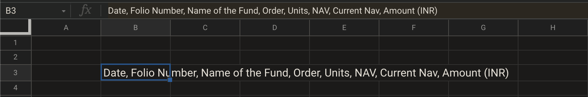
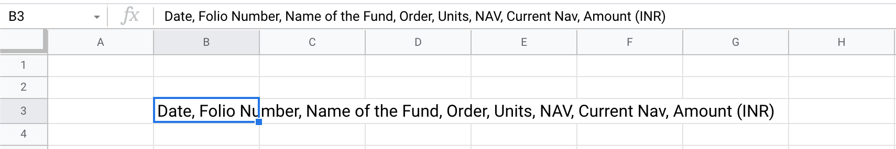
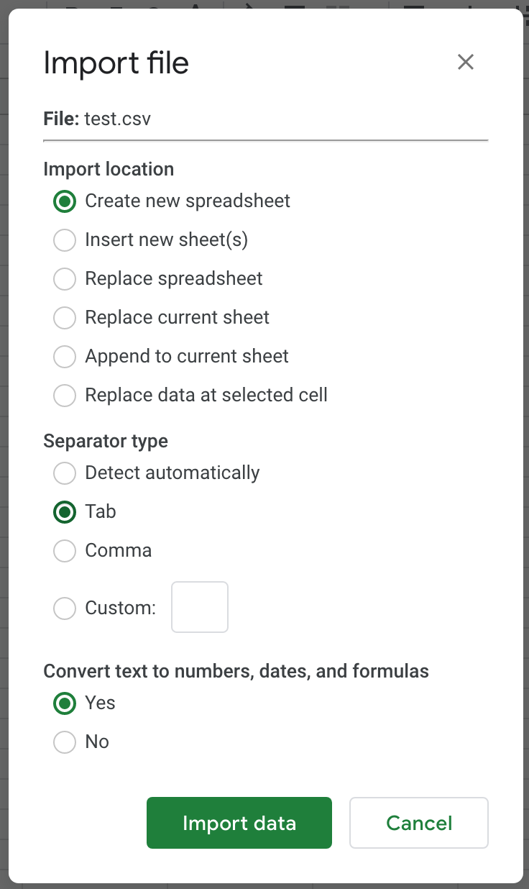
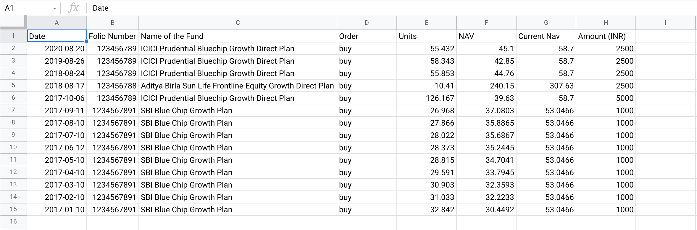

# CSV Format

## Introduction to CSV format

_CSV_ stands for **C**omma **S**eparated **V**alues. It’s a text file, which has entries, separated by comma \(`,`\).

The following is an example of transaction histories in comma-separated values format:

```text
Date, Folio Number, Name of the Fund, Order, Units, NAV, Current Nav, Amount (INR)
2020-08-20,123456789,ICICI Prudential Bluechip Growth Direct Plan,buy,55.432,45.10,58.7,2500.0
2019-08-26,123456789,ICICI Prudential Bluechip Growth Direct Plan,buy,58.343,42.85,58.7,2500.0
2018-08-24,123456789,ICICI Prudential Bluechip Growth Direct Plan,buy,55.853,44.76,58.7,2500.0
2018-08-17,123456788,Aditya Birla Sun Life Frontline Equity Growth Direct Plan,buy,10.41,240.15,307.63,2500.0
2017-10-06,123456789,ICICI Prudential Bluechip Growth Direct Plan,buy,126.167,39.63,58.7,5000.0
2017-09-11,1234567891,SBI Blue Chip Growth Plan,buy,26.968,37.0803,53.0466,1000.0
2017-08-10,1234567891,SBI Blue Chip Growth Plan,buy,27.866,35.8865,53.0466,1000.0
2017-07-10,1234567891,SBI Blue Chip Growth Plan,buy,28.022,35.6867,53.0466,1000.0
2017-06-12,1234567891,SBI Blue Chip Growth Plan,buy,28.373,35.2445,53.0466,1000.0
2017-05-10,1234567891,SBI Blue Chip Growth Plan,buy,28.815,34.7041,53.0466,1000.0
2017-04-10,1234567891,SBI Blue Chip Growth Plan,buy,29.591,33.7945,53.0466,1000.0
2017-03-10,1234567891,SBI Blue Chip Growth Plan,buy,30.903,32.3593,53.0466,1000.0
2017-02-10,1234567891,SBI Blue Chip Growth Plan,buy,31.033,32.2233,53.0466,1000.0
2017-01-10,1234567891,SBI Blue Chip Growth Plan,buy,32.842,30.4492,53.0466,1000.0
```

Notice the first line of the entry:

```text
Date, Folio Number, Name of the Fund, Order, Units, NAV, Current Nav, Amount (INR)
```

Think of these as the _column headers_ in a table. If we use the comma as guiding split-points, then we can also write this as:

| Data | Folio Number | Name of the Fund | Order | Units | NAV | Current NAV | Amount \(INR\) |
| :--- | :--- | :--- | :--- | :--- | :--- | :--- | :--- |


From second line onward, the values are entries in the table, below respective column headers.

Representing entires from the above CSV into a table, would look like this:

| Date | Folio Number | Name of the Fund | Order | Units | NAV | Current Nav | Amount \(INR\) |
| :--- | :--- | :--- | :--- | :--- | :--- | :--- | :--- |
| 2020-08-20 | 123456789 | ICICI Prudential Bluechip Growth Direct Plan | buy | 55.432 | 45.10 | 58.7 | 2500.0 |
| 2019-08-26 | 123456789 | ICICI Prudential Bluechip Growth Direct Plan | buy | 58.343 | 42.85 | 58.7 | 2500.0 |
| 2018-08-24 | 123456789 | ICICI Prudential Bluechip Growth Direct Plan | buy | 55.853 | 44.76 | 58.7 | 2500.0 |
| 2018-08-17 | 123456788 | Aditya Birla Sun Life Frontline Equity Growth Direct Plan | buy | 10.41 | 240.15 | 307.63 | 2500.0 |
| 2017-10-06 | 123456789 | ICICI Prudential Bluechip Growth Direct Plan | buy | 126.167 | 39.63 | 58.7 | 5000.0 |
| 2017-09-11 | 1234567891 | SBI Blue Chip Growth Plan | buy | 26.968 | 37.0803 | 53.0466 | 1000.0 |
| 2017-08-10 | 1234567891 | SBI Blue Chip Growth Plan | buy | 27.866 | 35.8865 | 53.0466 | 1000.0 |
| 2017-07-10 | 1234567891 | SBI Blue Chip Growth Plan | buy | 28.022 | 35.6867 | 53.0466 | 1000.0 |
| 2017-06-12 | 1234567891 | SBI Blue Chip Growth Plan | buy | 28.373 | 35.2445 | 53.0466 | 1000.0 |
| 2017-05-10 | 1234567891 | SBI Blue Chip Growth Plan | buy | 28.815 | 34.7041 | 53.0466 | 1000.0 |
| 2017-04-10 | 1234567891 | SBI Blue Chip Growth Plan | buy | 29.591 | 33.7945 | 53.0466 | 1000.0 |
| 2017-03-10 | 1234567891 | SBI Blue Chip Growth Plan | buy | 30.903 | 32.3593 | 53.0466 | 1000.0 |
| 2017-02-10 | 1234567891 | SBI Blue Chip Growth Plan | buy | 31.033 | 32.2233 | 53.0466 | 1000.0 |
| 2017-01-10 | 1234567891 | SBI Blue Chip Growth Plan | buy | 32.842 | 30.4492 | 53.0466 | 1000.0 |

Think of CSV format as an efficient way of representing table-compatible data, in raw text files where table UI is not present.

A CSV dataset can be parsed into a table; assuming it's having some uniformity of entries, and properly indicates where a new row starts.

## Why only a comma?

In a CSV, the `,` \(comma\) acts as a _separator_ or split point.

But it need not always be a comma. Some CSV files use other non-alphanumeric separators, such as semicolon \(`;`\), pipe \(`|`\), bang \(`!`\), period \(`.`\), space \( \`\`\) etc.

## Using in Excel

Importing CSV into Excel or Spreadsheet is straightforward.

However, we’d try to manually do it first.

Follow these steps:

* Create a new sheet in Google Sheets
* Add the first line of the CSV in a cell

  `Date, Folio Number, Name of the Fund, Order, Units, NAV, Current Nav, Amount (INR)`





Notice how the text has spilled over the cell, as expected.

But how to get column headers out of this? It’s just text, all mashed into a single cell!

That's where the `SPLIT()` function comes in

## A Perfect SPLIT

Spreadsheets provide an in-built function, `SPLIT()`, to split a text based on a separator or delimiter.

Here’s link to detailed documentation of the function:

[Docs Editor help](https://support.google.com/docs/answer/3094136?hl=en) \| [Internet archive link](https://web.archive.org/web/20210213105926/https://support.google.com/docs/answer/3094136?hl=en) \| [archive.is link](https://archive.is/5pSZw)

`SPLIT()` takes a text, and the separator \(which in this case, is comma or `,`\).

We can invoke it as follows:

```text
SPLIT(cellID, ",")
```

Notice the `""` around comma. Second argument to the `SPLIT` function is a string. It needs to be wrapped in single-quote \(`''`\) or double-quote\(`""`\).

Use it as shown in the video \(s\) below.





Notice how the output of `SPLIT()` function spreads the result into multiple cells, in **same row**.

## Splitting entire CSV dataset

Now that we know how to split a line into a row, we can combine with our knowledge of _autofill via drag_, and apply it on the entire dataset.

* Start by pasting the entire CSV from above into your spreadsheet.
* Use `SPLIT()` as shown earlier, to derive first line of the table from comma-separated values
* Drag the small square at the bottom of the first cell of this new line / row.

Refer to the video belo…**wait a second!**

### This isn’t going to work


The entire data is pasted into a single cell. Splitting it would only paste data into a single row.

It won’t be a table. It’d just be a row of data!

`SPLIT()` can only break text into cells in **same row**.

We want data split into multiple rows, as well as multiple columns.

Enter another in-built function `TRANSPOSE()`.

## Transpose

This is the documentation provided by Google Sheets team on `TRANSPOSE()` function

[Docs Editor link](https://support.google.com/docs/answer/3094262?hl=en) \| [Internet archive link](https://web.archive.org/web/20201204232243/https://support.google.com/docs/answer/3094262?hl=en) \| [archive.is link](https://archive.is/GXlQD)

It takes a row of data, and _rotates that_ into a column of data

How does that help us?

While the single cell of data is just a long text, the _split points_ are clear:

* if it’s a `SPACE`, then it’s a new line / row
* if it’s a comma\(`,`\), then it’s supposed to split into a new cell in same row

To break into multiple rows / lines, we’ve to split by SPACE, and transpose that.

```text
=TRANSPOSE(SPLIT(cellId, " "))
```

However, it’s not as simple.

There are lot of spaces in that text. If we apply this logic presented above, it’d spread those in multiple rows as well.

For example, there’s `ICICI Prudential Bluechip Growth Direct Plan`.

It’d split as follows

|  |
| :--- |
| ICICI |
| Prudential |
| Bluechip |
| Growth |
| Direct |
| Plan |

Then what do we do?

## Manual Option

It’s easy to visualize where the split point should be, for a new row.

We know the `SPLIT()` function to be able to split by any delimiter / separator.

In this case, it’s where the dates start \(YYYY-MM-DD format\) in that text / string.

We can manually add our own delimiter character, say, pipe \(`|`\).

Adding a pipe operator, in that CSV string would help. break this down into rows. And from there, we could go for using our trusty `TRANSPOSE()`, `SPLIT()` along with auto-fill drag.

Here’s the CSV, but with `|` delimiter added for each line-split

```text
Date, Folio Number, Name of the Fund, Order, Units, NAV, Current Nav, Amount (INR) | 2020-08-20,123456789,ICICI Prudential Bluechip Growth Direct Plan,buy,55.432,45.10,58.7,2500.0 | 2019-08-26,123456789,ICICI Prudential Bluechip Growth Direct Plan,buy,58.343,42.85,58.7,2500.0 | 2018-08-24,123456789,ICICI Prudential Bluechip Growth Direct Plan,buy,55.853,44.76,58.7,2500.0 | 2018-08-17,123456788,Aditya Birla Sun Life Frontline Equity Growth Direct Plan,buy,10.41,240.15,307.63,2500.0 | 2017-10-06,123456789,ICICI Prudential Bluechip Growth Direct Plan,buy,126.167,39.63,58.7,5000.0 | 2017-09-11,1234567891,SBI Blue Chip Growth Plan,buy,26.968,37.0803,53.0466,1000.0 | 2017-08-10,1234567891,SBI Blue Chip Growth Plan,buy,27.866,35.8865,53.0466,1000.0 | 2017-07-10,1234567891,SBI Blue Chip Growth Plan,buy,28.022,35.6867,53.0466,1000.0 | 2017-06-12,1234567891,SBI Blue Chip Growth Plan,buy,28.373,35.2445,53.0466,1000.0 | 2017-05-10,1234567891,SBI Blue Chip Growth Plan,buy,28.815,34.7041,53.0466,1000.0 | 2017-04-10,1234567891,SBI Blue Chip Growth Plan,buy,29.591,33.7945,53.0466,1000.0 | 2017-03-10,1234567891,SBI Blue Chip Growth Plan,buy,30.903,32.3593,53.0466,1000.0 | 2017-02-10,1234567891,SBI Blue Chip Growth Plan,buy,31.033,32.2233,53.0466,1000.0 | 2017-01-10,1234567891,SBI Blue Chip Growth Plan,buy,32.842,30.4492,53.0466,1000.0
```

You might have to scroll horizontally, to view the full text.

Or use the code-copy button, to copy it in your clipboard, without having to scroll.

Then paste it in your spreadsheet, and do the following:

* Use `TRANSPOSE(SPLIT(cellId, "|"))` to split the text or string into a set of rows.
* Create a set of cells calling `SPLIT(cellId, ",")` on first row
* Drag and auto-fill for each row created earlier

Refer to the video\(s\) below





Final result should look like as follows:


## Alternate Option : Automated Processing

It might not always be feasible to do this manually.

In a real transaction history CSV export, there might be hundreds, if not thousands of transactions, over the years.

It’s simply not humanly possible to expect that manually adding a pipe \(`|`\) delimiter is possible, and not error-prone \(i.e., putting it out-of-place by mistake\).

What if we could tell excel:

> hey, see those YYYY-MM-DD dates? add a pipe delimiter just before that

**OR**

> hey, see that word after every 7th comma? put a pipe delimiter just after that

We’ve to use **regular expressions** \(aka RegEx\) for these.

Discussing regular expressions are quite out of scope for this entire wiki, hence we won’t dabble in that. However, we do want to provide a brief overview.

We’d highly recommend checking out regular expression operator functions in google sheets, namely:

* [`REGEXMATCH()`](https://support.google.com/docs/answer/3098292?hl=en) \| [Internet archive link](https://web.archive.org/web/20210125193814/https://support.google.com/docs/answer/3098292?hl=en) \| [archive.is link](https://archive.is/t9K1l)
* [`REGEXREPLACE()`](https://support.google.com/docs/answer/3098245) \| [Internet archive link](https://web.archive.org/web/20210317145521/https://support.google.com/docs/answer/3098245) \| [archive.is link](https://archive.is/VzGnJ)

We won't be covering these in any detail here; because the next option is best. It's in-built, works for almost all CSV files, been around for years, if not decades.

## Importing a CSV file : Common Option

Most commonly, you’d find yourself importing content of your CSV file directly into your spreadsheet, using import.

Here's a sample CSV file for you to download



* Download `test.csv` into your system
* Go to `File` → `Import`
* It’d open up a dialog box, to import a file
* Select the last option, `Upload`
* Use your file browser program or just drag and drop the CSV file in that

Spreadsheet would ask you for inputs on how to parse the CSV data in the file.

In most common cases, it’d be able to parse that correctly into a table.





In this case, we should provide separator type as comma





How’s this even possible?!

We spent so much time struggling with `SPLIT()`, `TRANSPOSE()`; then alluded to some scary regular expression stuff.

And in-built spreadsheet import figured out how to create the table, how to split in rows and columns in matter of seconds!

### What’s going on here? Why did we not just do this from the beginning?

Well, you see, when you copy-paste a piece of text in a single cell, it loses some information already present in it.

This information is line split / line break. This is invisible to human eye. But this character is a special type of delimiter, that’d be present if we save the CSV as a text file.

Most spreadsheet or excel import programs are watching out for this special character:

* if there’s a line-break character, put it in next row
* if there’s comma, it goes in a new cell in same row

We lose this line-break character if we copy-paste entire CSV into a single cell.

We didn’t do it from the beginning, because under the hood, excel / spreadsheet would be using something akin to the core functionalities of `SPLIT()`, `TRANSPOSE()` etc. to do the layout.

This _magic_ needed some DIY \(**D**o **I**t **Y**ourself\) explanation.

## Wrapping Up

In this chapter, we learned

* how to deal with CSV data
* various separators
* `SPLIT()`, `TRANSPOSE()` functions
* CSV importing into a sheet as a table of data

It might feel as if there was no point to using these functions, when all this time we could have just used in-built import functionality.

Note that a CSV format might not always be a file you import. In a later chapter, we'd have to import CSV data from the web, which cannot be in a file format. `SPLIT()` might come in handy in such situations.

In the next chapter, we'd pick up a real world problem, that's common for most mutual fund investors. CSV format would be at the heart of this problem statement.

