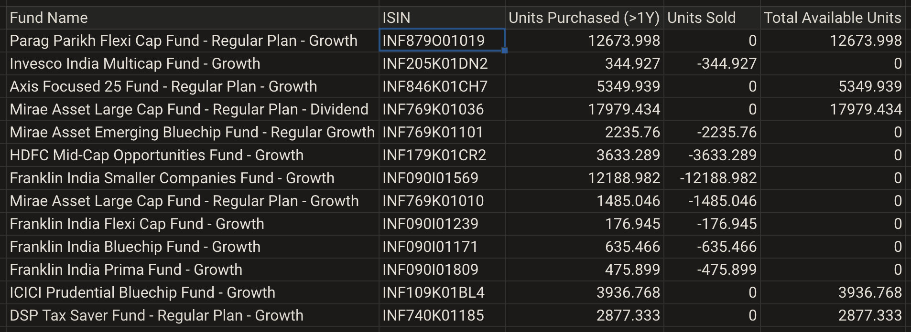
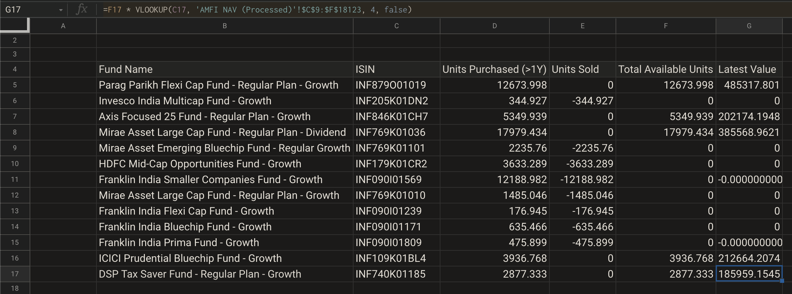
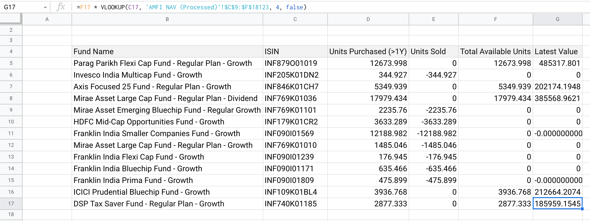

# Process for Estimating Tax

## Intro

In the previous chapter, we've seen how to compute total number of LTCG taxation eligible units, if equity transaction history has been provided.

Picking up from where we’d left off in in part 1, we can start with planning for potential tax computations

## Planning for Tax Computation <a id="Planning-for-tax-computation"></a>

At this point, we’ve computed units outside of STCG zone \(purchased more than a year ago, that’s still in investor’s portfolio, eligible for LTCG taxation if redeemed\). STCG stands for **S**hort **T**erm **C**apital **G**ain.

We need to compute these:

* tax liability, if investor were to sell all these units.
* total number of units present, where net tax liability is equal to or below 1L, if investors were to sell those

### How to compute Tax?

Tax is computed on _realized gain_, or booked profits. Realized gain, can be written as `SUM(selling price of units - purchase price of units)`.

Say, an investor purchased

* `U1` units, on date `t1`, at price `P1`.
* `U2` units, on date `t2`, at price `P2`.
* `U3` units, on date `t3`, at price `P3`.

Assume selling price \(NAV on day of selling\) is `P`.

This investor has `(U1 + U2 + U3)` available for selling. Realized gain is:

```text
[(U1 * (P - P1) + U2 * (P - P2) + U3 * (P - P3)]
```

Which can be written as:

```text
(U1 + U2 + U3) * P - (U1 * P1 + U2 * P2 + U3 * P3)
```

In previous section, we’ve computed effective value of `(U1 + U2 + U3)`, for any number of transactions.

We know `P1`, `P2`, `P3`; for all those transactions.

Only missing information is selling price, `P`.

What we need, is selling price as on today \(the given day when investor is attempting the sell transaction\).

In other words, we need a way to get access to latest NAV of these funds.

Because this NAV would change every day \(equity mutual funds update NAVs at the end of the day, every business day\); it’d be better to _programmatically_ access it, like we used `GOOGLEFINANCE()` for historic data.

`GOOGLEFINANCE()` can be one option here. But as we’ve learned in the previous section, it has issues \(remember seeing `#NA` all over the place?\)

Instead, we’d go to the source!

### Getting the latest NAV

Every AMC has a regulatory requirement to update their NAV daily with AMFI \(**A**ssociation of **M**utual **F**unds in **I**ndia\). And AMFI makes this data available for parsing, in a **CSV format**, on their website.

This is the link: [https://www.amfiindia.com/spages/NAVAll.txt](https://www.amfiindia.com/spages/NAVAll.txt)

Remember when you were thinking learning `SPLIT()` `TRANSPOSE()` would’ve been of no use? Well, as you’re about to see, not all CSV data come in text files.

Google Sheets has an `IMPORTDATA()` function, that’d do just fine. We provide it a URL for the AMFI NAV endpoint, and it’d fetch that latest raw NAV data.

Then we can _split_ that raw NAV feed into cells, as we see fit.

### Finding your fund

This AMFI URL has ~20k entries. To be able to find the funds as in the CSV transaction dump, our excel matchers would be fine.

But the problem is this: the name of fund can appear differently in that list, as opposed to how it appears in the CSV.

Finding fund by matching strings would lead to misses.

A better option would be to find fund the way it’s usually done - by a unique identifier.

This unique identifier is already present in the AMFI NAV feed URL: **`ISIN`**

ISIN \(**I**nternational **S**ecurities **I**dentification **N**umbers\) is unique across global securities market. Not only can there be no two funds with same ISIN in India; there can be no two securities with duplicate ISINs in regulated markets, across the world!

We have to find ISIN for each of the funds in CSV transaction, manually, and add a column in the second sheet, next to each fund, to add its ISIN.

List of ISIN is also present in AMFI NAV feed.

This is actually a straight-forward, one-time exercise. It should also make it clear to the reader why having too many funds to portfolio can be cumbersome.

## Execution <a id="Execution"></a>

#### Adding ISIN column <a id="Adding-ISIN-column"></a>

Let’s start by adding the ISIN column first

In the second sheet \(not the one named `data`\), add a column next to fund’s name. You can use _Insert Column_.

Insert ISINs as follows \(copy-paste from below\):

```text
ISIN
INF879O01019
INF205K01DN2
INF846K01CH7
INF769K01036
INF769K01101
INF179K01CR2
INF090I01569
INF769K01010
INF090I01239
INF090I01171
INF090I01809
INF109K01BL4
INF740K01185
```

Final results, should look like this

| Fund Name | ISIN |
| :--- | :--- |
| Parag Parikh Flexi Cap Fund - Regular Plan - Growth | INF879O01019 |
| Invesco India Multicap Fund - Growth | INF205K01DN2 |
| Axis Focused 25 Fund - Regular Plan - Growth | INF846K01CH7 |
| Mirae Asset Large Cap Fund - Regular Plan - Dividend | INF769K01036 |
| Mirae Asset Emerging Bluechip Fund - Regular Growth | INF769K01101 |
| HDFC Mid-Cap Opportunities Fund - Growth | INF179K01CR2 |
| Franklin India Smaller Companies Fund - Growth | INF090I01569 |
| Mirae Asset Large Cap Fund - Regular Plan - Growth | INF769K01010 |
| Franklin India Flexi Cap Fund - Growth | INF090I01239 |
| Franklin India Bluechip Fund - Growth | INF090I01171 |
| Franklin India Prima Fund - Growth | INF090I01809 |
| ICICI Prudential Bluechip Fund - Growth | INF109K01BL4 |
| DSP Tax Saver Fund - Regular Plan - Growth | INF740K01185 |




### Fetch and Process Latest NAV from AMFI

Follow these steps

* Create a new sheet, name it _AMFI NAV \(Raw\)_
* In a cell, enter the AMFI URL: `https://www.amfiindia.com/spages/NAVAll.txt`
* Invoke `IMPORTDATA()` function, and pass the cell ID of the URL above, as argument
* Given it few seconds, it’d fetch latest NAV from AMFI for all mutual funds. It should add some 18k+ rows.

  This data is in CSV format, separated by semicolon, per line.

* Create another new sheet, name it _AMFI NAV \(Processed\)_ 
* In this sheet, add somewhere this formula

  `=IF(ISBLANK(<cell ID>), , SPLIT(<cell ID>, ";")`, where `<cell ID>` points to a row of semicolon-separated data, in the sheet _AMFI NAV \(Raw\)_.  


  `ISBLANK(<cell ID>)` checks if the cell is empty. As you can see from the data, there can be plenty of empty cells. Invoking `SPLIT()` on these, would result in an error, it’d show up as a `#VALUE` error on spread sheet.  


  `IF(condition, arg1, arg2)` checks if `condition` is true for a cell \(in this case, if the cell is empty\). If so, the first argument `arg1` in inserted in the result cell \(not the cell on which condition is being evaluated\). Otherwise, `arg2` is inserted.

  `=IF(ISBLANK(<cell ID>), , SPLIT(<cell ID>, ";")` basically means _if `<cell Id>` is empty, don’t put anything, else split the content of the cell by semicolon, and put the results in cells._  

* Use autofill drag to fill out all 18k+ rows in new sheet. 

Technically, you won't need to fill out all 18k+ rows. As long as you fill out enough number of rows, such that all funds in that other sheet appear in those rows, it's good enough.

Refer to the following video\(s\) for reference





Your sheets would now have latest available NAV from all mutual funds, in a nice table format.

We've introduced a few new Google Sheets functions in this section:

* [IF\(\) documentation](https://support.google.com/docs/answer/3093364?hl=en) \| [archive.org link](https://web.archive.org/web/20210222224247/https://support.google.com/docs/answer/3093364?hl=en) \| [archive.is link](https://archive.is/9EbjD)
* [ISBLANK\(\) documentation](https://support.google.com/docs/answer/3093290?hl=en) \| [archive.org link](https://web.archive.org/web/20201127065209/https://support.google.com/docs/answer/3093290?hl=en) \| [archive.is link](https://archive.is/DKSP7)
* [IMPORTDATA\(\) documentation](https://support.google.com/docs/answer/3093335?hl=en) \| [archive.org link](https://web.archive.org/web/20210117194948/https://support.google.com/docs/answer/3093335?hl=en) \| [archive.is link](https://archive.is/9lsfh)

### Computation of Value as on Today

In this section, we’d compute net redemption value of units older than 1 year.

This is total available units older than one year \(already computed earlier\), multiplied by latest NAV.

We can look up latest NAV using `VLOOKUP` with ISIN as search query.

`VLOOKUP()` stands for _vertical lookup_ or row-wise lookup, across columns. It’s a way of _searching_ for matching data.

There’s also `HLOOKUP()` and `LOOKUP()`; but for our use case, `VLOOKUP()` would work fine for now.

[VLOOKUP\(\) documentation](https://support.google.com/docs/answer/3093318?hl=en) \| [archive.org link](https://web.archive.org/web/20210212012711/https://support.google.com/docs/answer/3093318?hl=en) \| [archive.is link](https://archive.is/MYAFD)

Follow these steps:

* Come back to the main sheet, which has information on available units and sold units.
* Add a column at the end, titled _Latest Value_
* Invoke `VLOOKUP()` for the top-most row as follows:

  ```text
  VLOOKUP(
    <cell ID that has ISIN for the fund>,
    <range of data from processed NAV sheet>,
    <column index, that has NAV for the fund>
    false
  )
  ```

  1st argument, `<cell ID that has ISIN for the fund>` is ISIN, but we’re doing it this way, to be able to drag and auto-fill.

  
  2nd argument, `<range of data from processed NAV sheet>` is a bit interesting.

  **`VLOOKUP()` does not work if the column we are searching for is not the first column of a range**. In our processed NAV sheet, the ISIN is the second column.  


  We have to pick a range, leaving out the first column.  


  This range is a combination of rows and cells. For instance, if your processed NAV sheet starts at `B3` with `Scheme Code` text in it; then, our range would be something like `C9:F18123` \(leaving out the last, date column\).  


  Since we’d be using drag & auto-fill, we can lock these cells: `$C$9:$F$18123`.  


  3rd argument, `<column index, that has NAV for the fund>`, is column index of the column for the result.We’re looking for NAV when ISIN matches, which is the 4th column in our range \(ISIN is the first column in this range\). Hence, we can put this value as 4.  


  Final argument, is `false`. It tells `VLOOKUP()` that the dataset in the range is **not sorted**. Our data set is not sorted on the basis of ISIN \(sorted alphabetically on AMC name, actually\), hence `false` is the right value to pass here.

Refer to this video to follow along steps:





Final outcome in the newly added column, should be similar to these screenshots:






Depending on when you're looking at these, the exact value might differ. Because it depends on latest NAV as on that date. This computation was done with NAV of 22nd March, 2021



We did not explicitly set out to do this, but it's trivial to take a CSV and compute latest portfolio valuation! You already have total number of units investor has in portfolio for each fund, and latest NAV for each fund.


### Adding up total cost of purchase

On the surface, this sounds easier than previous steps.

All one has to do, is go and _sum_ on units and NAV column, where date is much before the date 1 year ago.

In fact, investment amount is provided in the CSV transaction dump, so multiplication isn’t even needed \(invested amount = unit x NAV on that date\).

Except, it’s not that simple.

We have realized that even if units were acquired more than one year ago, doesn’t mean some of those weren’t sold in last 1 year, or before.

Remember that available units is **NOT** sum of all units purchased more than a year ago. We had to subtract the sold units \(sold at any point in time, not just more than a year ago\) to arrive at LTCG-eligible units.

In other words, we need to find unit purchase price for only these units. Not that of all units.

Another way to look at it: _keep adding purchase price, until total number of units added is same as LTCG-eligible units_.

#### **An Example**

An example to illustrate this idea:

Say, an investor is buying 10 units every month, from 2018 January, to 2020 December. That's a total 36 month period.

At the end of December 2020, $$24 \times 10 = 240$$ units purchased between January 2018 and December 2019, are eligible for LTCG.

Now assume that in 2020, at some point, this investor has also sold 54 units.

Then, at that point, they’ve $$240 - 54 = 186$$ units available for LTCG-eligible redemption.

What were the purchase price\(s\) for these 186 units?

More importantly, when were _these_ 186 units acquired?

We know that investor purchased 10 units every month, from Jan 2018 to Dec 2020. Investor has also sold 54 units some time in 2020.

Redemption works in a FIFO \(**F**irst **I**n **F**irst **O**ut\) manner in folio. Meaning, **earliest purchased units are to be redeemed first**.

We first need to account for 54 units that were sold. These units were acquired as follows -

| Month of Purchase | Number of units |
| :--- | :--- |
| January 2018 | 10 |
| February 2018 | 10 |
| March 2018 | 10 |
| April 2018 | 10 |
| May 2018 | 10 |
| June 2018 | 4 |

Once we’ve depleted the _earliest-purchased-earliest-sold_ scheme for already redeemed units, we can start to account for remaining 186 units.

These 186 LTCG-eligible units were acquired as follows:

| Month of Purchase | Number of units |
| :--- | :--- |
| June 2018 | 6 |
| July 2018 | 10 |
| August 2018 | 10 |
| September 2018 | 10 |
| October 2018 | 10 |
| November 2018 | 10 |
| December 2018 | 10 |
| January 2019 | 10 |
| February 2019 | 10 |
| March 2019 | 10 |
| April 2019 | 10 |
| May 2019 | 10 |
| June 2019 | 10 |
| July 2019 | 10 |
| August 2019 | 10 |
| September 2019 | 10 |
| October 2019 | 10 |
| November 2019 | 10 |
| December 2019 | 10 |
| **Total** | $$18 \times 10 + 6 = 186$$ |

When computing purchase price for these 186 units, we need to use purchase price from these months in the table; and not purchase price from January 2018.

In other words, **this is going to be the most complex part of the computation**.

To recap, we compute purchase cost / acquisition cost as follows:

* Account for existing sell transactions, depleting units, starting from initial purchase transaction; until total units add up to all units sold so far.
* Start adding up units from this date, till it adds up to total available LTCG-eligible units.

#### **A Special Case**

Luckily, we have a special scenario on our hands.

In our case, if you notice the units sold and LTCG-eligible units in the column, investor has either never sold any units from their current holdings in a specific fund; or they’ve completely sold off all their units in that specific fund.

Which means, for funds where there are LTCG eligible units; we **do NOT need to account for previous sell transactions**.

In other words, one can start adding up the purchase transaction costs from the very first purchase.

This won’t be the case for a typical CSV transaction dumps for most investors.

#### Grandfathering LTCG Computations <a id="Grandfathering-LTCG-Computations"></a>

We’ve so far carefully avoided discussing the _grandfathering_ clause in equity LTCG computation.

Union budget 2018, defined purchase price of equity, for LTCG computation as higher of price _as on_ 31st January 2018, or actual purchase price - if units were bought before this date.

To factor this in, we’d need information on NAV price as on 31st January, for each of the funds present in the CSV transaction dump, which has LTCG-eligible units.

The AMFI URL for latest NAV won’t do.

Instead, we can use this URL for fetching historic data: `http://portal.amfiindia.com/DownloadNAVHistoryReport_Po.aspx?mf=<AMC Code>&tp=1&frmdt=31-Jan-2018&todt=31-Jan-2018`

This URL returns data in CSV format as before. However, it’s specific to each AMC, identified by an AMC code.

An AMC code is a number, between 1 and 100. However, not all numbers between 1 and 100 correspond to a valid AMC code. You’d have to try out each number, and see which ones result in valid URLs that return data.

For example, Nippon AMC is identified by AMC code 21. This URL would return NAV history of all Nippon AMC funds, as on 31st January 2018: `http://portal.amfiindia.com/DownloadNAVHistoryReport_Po.aspx?mf=21&tp=1&frmdt=31-Jan-2018&todt=31-Jan-2018`

You can follow similar steps as earlier to incorporate data from this URL into your calculations.

### An Exercise for You

We won’t be covering the last bit of calculation here, as it’d be quite complex.

It’s left as an exercise to the reader; as it won’t be of much value to do these with Excel / Spreadsheet, for most investors.

To achieve such conditional summing-up, one would most likely need to use `QUERY()` function, writing something akin to SQL queries.

[QUERY\(\) documentation](https://support.google.com/docs/answer/3093343?hl=en) \| [archive.org link](https://web.archive.org/web/20201203052351/https://support.google.com/docs/answer/3093343?hl=en) \|  [archive.is link](https://archive.is/zPqVv)

It’d also be much harder to update or understand. for another person going through same excel sheet or spreadsheet; which would have such esoteric constructs.

At that point, using a for-loop equivalent in commonly used programming languages \(Python / Node / Java / Ruby / Go etc.\) would be much easier to reason about.

Another option would be to use [GApps Script](https://developers.google.com/apps-script) \([archive.org link](https://web.archive.org/web/20210318003145/https://developers.google.com/apps-script/) \| [archive.is link](https://archive.is/JXjX5)\), in Google Sheets; which is basically JavaScript to program your sheets. However, we won’t be covering that here.

## Wrapping Up

Phew! We covered a lot of ground in these three chapters.

We can only hope power of spreadsheets are becoming more and more apparent to you. Simultaneously, you've also started seeing the rough edges.

Excel / spreadsheets with complex formulas can be hard to maintain - it's tough to understand and update if needed.

We'd gradually address these in upcoming chapters and series.

