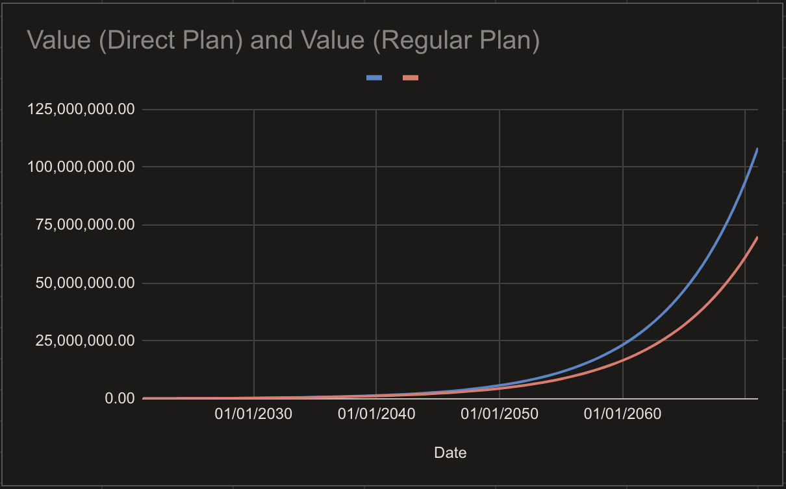
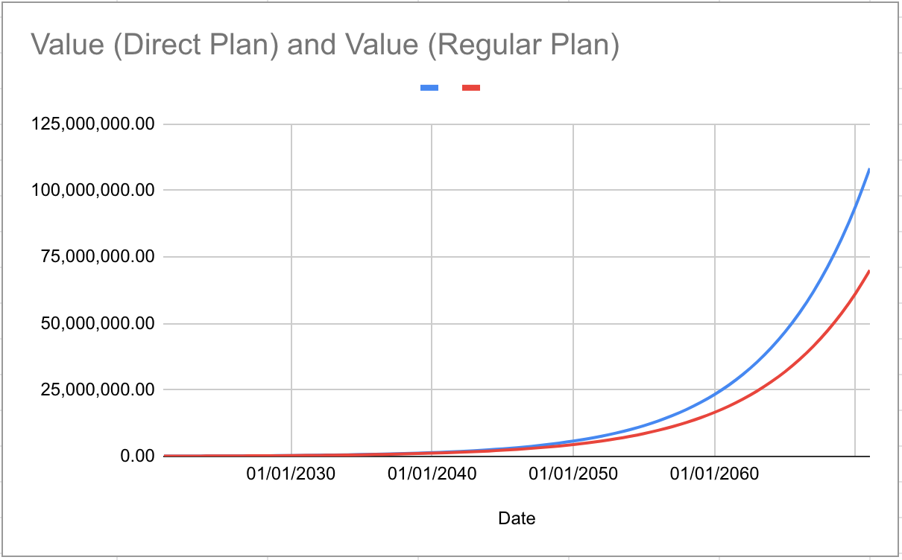
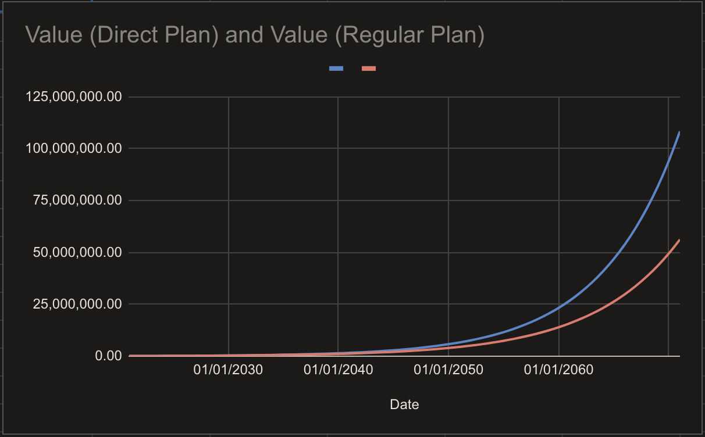

# Why should I invest in Direct Plans instead of Regular Plans?

A mutual fund is not free from costs. An asset management company \(AMC\) is a for-profit entity who aim to make some profit from their venture. They also have to pay their security analysts, operations teams, pay brokerage fees for market participation, and record keeping fees to registrars like CAMS and KFintech, formerly known as Karvy.

A regular plan of a mutual fund has one more additional expense — **distributor commission**.


There are various types of commissions. In this FAQ, we'll only focus on recurring trail commissions, and ignore upfront one-time commissions.


## Why is distribution commission bad for an investor?

There are many reasons why regular plans shouldn’t exist.

* **Erosion of Value**  

  Regular Plans add no value to the portfolio of an investor. All it does is eats away at your portfolio valuation and make the distributor richer.  

  This cost _scales_ with your portfolio valuation. The more your investments grow in value, the more money is taken out of your investment.  

  It’s a classic case of _tyranny of compounding costs_, words made famous by Jack Bogle.  

* **Distributors are Inherently Biased Against the Investor**  

  The distributor which subscribes an investor to a regular plan is inherently biased against an investor because the distributor would recommend funds which have high distributor commissions regardless of whether the fund is actually good for an investor or not.  

  To prove our point, here’s an example.  

  As of February 2021, Mirae Asset Tax Saver had a total expense ratio \(TER\) of $$1.83\%$$ for its regular plan and $$0.28\%$$ for its direct plan. That’s a difference of $$1.55\%$$ between the regular plan and the direct plan of the same fund. On the other hand, UTI Nifty Index had a total TER of $$0.14\%$$ for its regular plan and $$0.1\%$$ for its direct plan.  
  
  The assets under management \(AUM\) distribution of these two funds is interesting. Mirae Asset Tax Saver had AUM of $$₹6,332.2$$ crores out of which $$31\%$$ AUM is from the direct plan and the rest is from its regular plan. Meanwhile, UTI Nifty Index had a total AUM of $$₹3,353.11$$ crores but had $$77\%$$ of its AUM from its direct plan.  
  
  This stark difference in the source of AUM should be enough to highlight where the priorities of regular plan distributors lie.  
  
  We’ve got the data about AUM distribution from [this](https://www.miraeassetmf.co.in/docs/default-source/other-disclosure/average-asset-under-management-%28aaum%29-disclosure---february-2021.xlsb?sfvrsn=90523d20_2) link on [this](https://www.miraeassetmf.co.in/downloads/statutory-disclosure/other-disclosure) page. You’ll need to search for similar links on other AMC websites.  

* **It’s unfair**  

  You might’ve placed a purchase order five years ago in the regular plan of a fund, to purchase some units. This one transaction and subsequent payments, have been lining up pockets of the distributor, every day, for the last five years. And it would continue to do so as long as you have even a single unit in the regular plan of the fund.  

  Meanwhile, the distributor is not at all involved in the process of managing your portfolio — that’s being handled by the respective AMC.  

  This payment model of _perpetual payment in eternity_ is rarely ever seen in nature, outside of this one use-case. Imagine visiting a doctor who demands 1% of your income every month in perpetuity till you’re alive.  

* **It’s sneaky**

  
  For most mutual fund investors out there, the disadvantages of investing in regular plans are not well understood. Lack of financial knowledge, and fear of complexity have driven a generation of investors to blindly trust their distributors without looking too closely at account statements.  

  But this charge is so sneaky, there’s no column in most account statements sent by AMCs, that include an entry for the _amount that went to your distributor in the last 1M / 1Y / 5Y_. Fortunately, your NSDL / CDSL consolidated account statement \(CAS\) would include this information.  

  If distributors have faith in their financial advice and planning, they should have no shame in openly sharing with their clients, how much they’ve made blindsiding them. Or, the distributors should send an invoice to said clients. But they don’t, and to hide this daylight robbery, the payment is done by an AMC to the distributor directly, at periodic intervals.

## What difference does an extra 1% make?

Let’s try to understand, with real world scenarios, exactly how much one can stand to lose investing in regular plans. However, before we get there, let’s discuss what **direct plans** are.

The only difference between a direct plan and a regular plan of a mutual fund is that direct plans do not have distributor commissions. The word **direct** must be present in your NSDL / CDSL / AMC account statements if you’re investing in a direct plan of a mutual fund.

Although it may not be straightforward to calculate the difference in returns between a regular plan and a direct plan of a mutual fund from AMC account statements, we can calculate it by simulating the same transactions on the same date in the direct plan of a fund.

### Lumpsum Purchase in Axis Long Term Equity and Tata Large Cap

As of 9th April 2021, the 5 year return \(CAGR\) of **Axis Long Term Equity** Direct Growth Plan stands at $$17.70\%$$ and that of the regular plan is $$16.55\%$$. Let’s assume an initial investment of $$₹1$$ lakh on 9th April 2016.

| Fund Type | 5Y CAGR | Final Value |
| :---: | :---: | :--- |
| Direct Growth | $$17.70\%$$ | $$₹ 1,00,000\times(1+0.1770)^5= ₹ 2,25,882.36$$ |
| Regular Growth | $$16.55\%$$ | $$₹ 1,00,000\times(1+0.1655)^5= ₹2,15,060.86$$ |
|  | **Commission Outflow** | $$₹ 10,821.5$$ |

The distributor of this plan has made approximately $$10.8\%$$ of the original investment as commission in the last 5 years. And 5 years is a small time period in equity markets. Of course, this commission will only increase with time. However, this cost could’ve been easily avoided, just by investing in the direct plan of the same fund, 5 years ago.

One might say that the commission looks high only because the returns are high enough to more than double the original investment. After all, $$16\%−17\%$$ annualized returns over 5 year periods aren’t common.

Keeping this in mind, let’s take a different fund with a lower 5Y CAGR, where we do the same comparison, and see if losses to commission really goes down with the returns. As of 9th April 2021, the 5 year return \(CAGR\) of **Tata Large Cap** Direct Growth Plan stands at $$13.82\%$$ and that of the regular plan is $$12.40\%$$.

| Fund Type | 5Y CAGR | Final Value |
| :--- | :--- | :--- |
| Direct Growth | $$13.82\%$$ | $$₹ 1,00,000 \times (1 + 0.1382)^5 = ₹ 1,91,026.19$$ |
| Regular Growth | $$12.40\%$$ | $$₹ 1,00,000 \times (1 + 0.1240)^5 = ₹ 1,79,403.77$$ |
|  | **Commission Outflow** | $$₹ 11,622.42$$ |

Although the returns and nominal profit of the investor have been reduced by a lot, the distributor commission has increased! In this case, it’s approximately $$11.6\%$$ of original investment, eroded over 5 years. Your distributor would make bank, whether your returns are higher or lower. They’d make even more, if your portfolio does well.

Next time, when a distributor tells you to keep your SIPs going, you have to wonder whether it’s because they don’t want to see their income disrupted, which is tied to total portfolio value.

### Total Expense Ratio from an AMC’s Perspective

Let’s consider Kotak Standard Flexi Cap, one of the largest \(in terms of AUM\) equity mutual fund in India with an average AUM of $$₹35,114.71$$ crore at the end of March 2021. Its direct plan had a TER of $$0.61\%$$ and the regular plan had a TER of $$1.62\%$$. From the average AUM disclosure provided by Kotak AMC for the month of March 2021, we know that Kotak Standard Flexi Cap had $$₹25,899.10$$ crores from its regular plan and $$₹9,215.61$$crores from its direct plan.

We can use this data to get some insights about the expenses generated by this fund.

| **Fund Type** | **AAUM** | **Expenses Deducted** |
| :--- | :--- | :--- |
| Direct Plan | $$₹9,215.61$$ | $$₹35,114.71\times0.61\%=₹214.19$$ crores |
| Regular Plan | $$₹25,899.10$$ | $$₹25,899.10\times(1.62\%-0.61\%)=₹261.58$$ crores |
|  | $$₹35,114.71$$ crores | **Total Expenses:** $$₹475.77$$ crores |

Kotak AMC gets to keep $$₹35,114.71\times0.61\%=₹214.19$$ crores from both the regular and direct plan. Since distributors get $$1.62\%−0.61\%=1.01\%$$ on the regular plan, their commission comes out to be $$₹25,899.10\times1.01\%=₹261.58$$ crores.

In a mutual fund with over $$₹35,114$$ crores in AUM, $$73\%$$ of its AUM comes from regular plans and mutual fund distributors end up taking away $$22\%$$ more expense income than the AMC of the fund itself even though the fund manager does the job of managing the mutual fund portfolio while your distributor does nothing except earn commissions and help the AMC inflate its AUM.


We’ve got the data about AUM distribution from [this](https://assetmanagement.kotak.com/documents/19/555dfead-2a88-4e98-8d1b-853678294e51) link on [this](https://assetmanagement.kotak.com/aaum) page.



In mutual funds, TER is an yearly average expense deduction. It’s deducted everyday before publishing the new NAV of the fund. All returns reported on mutual funds, are after costs have been deducted. There’s no need to subtract TER from final returns or NAV, as it’s been already factored in.


### SIP for 8+ Years

As on 9th April 2021, the direct plan of mutual funds have had more than 8 years of history since they were started back in January 2013.  
  
We’ll simulate a SIP of $$₹10,000$$ per month, in the direct and regular plan of some funds, starting from 2nd January 2013.  
  
We are considering some large-cap funds that have mostly stayed true to their large-cap stock selection mandate, i.e., mostly having bluechip stocks in portfolio of the fund. Mirae Asset Large Cap fund has been excluded, as it was operated as a multi-cap fund throughout most of this time period \(2013-2018\) that’s being considered.

#### UTI Nifty Index

| Fund Type | Invested Amount  | Current Value  | Total Gain | Return \(p.a.\) |
| :--- | :--- | :--- | :--- | :--- |
| Direct Plan | $$₹10,00,000$$ | $$₹17,71,612$$ | $$₹7,71,612$$ | $$13.5\%$$ |
| Regular Plan | $$₹10,00,000$$ | $$₹17,64,606$$ | $$₹7,64,606$$ | $$13.4\%$$ |

#### HDFC Top 100

| Fund Type | Invested Amount  | Current Value  | Total Gain | Return \(p.a.\) |
| :--- | :--- | :--- | :--- | :--- |
| Direct Plan | $$₹10,00,000$$ | $$₹16,94,408$$ | $$₹6,94,408$$ | $$12.5\%$$ |
| Regular Plan | $$₹10,00,000$$ | $$₹16,42,630$$ | $$₹6,42,630$$ | $$11.8\%$$  |

#### Franklin Bluechip

| Fund Type | Invested Amount  | Current Value  | Total Gain | Return \(p.a.\) |
| :--- | :--- | :--- | :--- | :--- |
| Direct Plan | $$₹10,00,000$$ | $$₹17,33,671$$ | $$₹7,33,671$$ | $$13.0\%$$ |
| Regular Plan | $$₹10,00,000$$ | $$₹16,68,038$$ | $$₹6,68,038$$ | $$12.1\%$$ |

#### ABSL Frontline Equity

| Fund Type | Invested Amount  | Current Value  | Total Gain | Return \(p.a.\) |
| :--- | :--- | :--- | :--- | :--- |
| Direct Plan | $$₹10,00,000$$ | $$₹17,86,176$$ | $$₹7,86,176$$ | $$13.7\%$$ |
| Regular Plan | $$₹10,00,000$$ | $$₹17,14,436$$ | $$₹7,14,436$$ | $$12.8\%$$ |

#### SBI Bluechip

| Fund Type | Invested Amount  | Current Value  | Total Gain | Return \(p.a.\) |
| :--- | :--- | :--- | :--- | :--- |
| Direct Plan | $$₹10,00,000$$ | $$₹19,05,761$$ | $$₹9,05,761$$ | $$15.2\%$$ |
| Regular Plan | $$₹10,00,000$$ | $$₹18,23,117$$ | $$₹8,23,117$$ | $$14.2\%$$ |

#### DSP Top 100

| Fund Type | Invested Amount  | Current Value  | Total Gain | Return \(p.a.\) |
| :--- | :--- | :--- | :--- | :--- |
| Direct Plan | $$₹10,00,000$$ | $$₹16,40,187$$ | $$₹6,40,187$$ | $$11.7\%$$ |
| Regular Plan | $$₹10,00,000$$ | $$₹15,87,479$$ | $$₹5,87,479$$ | $$11.0\%$$ |

#### ICICI Prudential Bluechip

| Fund Type | Invested Amount  | Current Value  | Total Gain | Return \(p.a.\) |
| :--- | :--- | :--- | :--- | :--- |
| Direct Plan | $$₹10,00,000$$ | $$₹18,34,300$$ | $$₹8,34,300$$ | $$14.3\%$$ |
| Regular Plan | $$₹10,00,000$$ | $$₹17,63,591$$ | $$₹7,63,591$$ | $$13.4\%$$ |

#### Nippon Large Cap

| Fund Type | Invested Amount  | Current Value  | Total Gain | Return \(p.a.\) |
| :--- | :--- | :--- | :--- | :--- |
| Direct Plan | $$₹10,00,000$$ | $$₹17,83,845$$ | $$₹7,83,845$$ | $$13.7\%$$ |
| Regular Plan | $$₹10,00,000$$ | $$₹17,05,182$$ | $$₹7,05,182$$ | $$12.6\%$$ |


We have generated this data using the ‘My Investment’ tool from [Value Research](https://www.valueresearchonline.com/).


As we can see, in the large cap space, equity mutual funds have mostly performed in-line with the index funds over the last 8 years. Most of them have underperfomed, but some of them have outperformed.

Let’s look at the data presented above from a different perspective. We’ll focus on distributor commissions and their impact on our portfolio.

| **Fund Name** | **TER \(Regular\)** | **TER \(Direct\)** | $$\Delta$$ **TER**  | **Commission Losses** | **Commission \(% of total investment\)** |
| :--- | :---: | :---: | :---: | ---: | :--- |
| UTI Nifty Index | $$0.14\%$$ | $$0.10\%$$ | $$0.04\%$$ | $$₹7,006$$ | $$0.07\%$$ |
| HDFC Top 100 | $$1.85\%$$ | $$1.23\%$$ | $$0.62\%$$ | $$₹51,778$$ | $$5.17\%$$ |
| Franklin Bluechip | $$1.91\%$$ | $$1.18\%$$ | $$0.73\%$$ | $$₹65,633$$ | $$6.56\%$$ |
| ABSL Frontline | $$1.70\%$$ | $$1.08\%$$ | $$0.62\%$$ | $$₹71,740$$ | $$7.17\%$$ |
| SBI Bluechip | $$1.75\%$$ | $$1.00\%$$ | $$0.75\%$$ | $$₹82,644$$ | $$8.26\%$$ |
| DSP Top 100 | $$2.09\%$$ | $$1.32\%$$ |  $$0.77\%$$ | $$₹52.708$$ | $$5.27\%$$ |
| ICICI Pru Bluechip | $$1.72\%$$ | $$1.21\%$$ | $$0.51\%$$ | $$₹70,709$$ | $$7.07\%$$ |
| Nippon Large Cap | $$1.88\%$$ | $$1.18\%$$ | $$0.70\%$$ | $$₹78,663$$ | $$7.86\%$$ |


In the above tables, we’re using the TER data available as on 9th April 2021. TER changes from time to time, and the latest TER differences won’t reveal historical performance.


Besides SBI Bluechip’s regular plan, no large-cap fund from our list has managed to generate higher corpus in its regular plan than UTI Nifty Index fund direct growth plan has done over the last 8+ years for a simple $$₹10k$$ / month SIP.

As you can imagine, no popular distributor was publicly recommending UTI Nifty Index fund’s direct plan, back in 2013-14. This isn’t surprising considering the fact that for a regular plan distributor, recommending UTI Nifty Index fund’s regular plan would’ve been the least profitable.

## How Bad Will It Be in the Long Run?

Unfortunately, investing in the regular plan of a mutual fund is only the beginning. As more and more time passes by, staying invested in the regular plan of a fund will erode your portfolio further.

As Jack Bogle said:

> The miracle of compounding returns has been overwhelmed by the tyranny of compounding costs.

The recurring cost model of regular plans can unleash this mythical tyranny right on your portfolio, without you even realizing it.

We saw earlier that the difference in TER difference between the direct and regular plan of a mutual fund, or $$\Delta TER$$, can be thought of as an indicator of regular plan’s distribution costs.

Let’s assume that investing a lumpsum amount of $$₹1,00,000$$ in an asset generates a CAGR of $$15\%$$. This asset also has a regular plan variant which generates a CAGR of $$14\%$$. At $$1\%$$ lower CAGR, this is how the valuation would change over time.

If the difference in CAGR is assumed to be $$1.5\%$$, this is how the corpus changes.

Eventually, an investor could end up losing $$30\%-40\%$$ of their portfolio to distributor commissions over a long period of time.

## Falsehoods and Myths about Regular Plans

As you’d imagine, regular plans are a juicy proposition for every participant involved, except for the investor whose capital is being eroded.

An investor might come across some of the following arguments in favor of regular plans. We’ll go ahead and debunk them.

### But why would AMCs purposefully lower their returns in regular plans? It doesn’t make sense.

AMCs don’t have a reason to compete on performance, when they can just offer more commissions on their funds. The distributors would then sing praises of such funds over other available options.

AMCs like Mirae Asset, have been artificially reducing the TER of the direct plan of their funds well below that of their competitor fund houses, creating large TER differences between their funds’ direct plan TER and regular plan TER.

This incentivizes distributors to recommend Mirae Asset equity funds over other funds and lures in direct plan investors with unusually low expense ratios. Of course, the unusually low TER of direct plans can simply be increased later once Mirae Asset’s AUM targets are achieved. It’s unfortunate that there are no regulations on frequent TER changes made by AMCs.

As on 9th April 2021, this is how the TERs look like for flagship funds from Mirae Asset AMC:

| Fund Name | TER \(Regular\) | TER \(Direct\) | $$\Delta$$ TER |
| :--- | :--- | :--- | :--- |
| Mirae Asset Emerging Bluechip | $$1.81\%$$ | $$0.70\%$$ | $$1.11\%$$ |
| Mirae Asset Large Cap | $$1.64\%$$ | $$0.54\%$$ | $$1.10\%$$ |
| Mirae Asset Tax Saver | $$2.00\%$$ | $$0.29\%$$ | $$1.71\%$$ |
| Mirae Asset Healthcare | $$2.16\%$$ | $$0.59\%$$ | $$1.57\%$$ |
| Mirae Asset Focused Equity | $$1.94\%$$ | $$0.32\%$$ | $$1.62\%$$ |
| Mirae Asset Hybrid Equity | $$1.88\%$$ | $$0.39\%$$ | $$1.49\%$$ |

Of course, Mirae Asset isn’t the only AMC which is doing this. You might come across unsustainably low TERs in direct plans of other AMCs, with reasonably high TER in the regular plan of the same fund.

From our previous calculations, it should be clear that $$1.5\%-1.8\%$$ additional expenses would erode the corpus of an investor significantly in the long run.

### But why would my distributor recommend such funds? He’s our family friend / relative and has our best interests at heart.

If that person really did have your best interests at heart, he wouldn’t recommend funds with a high $$\Delta TER$$. If he’s doing that, he has his own interests on greater priority than yours. This wouldn’t be a problem in some other case but here, it’s about **your** money, not his.

Regular Plan distributors don’t have to recommend good funds, because if it doesn’t perform well, they could just tell you that the markets were bad this year, keep your SIPs going, and buy at lower prices. Your uninterrupted inflows in regular plans makes the regular plan distributor richer.

To understand how deep this nexus is, take a look at AMFI disclosure reports on commission to distributors, from past years:

[Link to commission disclosure](https://www.amfiindia.com/commission-disclosure)

Let’s start with the latest report, from 2019-20. It’s a PDF that lists the names of distributors and the gross amount paid in multiples of $$₹1,00,000$$.

As expected, big banks like HDFC, ICICI, Kotak, and SBI are easily making hundreds of crores, just from rent-seeking and not adding any meaningful value to the portfolio of investors. However, relatively small distributors have been doing great as well. Based on that list, it’s not unusual to make over $$₹1$$ crore \(a pretty large milestone in annual income for most Indians\) by selling regular plans of mutual funds.

### But the NAV of Regular Plans are lower than Direct Plans. Shouldn't I buy low and sell high?

The NAV of regular plans is lower because it includes distributor commission and it'll always be lower than the NAV of its direct plan counterpart. In this case, your purchase price doesn't matter. What matters, is the rate of growth _after_ you purchase.

Let's consider the NAV of Axis Long Term Equity as on 12th April 2021. It was $$₹59.71$$ for the regular plan and for $$₹65.22$$ the direct plan. If we invest $$₹10,000$$ in the regular plan, we'll get $$167.47$$ units in the regular plan, and $$153.32$$ units in the direct plan. Let's assume that we get $$10\%$$ CAGR after 5 years in the regular plan and $$11\%$$ CAGR in the direct plan. The final portfolio value of the regular plan would be $$₹10,000\times(1+0.1)^5=₹16,105.1$$ and that of the direct plan would be $$₹10,000\times(1+0.11)^5=₹16,850.58$$.

As we just saw, the NAV purchase price and the number of units that you get are irrelevant and do not affect the final portfolio value. The CAGR, however, does, and it should be evident that the CAGR of a direct plan will always be higher than its regular plan counterpart.

### But it’s just a difference of 1%. It won’t have much impact.

As we’ve already shown above, a $$\Delta TER$$ of $$1\%$$ can erode more than $$30\%$$ of your portfolio value over the long term. Even $$10\%$$, let alone $$30\%$$, is a significant loss to your portfolio. Are you okay with losing $$₹10$$ lakh from your corpus of $$₹1$$ crore and end up having $$₹90$$ lakhs? How about losing $$₹30$$ lakhs?

### I know regular plans are bad but if I switch, I'd have to pay taxes. I don't want to pay taxes unnecessarily.

Taxes are on realized gains. Commission is on entire corpus.

Just like the largest ant is no match for the smallest elephant, your taxes might be low enough, if any, compared to your potential commission losses over next few years. Even if it’s not, tax is a one-time headache. Commissions are forever, till the date you’ve zero units to your name in that regular plan of a fund.

You could also switch out partially, and not all at once. That’d save you some taxes by spreading your redemptions over more than one financial year.

In a scenario like this, it’s best to compute the potential values for tax liabilities, project losses in commissions, and make a choice on a case-by-case basis.

### If not for my distributor, I wouldn't have started investing in mutual funds. I'm grateful to him. I can't just switch to direct plans now.

It's your decision to make but we'd advise you to think rationally about this, and keep your emotions aside when making decisions about your money.  
  
Your distributor may have introduced you to mutual funds but if he signed you up on regular plans, he probably didn't sign you up because he was thinking of your welfare first.

At this point, you have the power to make decisions about your own money and switch to direct plans to save expense costs. You don't even have to find different funds.  
  
If you're not comfortable choosing funds, you can start investing in the direct plans of the same funds offered by your distributor. Even in that case, you'd save on a lot of expenses.

Would you rather be grateful to your distributor for the rest of your investing journey and lose up to $$30\%-40\%$$ of your corpus in the long term, or switch to direct plans and not lose that money?

### But my distributor also gives advice. I don’t know anything about mutual funds. Investing in direct plans is only for advanced investors.

As we saw in the previous section, in the last 8 years, regular plans of large cap funds haven’t been able to achieve for the average SIP investor, what the direct plan of a low-cost Nifty index fund has generated.  
  
Clearly, the so-called financial advice from regular plan distributors hasn’t been good enough to even make-up for the cost.

Investing in direct plans is a risk-free way of improving returns. A good advisor would recommend direct plans to their clients.  
  
Also, when you invest in a mutual fund, the fund manager manages your portfolio. They are responsible for managing the investments in the you’ve invested in and adapt it according to market conditions. Your distributor has no role to play there.

SEBI has already issued notices saying that mutual fund distributors cannot be advisors. A person can either sell or advise but not do both.

[Individual mutual fund distributor can’t be an investment advisor: SEBI](https://economictimes.indiatimes.com/mf/analysis/individual-mutual-fund-distributor-cant-be-an-investment-advisor-sebi/articleshow/74184549.cms) \| [archive.is link](https://archive.is/mP0WT)

Unlike a few years ago, we have many platforms today that offer investment in direct plans to every investor in the country. It has become much easier to invest in direct plans and manage your portfolio these days. One doesn’t need to visit an office, or use clunky AMC websites with bugs and errors.

If you’re wondering which website / app you should use to invest in direct plans, check out the following article.



If you’re wondering which mutual fund should you invest in, check out the following article.



We’d like to mention that choosing a “good” or a “best” fund isn’t important or required. Pick a decent actively managed fund and stick with it unless something fundamental changes about the fund. Or, if you’re still confused, pick an index fund and call it a day. The choice of the fund isn’t as important as sticking to that fund and investing in it in the face of market turbulence.

## Wrapping Up 

The real takeaway here is that recurring costs can affect your investment corpus in a really bad way over the long term. As an investor, avoiding regular plans is important. But in the same spirit, we should also avoid other recurring costs as well, which add up over the years, such as \(but not limited to\):

* brokerage commission, in percentage terms \(and not fixed\), for equity delivery
* rebalancing costs
* frequent selling leading to capital gains taxes
* high asset management fees of exotic products

Unlike regular plans, some of the above aren’t always avoidable. But do keep the adverse effects of costs from repeatedly doing these in mind, when engaging in, say, rebalancing.

Quantum AMC started offering direct plans of their flagship funds, Quantum Liquid and Quantum Long Term Equity, back in 2006. They were the first AMC to do so in India. They chose to not tie up with distributors, but rather offer a direct purchase option to the investors via offline mode \(CAMS or KFinTech offices\) and on their own website.

Since January 2013, SEBI regulations have forced all AMCs to launch direct plans for each and every mutual fund that they had and would come up with in the future.

However, despite the ease of access, most retail and HNI \(High Net-worth Individual\) investors still invest in regular plans. This is evident by the fact that most of the mutual fund industry AUM is still in regular plans, and not direct plans. [According to this news article from The Hindu](https://www.thehindu.com/business/Industry/direct-plan-vs-regular-plan-know-which-one-is-better/article32121374.ece) \([archive.org link](https://web.archive.org/web/20210208172051/https://www.thehindu.com/business/Industry/direct-plan-vs-regular-plan-know-which-one-is-better/article32121374.ece) \| [archive.is link](https://archive.is/c2oxb)\), only $$19\%$$ of the industry AUM is in direct plans, while rest of it are in regular plans.

PayTM Money maintains [this page](https://www.paytmmoney.com/mutual-funds/direct-vs-regular-plans) listing difference in TER between direct plan and regular plan of mutual funds.

If you haven’t done it yet, take a look at your NSDL / CDSL CAS, and see if the word “**direct**” appears in the name of the funds that you’re invested in. If not, you’re most likely invested in the regular plan variant instead. Ideally, all your funds should be in direct plan mode, and no fund should be in regular plan mode. You might be losing money to a rent-seekers without receiving anything of value in return. If that’s the case, start the process of switching to direct plan today.

