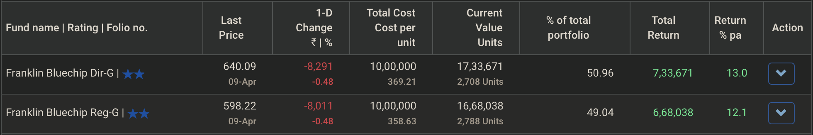
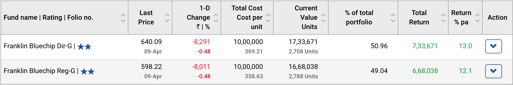
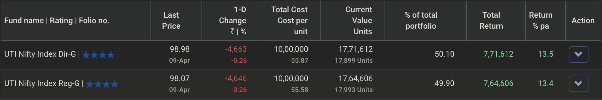
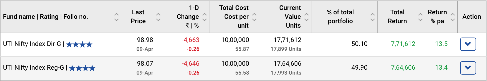
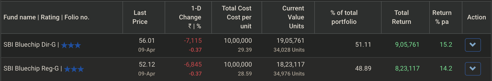
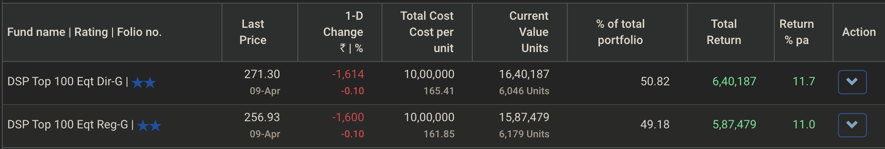
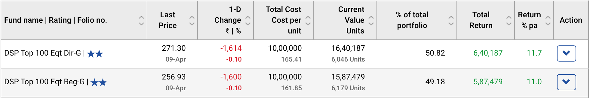
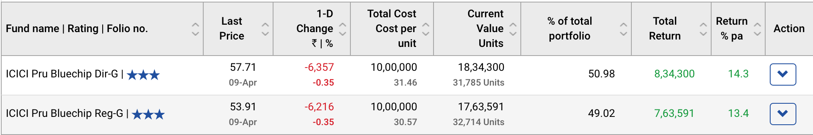

# Why should I invest in Direct plans over Regular plans?

## What is a Regular plan?

A mutual fund is not free from costs of running and managing the fund.   
  
Here are a few of the costs, because the fund house:

* is a for-profit entity.   They’d have to make some revenue from this venture. 
* has to pay its security analysts and operations teams’ salaries and other employee benefits; in addition to bear operational expenses \(maintaining an office, for example\). 
* would’ve to pay brokerage and other fees in the markets, to manage the underlying portfolio of the fund and transact. 
* has to pay record keeping fees to the registrars, to maintain detail records of transactions; and bear various compliance costs

A mutual fund has various other expenses, only a handful of these have been noted above.

**Regular plans** are an offering of a fund by AMC \(**A**sset **M**anagement **C**ompany\), where in addition to these expenses of running a fund, an additional expense is added: **distributor commission**.

This is an incentive to the distributors, who get their clients to sign up for these funds.

In summary, a regular plan of a mutual fund deducts a portion of your investments in that fund, to pay the distributor who sold you the fund.


There are various types of commissions. In this FAQ, we'd only focus on recurring trail commissions, and ignore upfront one-time commissions.


## Why is this bad for investors? 

There are umpteen reasons why regular plans should not even exist:

* **Erosion of value**  

  It adds no value to end customer - the investor in the fund. Rather, it eats away at their portfolio valuation.  

  It’s a cost that _scales_ with your portfolio valuation. The more your investments grow in value, more and more money is taken out of that investments.  

  Classic case of tyranny of compounding, working against you.  

* **It biases the advice from distributor who’s sold you the fund**  

  Given distributor commission is mostly to entice the distributors to sell the product, a specific fund from a fund house.  

  Naturally, most distributor would want to sell you a fund, that pays them well first.  

  The asset selection is then less about aligning with your financial goal, and more about which fund benefits your distributor more.  

* **It’s unfair**  

  You might've placed a purchase order five years ago in regular plan of a fund, to purchase some units. This one transaction and subsequent payment, has been lining up pockets of the distributor, every day, for last five years.  

  And it’d continue to do so as long as you have even a single unit in the regular plan of the fund.  

  Meanwhile, the distributor is not at all involved in the process of managing your portfolio - that’s being handled by fund management team.  

  This payment model of _perpetual payment in eternity_ is rarely ever seen in nature, outside of this one use-case. Imagine visiting a doctor, who demands 0.01% of your income every month in perpetuity, till you’re alive.  

* **It’s sneaky**  

  For most mutual fund investors out there, this reality is not well understood. Lack of financial knowledge, and fear of complexity; have driven a generation of investors to blindly trust their distributors without looking too closely at account statements.  

  But this charge is so sneaky, there’s no column in most account statements sent by AMCs, that include an entry for _amount that went to your distributor in the last 1M / 1Y / 5Y_ \(notable exception being CDSL & NSDL CAS, which include some information on this\).  
  
  If distributors have faith in their financial advice & planning, they should have no shame in openly sharing with their clients, how much they’ve made from selling funds to them. Or the distributors should send an invoice to said clients.  
  
  But they don’t, and therefore to hide this daylight robbery, the payment is done by an AMC to the distributor directly, at periodic intervals.

## How bad is it? 

Let’s try to understand, with real world scenarios, exactly how much one can stand to lose investing in regular plans.

Before we get there, we need to discuss **direct plans**.

### What is a direct plan?

A direct plan of a mutual fund is one, where this distributor commission is not present, all other aspects \(portfolio, fund manager, mandate, risk profile etc.\) being exactly the same.

In your account statement, direct plan of a mutual fund, must be listed with the word **direct** in its name.

We’d mentioned earlier that it’s not easy to derive from a single account statement, as there would be no specific column for how much commission would have been deducted.

However, we can derive it from computing final portfolio value of an investment in direct plan; then comparing with same investments in regular plan of same fund, with same transactions and same dates.

### Lumpsum Purchase in Axis LTE

At the time of writing this, as on 9th April 2021, the 5Y return \(CAGR\) of Axis Long Term Equity **Direct** Growth plan, stands at $$17.70\%$$ p.a.

If someone had invested $$₹100,000$$ \(1L INR\) 5 years ago, on 9th April, 2016; in this fund, it’d have become $$100,000\times(1+17.70/100)^5=225,882.36$$INR.

On same date, if the purchase transaction was done in Axis Long Term Equity **Regular** Growth, the _regular_ counterpart of this fund, which has a 5Y CAGR of $$16.55\%$$ p.a.; final valuation as on 9th April 2021, would have been $$100,000\times(1+16.55/100)^5=215,060.86$$ INR.

| Fund Type | 5Y CAGR | Final Value \(INR\) |
| :---: | :---: | :--- |
| Direct Growth | $$17.70\%$$ p.a. | $$100,000\times(1+0.1770)^5=225,882.36$$ |
| Regular Growth | $$16.55\%$$p.a. | $$100,000\times(1+0.1655)^5=215,060.86$$ |
|  | **Commission Outflow** | $$10,821.5$$ |

The distributor of this plan, has made **~10.8% of original investment as commission in the last 5 years**. And 5 years is a small time period in equity markets.

This deduction was not linear, it went up with time. but this cost could’ve easily been avoided, just by investing in direct plan of the same fund, 5 years ago.

One might say, _but the commission looks high only because the returns are high enough to more than double the original investment_.

After all, $$16\% - 17\%$$ annualized returns over ~5+ year periods are really rare.

So, let’s take a different fund, where we do the same comparison, which has lower 5Y CAGR, and see if losses to commission really goes down with the returns.

### Lumpsum Purchase in Tata Large Cap

Following table is similar, but instead of Axis Long Term Equity, we use **Tata Large Cap** fund’s direct and regular plans.

| Fund Type | 5Y CAGR | Final Value \(INR\) |
| :--- | :--- | :--- |
| Direct Growth | $$13.82\%$$ p.a. | $$100,000 \times (1 + 0.1382)^5 = 191,026.19$$ |
| Regular Growth | $$12.40\%$$ p.a. | $$100,000 \times (1 + 0.1240)^5 = 179,403.77$$ |
|  | **Commission Outflow** | $$11,622.42$$ |

Returns and nominal profit of the investor has been reduced by a lot. However, the distributor commission has **only increased**!

Now it’s **~11.6% of original investment**, eroded over 5 years.

Your distributor would make bank, whether your returns are lower or higher. They’d make even more, if your portfolio does well.

Next time, a distributor tells you to _keep your SIPs going_, you have to wonder if it’s because they don’t want to see their income disrupted, which is tied to total portfolio value.

### TER

A discussion on costs of mutual funds cannot be done without delving into what TER \(**T**otal **E**xpense **R**atio\) is.  
  
Expense ratio of a fund denotes _the percentage of total assets, a fund house deducts every year, for expenses_.

Case in point, as on 31st March 2021, Kotak Standard Flexi Cap fund has average total asset size \(AAUM, or **A**verage **A**sset **U**nder **M**anagement\) is $$₹35,114.71$$ Crore. Its direct plan has an expense ratio of $$0.61\%$$. Meaning, in a year, the AMC would deduct about $$35,114.71 \times 0.61\% = 214.20$$Cr. in Indian currency for its operations.  
  
AMC would take care of all costs of running the fund, generating revenue, pay registrars, brokerage fees etc. out of that $$214.20$$ Cr.  
  
Similarly, Kotak AMC has been running other funds too, from which it's been collecting expenses, commensurate with those funds' expense ratios.   
  
Where it gets interesting, is that regular plan of the fund has a different, higher expense ratio. In this case, it's $$1.62\%$$.  
  
Out of that AUM of $$₹35,114.71$$ Cr., note that $$9215.61$$Cr. is in Direct plan mode \(investors have not purchased via middlemen distributors who take commission on these\). While rest of it, about $$25,899.10$$Cr., is in regular mode, invested through associated and non-associated distributors.  
  
Then on that regular plan AUM of $$25,899.10$$ Cr., the higher expense ratio would apply. As a result, NAV  \(**N**et **A**sset **V**alue, or per unit price\) of regular plan would be lower, than NAV of direct plan of same fund.

Total expense deduction in a year can be thought of as akin to:

$$35,114.71 \times 0.61\% + 25,899.10 \times (1.62\% - 1.01\%) = 214.20 + 261.58$$Cr.

Out of this, $$214.20$$Cr. stays with AMC, which AMC can spend on other items as outlined above. While the $$261.58$$Cr. gets distributed among distributors, proportionate to portfolio size of each client.


In mutual fund, TER is yearly average expense deduction. Expenses are deducted everyday, before publishing new NAV of the fund. All returns reported on mutual funds, are after costs have been deducted.


The difference in TER, or $$\Delta$$TER, between regular plan and direct plan, is the trail commission that goes to distributors, who have enrolled clients in regular plans.

In this case, $$\Delta$$TER $$= 1.62\% - 0.61\% = 1.01\%$$. This means every year, if rates remain the same, $$1.01\%$$of asset valuation in regular plans, are sent to distributors as commissions from this fund.

### SIP for 8+ Years

Direct plans of all funds have been around, since January 2013. At the time of writing this, these funds have had more than 8 years of history.  
  
We simulate SIP of ₹10,000 \(10k INR\) per month, in direct plan and regular plan of same fund, from 2nd January 2013 onward, in some popular mutual funds.


We are considering some large-cap funds, that have mostly stayed true to their large-cap stock selection mandate, i.e., mostly having bluechip stocks in portfolio of the fund.  
  
Mirae Asset Large Cap fund has been excluded, as it's operated as a multi-cap fund throughout most of this time period \(2013-2018\).


#### HDFC Top 100

#### Franklin Bluechip

#### UTI Nifty Index

#### ABSL Frontline Equity

#### SBI Bluechip

#### DSP Top 100

#### ICICI Prudential Bluechip

#### Commission Losses

In the large cap space, equity mutual funds have mostly performed in-line with the index funds over last 8 years; most of them underperforming, and some outperforming.

Now, let's look at the above data, in a table, comparing TER differences between the funds, and commission outflow

| Fund Name | TER \(Regular\) | TER \(Direct\) | $$\Delta$$ TER  | Commission Losses \(₹\) | Commission \(% of total investment\) |
| :--- | :---: | :---: | :---: | ---: | :--- |
| HDFC Top 100 | $$1.85\%$$ | $$1.23\%$$ | $$0.62\%$$ | $$51,778$$ | $$5.17\%$$ |
| Franklin Bluechip | $$1.91\%$$ | $$1.18\%$$ | $$0.73\%$$ | $$65,633$$ | $$6.56\%$$ |
| UTI Nifty Index | $$0.14\%$$ | $$0.10%$$ | $$0.04\%$$ | $$7,006$$ | $$0.7\%$$ |
| ABSL Frontline | $$1.70\%$$ | $$1.08\%$$ | $$0.62\%$$ | $$71,740$$ | $$7.17\%$$ |
| SBI Bluechip | $$1.75\%$$ | $$1.00\%$$ | $$0.75\%$$ | $$82,644$$ | $$8.26\%$$ |
| DSP Top 100 | $$2.09\%$$ | $$1.32\%$$ |  $$0.77\%$$ | $$52.708$$ | $$5.27\%$$ |
| ICICI Pru Bluechip | $$1.72\%$$ | $$1.21\%$$ | $$0.51\%$$ | $$70,709$$ | $$7.07\%$$ |


In the above table, we are using latest TER data. TER changes from time to time, and latest TER differences won't reveal how it's been historically.


Based on above screenshots, and summary table; we see that for a distributor, recommending UTI Nifty Index fund's regular plan would've been least profitable.   
  
Except for SBI Bluechip's regular plan, no large-cap fund from our above list, has managed to generate higher corpus in regular plan; as much as UTI Nifty Index fund direct growth plan has done over last ~8+ years for a vanilla 10k / month SIP.

As you can imagine, no popular distributor was publicly recommending UTI Nifty Index fund's direct plan, back in 2013-14.

## Falsehoods and Myths 

As you’d imagine, regular plans are a juicy proposition for every participant involved, except for the investor whose capital is being eroded.

### Financial Incentives for AMC

AMCs don’t have a reason to compete on performance, when they can just offer more commissions on their funds; and the distributors would sing praises of said fund over other offerings.

AMCs like Mirae Asset, have been artificially reducing TER of the direct plan of their funds well below that of their competitor fund houses, creating large TER differences between their funds' direct plan TER and regular plan TER.   
  
This incentivizes distributors to recommend Mirae Asset equity funds over other funds. And investors in direct plans can be lured in with lowered expense ratios, which can be increased later once AUM targets are achieved.  
  
At the time of writing this, this is how the TERs look like, for flagship funds from Mirae Asset AMC:

| Fund Name | TER \(Regular\) | TER \(Direct\) | $$\Delta$$ TER |
| :--- | :--- | :--- | :--- |
| Mirae Asset Emerging Bluechip | $$1.81\%$$ | $$0.70\%$$ | $$1.11\%$$ |
| Mirae Asset Large Cap | $$1.64\%$$ | $$0.54\%$$ | $$1.10\%$$ |
| Mirae Asset Tax Saver | $$2.00\%$$ | $$0.29\%$$ | $$1.71\%$$ |
| Mirae Asset Healthcare | $$2.16\%$$ | $$0.59\%$$ | $$1.57\%$$ |
| Mirae Asset Focused Equity | $$1.94\%$$ | $$0.32\%$$ | $$1.62\%$$ |
| Mirae Asset Hybrid Equity | $$1.88\%$$ | $$0.39\%$$ | $$1.49\%$$ |

You might find similar _unsustainably low_ TERs in direct plans of other AMCs, with reasonably high TER in regular plan of same fund.  
  
From previous calculations, it should be clear, a $$1.5\%-1.8\%$$cost drag would set one back by quite a mile.

### Financial Incentives for the Distributors

Distributors don’t have to recommend good funds, because if it doesn’t perform well, they could just tell you _markets were bad this year, keep your SIPs going and buy at lower prices_ - because it directly benefits them.

To understand how deep this nexus is, take a look at AMFI disclosure reports on commission to distributors, from past years:

[Link to commission disclosure](https://www.amfiindia.com/commission-disclosure) \| [archive.org link](https://web.archive.org/web/20201111223806/https://www.amfiindia.com/commission-disclosure) \| [archive.is link](https://archive.is/W7Pzy)

Let’s start with the latest report, from 2019-20. It’s a PDF that list name of the distributor and gross amount paid in multiples of ₹100,000 \(1 L\).

If you notice, big banks like HDFC / ICICI / Kotak / SBI / Kotak are easily making **few hundred crores** \(1 crore = 100L = 10 millions\) in INR, just from _rent-seeking_ and not adding any meaningful value to portfolio of investors.

And relatively smaller distributors have been doing great, as well. Based on that list, it’s not that uncommon to make over 1 Cr. \(a pretty large milestone in annual income for most Indians\) INR selling regular plans of mutual funds.

Clearly, with such massive financial incentive, the regular plan industry would create falsehoods and myths, to mislead unsuspecting investors.

This section covers a few of those, and how we address those.

### **Direct plan NAV is always higher. Buy low, not high**

Your purchase price is immaterial. What matters, is the rate of growth _after_ you purchase.

Imagine, if price of a security is $$X$$, at the time of purchase. You invested capital $$C$$ in it. Then number of units purchased, is $$\frac{C}{X}$$.

If the asset now grows by $$r$$, over a period of unit time $$n$$, then final price is $$X \times (1+r)^n$$, portfolio and value is : $$\frac{C}{X} \times X \times (1+r)^n$$

Which can be written as $$C(1+r)^n$$. This doesn’t depend on $$X$$, original purchase price.

Direct plan of a fund would always outperform regular plan of the same fund, over any given period of time.   
  
Therefore, $$r$$ in direct plan would be always higher, which is what you want as an investor.

### **Small 0.7%-0.8% expenses is not important**

A fund has a TER, that indicates expenses deducted from the fund’s AUM \(**A**sset **U**nder **M**anagement\).

Consider the example of Axis Long Term Equity. At the time of writing this, TER for Direct plan is $$0.72\%$$, while TER for regular plan is $$1.61\%$$.

As expected, regular plan of the fund has higher expense ratio. The difference in these two TERs,  $$\Delta$$TER is approximately indicative of how much the distributor has been pocketing as expenses.

In this case, the difference comes out to be $$1.61\%−0.72\% = 0.89\%$$.

It looks small. It’s not even $$1\%$$!

And yet, this less than $$1\%$$ commission which looked almost innocuous, has erored more than $$10\%$$ of the original investment. And not $$5 \times 0.89\%=4.45\%$$

Keep in mind these are recurring expenses, compounded cost working against you. In absolute terms, as times pass by, these commission losses would be going higher and higher, growing exponentially.

### **I know regular plans are bad but if I switch, there’d be taxes. I want to save on taxes.**

Taxes are on realized gains. Commission is on entire corpus.

Just like the largest ant is no match for the smallest elephant, your taxes might be low enough, if any, compared to your potential commission losses over next few years.

Even if it’s not, tax is a one-time headache. Commissions are forever, till the date you’ve zero units to your name in that regular plan of a fund.

You could also switch out partially, and not all at once. That’d save you some taxes by spreading your redemptions over more than one financial year.

In a scenario like this, it’s best to compute the potential values for tax liabilities, and project losses in commissions; and make a choice, on a case-by-case basis.

### **We also give advice. Direct plan is only for advanced DIY investors**

Recommending direct plan is a risk-free way of improving returns. A good advisor recommends direct plan to their clients.

When you invest in a mutual fund, the fund manager is your advisor. They keep the portfolio up to date according to market conditions. Your distributor has no role to play there.

We’d discussed earlier how regular plan can disincentivize financial planners, to recommend funds that have highest difference between TERs of regular plan and that of direct plan.  
  
Recommending regular plans is a sure-shot way of showing the distributors don't have same financial interests as their clients.

We’ve so many direct plan platforms today, that offer free direct-plans to every investor in the country, that it’s much easier to invest in direct plan & manage your portfolio these days, than it is to invest in regular plan.

In 2018, market regulator SEBI published a notice, basically saying _distributors cannot be advisors_. Under SEBI regulations, a registered advisor cannot take commission on investment assets they recommend.

## Wrapping Up 

In India, Quantum AMC launched their two flagship funds, Quantum Liquid fund and Quantum Long Term Equity fund as the original direct plans, back in 2006.

They chose to not tie up with distributors, rather offer a direct purchase option to the investors via offline mode \(CAMS or KFinTech offices\) or their own website.

Since 2013 January, according to SEBI regulations on direct plans, all funds from all AMCs have had to launch a direct plan variant.

Despite ease of access and transaction, retail and HNI \(**H**ight **N**et-worth **I**ndividual\) investors still invest in regular plans.

Most of the mutual fund industry AUM is in regular plan, and not direct plan. [According to this news article from The Hindu](https://www.thehindu.com/business/Industry/direct-plan-vs-regular-plan-know-which-one-is-better/article32121374.ece) \([archive.org link](https://web.archive.org/web/20210208172051/https://www.thehindu.com/business/Industry/direct-plan-vs-regular-plan-know-which-one-is-better/article32121374.ece) \| [archive.is link](https://archive.is/c2oxb)\), only **19%** of industry AUM is in direct plans, while rest of it are in regular plans.

Regular plan distributors recommend funds that net them a decent commission, close to 1% of higher. And if they recommend more than one fund for a typical portfolio, usually, the one with higher commission would get higher allocation.

[PayTM Money maintains this page, listing difference in TERs between direct plan and regular plan of mutual funds, in a table](https://www.paytmmoney.com/mutual-funds/direct-vs-regular-plans).

If you haven’t yet, take a look at your portfolio, and see if the word **direct** appears anywhere. Ideally, all your funds should be in direct plan mode, and no fund should be in regular plan mode.

Cross-check your account statements, for name of the funds you hold.

You might be losing money to a rent-seeker without receiving anything of value in return. If that’s the case, start the process of switching to direct plan today.

