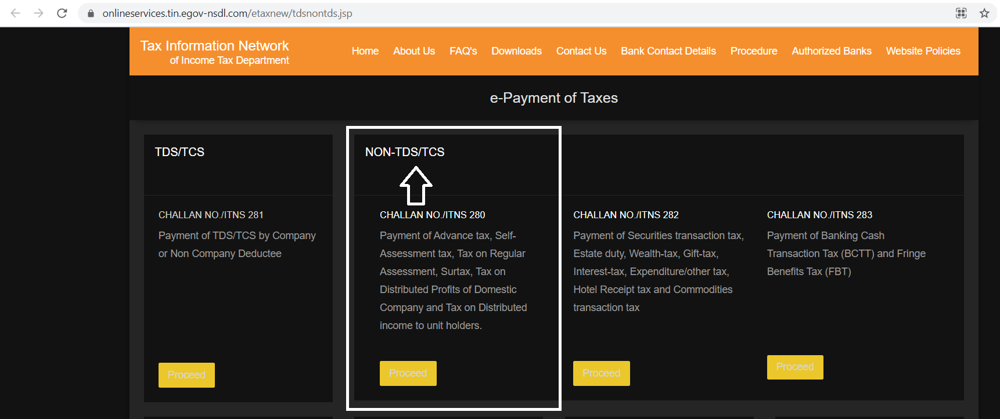
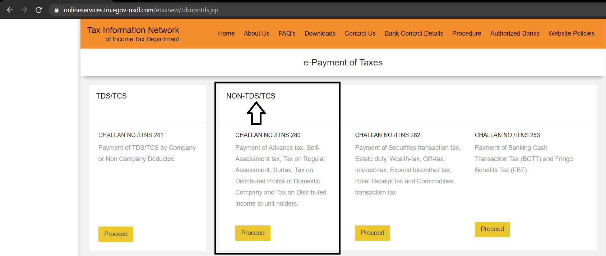
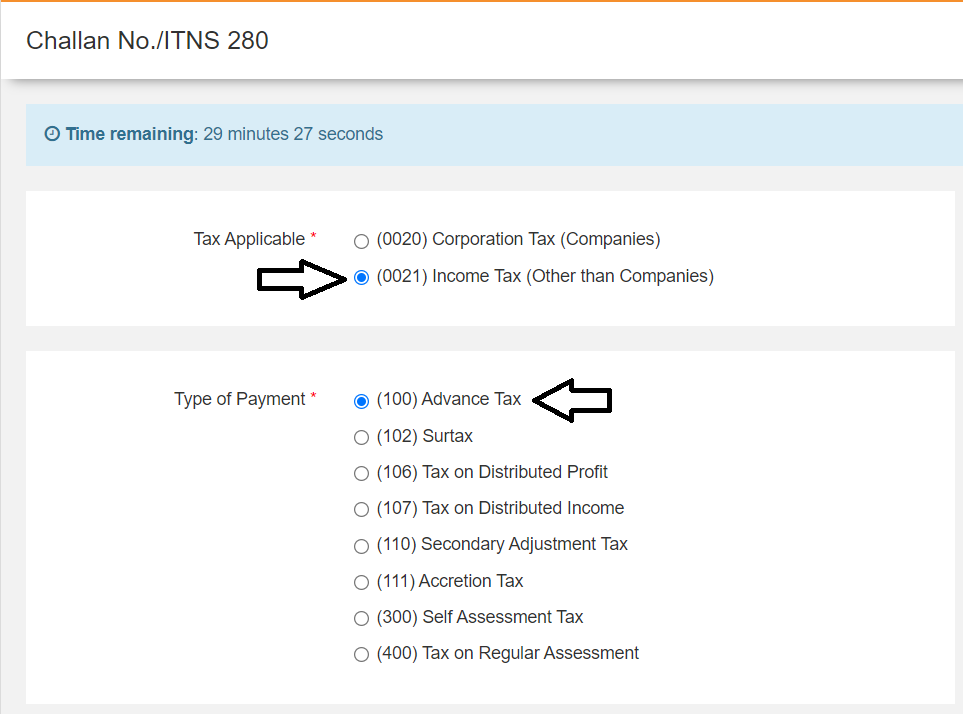

# How to Pay Advance Tax

## Introduction

Income tax is commonly deducted _at source_ by the entity \(employer, banks etc.\) while making a payment to the taxpayer in any form \(salary, interest, income from profession etc.\).

This is known as TDS \(**T**ax **D**educted at **S**ource\) and is generally reflected in Form 26AS every financial year/ assessment year.

For example, if an employer has paid $$₹1,000,000$$ in salary over the year to an employee, then depending on tax saving investments for the employee, the employee might be liable for, say, $$₹80,000$$ in taxes.  
  
This entire $$₹80,000$$ would have ideally been deducted by the employer, as TDS, and deposited to income tax department. In particular, the TDSPC \(**T**DS **P**rocessing **C**ell\).

However, the taxpayer might have other sources of income on which no tax has been deducted. Or, adding up the income from multiple sources would probably put them in a different tax bracket with extra tax liability; that neither entities might know about.

Examples include:

* Capital Gains from sale of stocks or mutual fund units, or selling house / real estate
* Rental income
* Freelance/business income
* Income from bank deposits

In such cases, the responsibility lies on the taxpayer to compute their tax liability in advance and pay it to the government directly; as advance tax.

However, it's also **not enough** to just pay the total tax owed to the Income Tax department, by end of the financial year.

As it happens, one needs to also pay the right tax based on estimate of gross income for the whole year, before the right dates \(advance tax deadlines\) in a financial year.

## When to pay the Advance Tax 

Based on prevailing Indian tax law and IT act, it's generally supposed to be paid on a quarterly basis.

The advance tax must be computed and paid based on the tax slab, to which the taxpayer belongs, if the overall tax liability is greater than ₹10,000 in a financial year.

| Due Date | Tax payable |
| :--- | :--- |
| On or before 15th June | $$15\%$$ of liability |
| On or before 15th September | $$45\%$$ of liability, minus tax already paid |
| On or before 15th December | $$75\%$$ of liability, minus tax already paid |
| On or before 15th March | $$100\%$$ of liability, minus tax already paid |

#### Note 

* For freelancers and other non-salaried professionals, $$100\%$$ of tax must be paid on or before 15th March. 
* If advance tax is not paid, interest may be charged on the tax liability under sections 234B and 234C of the Income Tax Act. 
* For senior citizen \(more than 75 yr old\), if only pension and income from bank interest are only the 2 sources of income, the bank will deduct the TDS and no need to file ITR \(**I**ncome **T**ax **R**eturn\).

## Steps for Payment 

* Visit the tax information network portal of the income tax department.  Link: [https://www.incometaxindia.gov.in/Pages/tax-services/pay-tax-online.aspx](https://www.incometaxindia.gov.in/Pages/tax-services/pay-tax-online.aspx) 
* Click on Challan No./ITNS 280 section  See image\(s\) below for guidance, and click to zoom in

* Select \(0021\) Income Tax \(Other than companies\) under _Tax Applicable_. 
* Select \(100\) Advance Tax under _Type of Payment_

* Select the mode of payment, enter your PAN, assessment year and other details.  Assessment Year \(AY\), is usually one year ahead of Financial Year \(FY\).  For example, if it's advance tax for FY20-21, then that should be selected as AY21-22. 
* Make the payment with Netbanking or Debit card or UPI \(as applicable\), and keep a copy of the tax receipt /challan, which has details such as  
  * BSR Code
  * Tender Date
  * Challan No.  

See below for a sample counterfoil after advance tax has been paid.

This will be useful at the time of filing of tax returns where details of advance tax paid should be entered.  
  
However, ideally, if the transaction and payment were successful, you should see your 26AS statement updated in a few days after paying advance tax, reflecting the amount. This would also be auto-filled in your ITR, during return filing.

## Wrap Up

One might wonder, if there's any value in paying taxes in advance. Why can't we just pay it during filing returns?  
  
Section 234, in particular section 234B and section 234C, deal with penalties of not paying right taxes at the right time. Rest assured, if you owe the Govt. any taxes, you'd have to pay it.  
  
If you don't do it on time, you'd be paying that with exorbitant interest as penalty for late payment.  
  
If you've any concerns over how to estimate advance taxes, it's prudent to do a tax planning at the beginning of the financial year, and review that once a quarter. If needed, it's of extreme value to employ a tax professional for a fee. Might save you a lot of headache and surprises down the line.

You might want to refer to some online articles or posts about more details on this process, and various corner-cases. Here are a few examples, provided below.

* [Clear Tax article on Advance Tax](https://cleartax.in/s/advance-tax) \| [archive.org link](https://web.archive.org/web/20210428052959/https://cleartax.in/s/advance-tax) \| [archive.is link](https://archive.is/ItQwE)
* [Clear Tax article on paying advance tax](https://cleartax.in/s/pay-income-tax-due) \| [archive.org link](https://web.archive.org/web/20210428053411/https://cleartax.in/s/pay-income-tax-due) \| [archive.is link](https://archive.is/SBJze)

