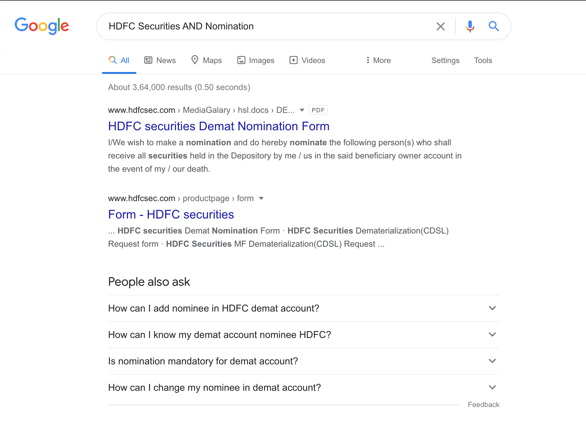

# How to Update Nominee Details?

## Intro 👋

Let us first begin with what _nomination_ means. 

According to AMFI \(**A**ssociation of **M**utual **F**unds in **I**ndia\):

_Nomination is a facility that enables an individual unit_-_holder \(including sole proprietor of sole proprietary concern\) to nominate a person, who can claim the units held by the unit-holder or the redemption proceeds thereof in the event of death the unit-holder._

In short, nominees **do not** inherit the assets after the death of the unit holders. They are responsible for distributing the assets, as per the will, or to the legal heir of said unit-holder.

Nominees are usually added to a mutual fund folio at the time of its creation; but it can also be added or altered at a later phase.

## Mutual Fund Folios 📒

There are various ways to go about updating nominee details in mutual fund folios.

### Option 1: MFUtility

The easiest and fastest way to update nomination for all mutual fund folios, across fund houses \(AMCs\) is to update the same via [MFUtility](https://www.mfuindia.com/).


💡If you don't have an MFUtility account, this convenience alone is worth it to sign up for one.


You'd need to fill out a nominee update form, which can be found below

[Link to nomination change form](https://www.mfuindia.com/downloads/NCT-Nomination.pdf) \| [archive.is link](https://archive.is/99hfV) \| [google webcache link](https://webcache.googleusercontent.com/search?q=cache:https://www.mfuindia.com/downloads/NCT-Nomination.pdf)

Investor needs to print the form, duly fill it as instructed, and then can do one of the following:

* Send it to MFUtility head office at Thane, Maharashtra; via registered post. Address is mentioned at the bottom of the form. 
* Visit a CAMS or KFinTech office in your city, and submit the form there.

This will update the nominees for all the mutual funds folios, mapped with the **C**ommon **A**ccount **N**umber\(CAN\). Benefit of this process is to use one single form, and update all nominees, across all folios with all mutual fund houses, that have been mapped to the CAN.  

### Option 2 : Visiting an RTA Office

Another way to update nominee details is to visit the nearest office of the AMC, or the nearest **R**egistrar and **T**ransfer **A**gents \(RTA\) office. RTAs are responsible for managing the records of investor folios, for the AMCs.

There are predominantly two RTAs these days — CAMS and KFinTech,;and together they serve all the AMCs \(except Franklin, which is served by FTAMIL presently, though they plan on moving to one of the two major RTAs\).   
  
You can find the RTA responsible for a particular AMC, by checking these links below:

* [List of AMCs served by CAMS](https://www.camsonline.com/InvestorServices/COL_ISMutualFunds.aspx) \|  
* [List of AMCs served by KFinTech](https://mfs.kfintech.com/mfs/Generalpages/ourCredential.aspx) \| [archive.org link](https://web.archive.org/web/20210120192816/https://mfs.kfintech.com/mfs/Generalpages/ourCredential.aspx) \| [archive.is link](https://archive.is/egomv) \| [google webcache link](https://webcache.googleusercontent.com/search?q=cache:https://mfs.kfintech.com/mfs/Generalpages/ourCredential.aspx) 

Investors can download the nominee update form from the website of the AMCs or download a generic form, from the RTA’s website.

For CAMS, [nomination forms are available here](https://new.camsonline.com/Investors/Service-requests/Service-Request-Forms/Nomination-Form). If the AMCs you invest with are using KFinTech, then [use this link](https://mfs.kfintech.com/mfs/Generalpages/downloads/8NOMINATIONFORM.pdf).

Disadvantage of using this method - investors need to fill a separate form for every AMC in which they want to update the nominee details, and submit the form physically at the nearest center. In some cases, one might even need to fill out one form for each folio.

Or, with the RTA forms, one would need to find out which RTA their AMC is using for record-keeping, and pick specific form. 


Above links, to nomination forms on websites of RTAs and MFUtility , may change in the future. Always download latest versions of these forms from the official website of the entities as mentioned.

[MFUtility](https://www.mfuindia.com/)  \| [CAMS](https://new.camsonline.com/) \| [KFinTech](%20https://www.kfintech.com/)


### Option 3 : Online Update


⚠️This is not applicable for all AMCs.


Some AMCs \(like DSP Mutual Fund, at the time of writing this\) allow investors to update nominee from their investor portal.

Just log on the portal and visit the folio section, and you will find nominee details.

### Option 4: Through Broker / RIA / Distributor

Plenty of us invest through third party platforms, in mutual funds - Coin, Groww, Kuvera, PayTM Money, INDMoney, FundsIndia, ScripBox, Wealthy.in, ICICI Direct, HDFC Securities etc.

In such cases, it'd be instructive to follow up with respective platform's service team. They'd be able to guide you better with respect to nominee update process, specific to their platform.

For the mutual funds units that are held in demat \(for instance, Zerodha Coin or HDFC Securities\), nominee\(s\) will be same as the nominee\(s\) for the trading and demat account. 

If the investor updates the nominee for their demat account, the nominee will be updated for all the folios held in the demat account with the respective broker.

## Demat Account : Stocks & Bonds 📈 

Steps to update the nominee for trading and demat account is similar for all the brokers.

**Investors can, and should, directly contact their broker’s support teams for the exact process for updating nomination.**

Generally, the first step is to download and print the nomination form from the website of the broker.

Copy the text and replace “Name of broker” with the name of your broker.

`"Name of Broker" AND "Nomination"`

For e.g. if the investor wants to update the nominee for demat account with HDFC Securities then they can search for:

“HDFC Securities” AND “Nomination”

Visit the link that is from the website of the broker and the form will be available on the page.

Once the form has been duly filled, investor can send the nomination form with an attested proof of identity, to the registered office of the broker.

For brokers with pan-India presence, investors can also submit the form to the nearest office. These are usually traditional brokers like ICICI Direct, HDFC Securities etc.

**Some brokers charge a service fee for updating nomination.** For e.g. Zerodha charges ₹25+18% GST, at the time of writing.

## Bank Accounts 🏛️

To update nominee in a bank account, usually you've to visit the local branch with identity proof, close to your residence, for that bank.

However, some banks these days, do allow updating these details via their app / web portal. It's best to contact email or call or chat support of your bank, or just checking their website once, before physically visiting a branch to update nominee\(s\).

