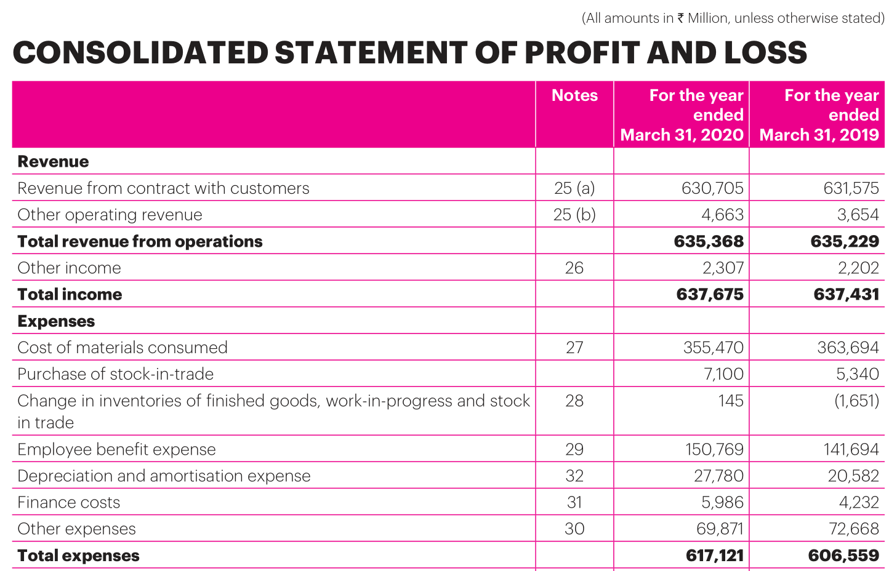
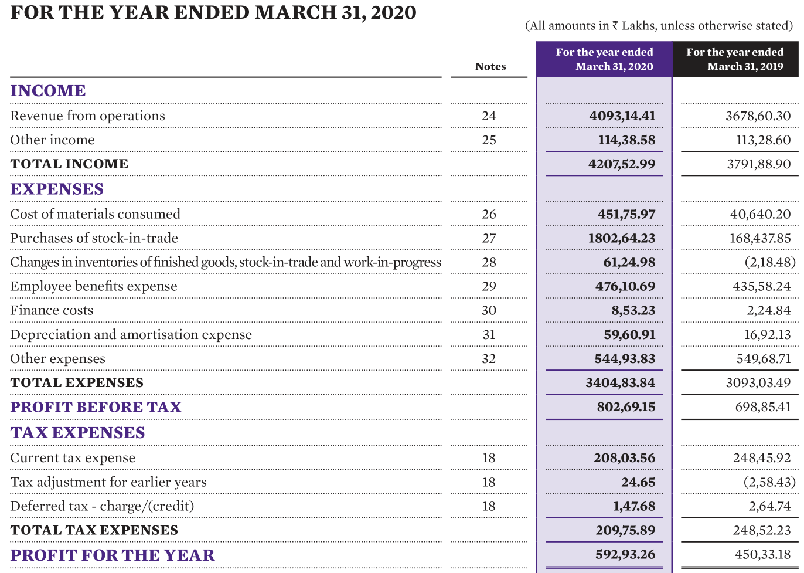
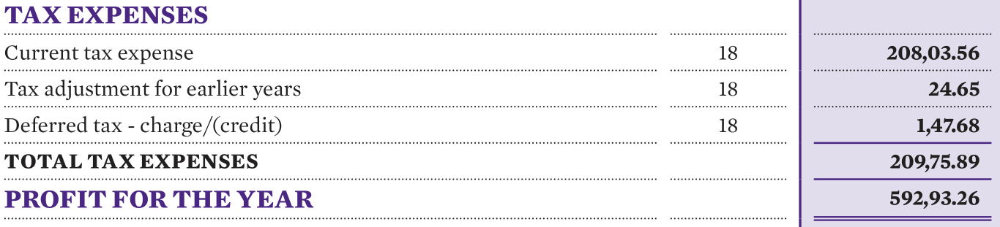
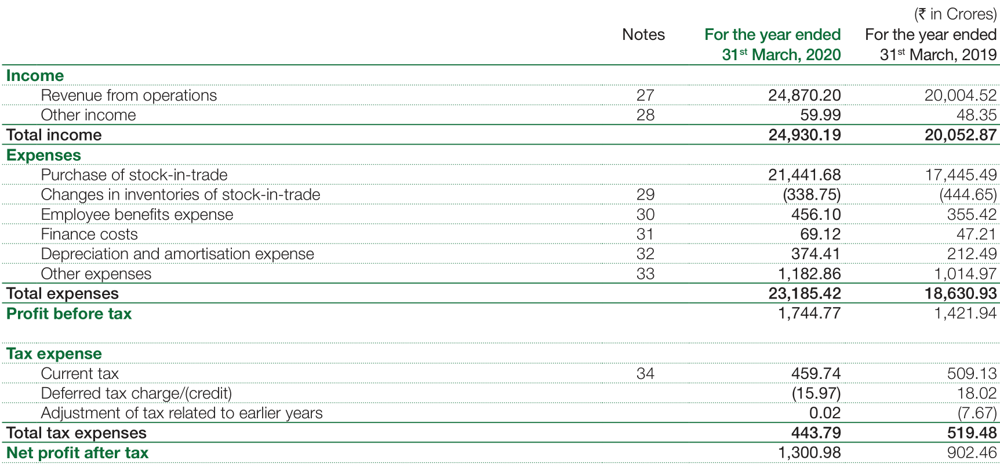
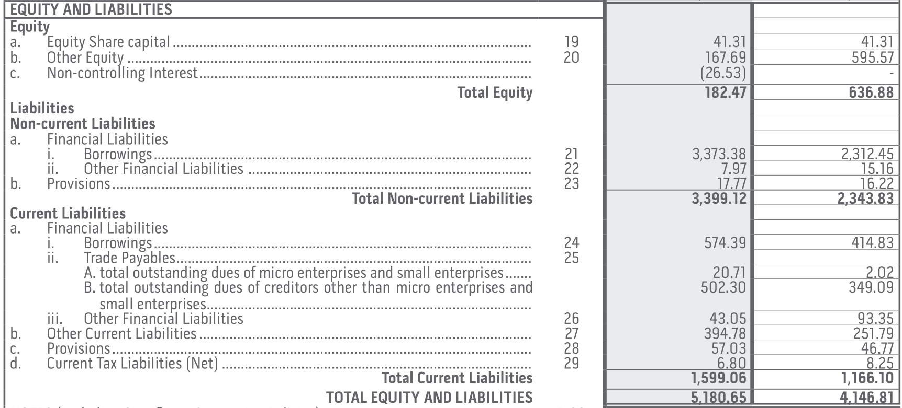
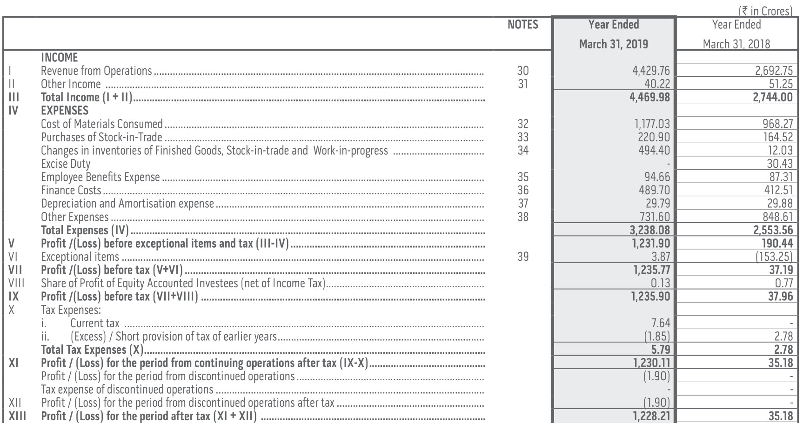
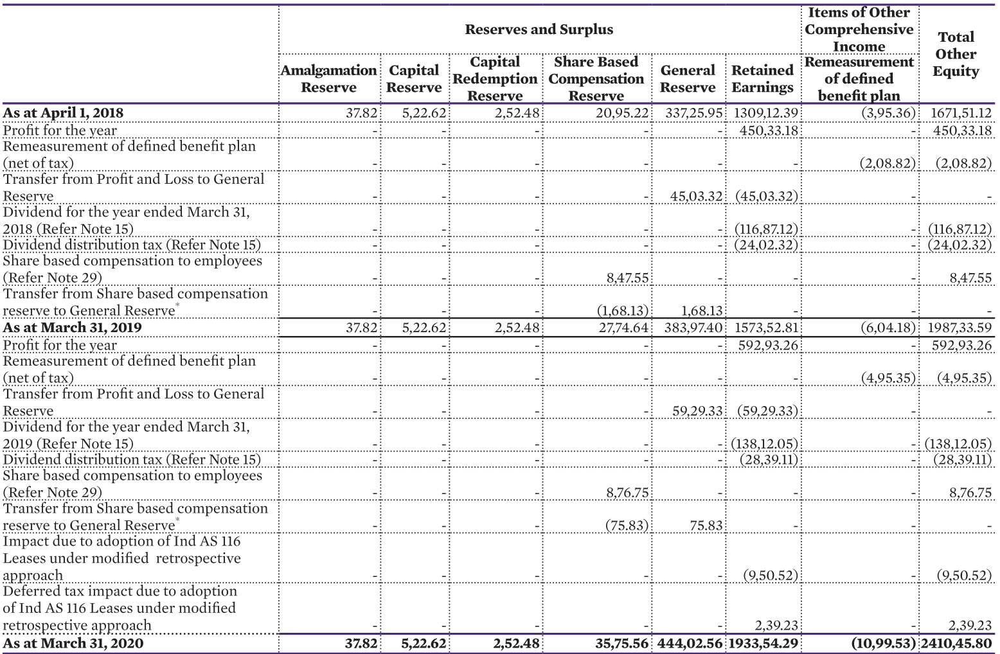
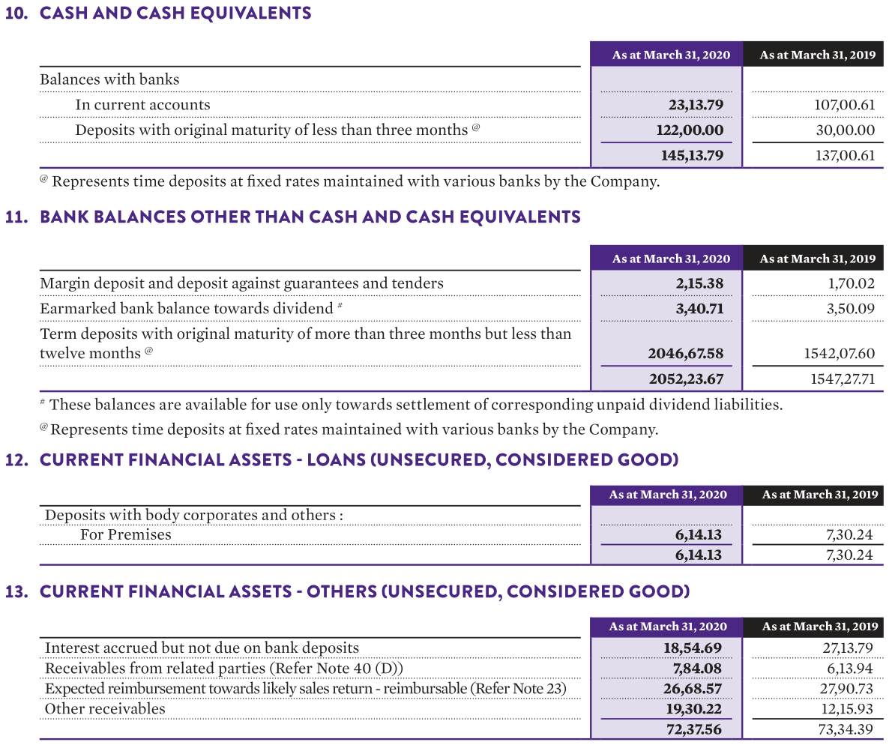

# Profitability

### Gross Profit

There are three major types of profits -

* gross profit
* operating profit
* net profit

Each of them are significant in their own way.

**Gross Profit** is the amount of money a company earns after deducting the costs _directly_ associated with producing their goods/products/services from the revenue. These costs are collectively known as **Cost of Goods Sold** or **COGS**.

How do we define COGS though and what do _directly associated_ costs mean? Interestingly, the answer can vary depending upon the company we're looking at. Let's look at some examples.



For a capital intensive company like Motherson Sumi which deals with a lot of tangible raw materials, it should be expected that the _cost of materials consumed_ would be relatively high. _Purchase of stock-in-trade_ measures the expenses incurred in buying products used as intermediates to create the finished products sold by the company. _Change in inventories of finished goods, work-in-progress, and stock-in-trade_, as the name implies, are the expenses incurred on creating the products left in the inventory of Motherson Sumi at the end of the financial year 2020.

These costs can be considered directly associated with creating the end product. Expenses like the _finance costs_ or _depreciation & amortization_ aren't directly related to the creation of the end product. We can ask the following question to think whether an expense qualifies as COGS — **would this expense have emerged even if no sales were generated?** If yes, then it probably shouldn't be included in COGS.

The labor costs incurred to produce the end product are also direct costs eligible for inclusion in COGS. However, this should only include actual labor costs paid to employees responsible for creating the product, not employees in marketing or HR, for example. This is a conundrum because the notes for _employee benefit expenses_ looks like this


We don't know the details of how much of the _salary, wages, & bonus_ are direct costs. The details are not mentioned possibly due to competitive and logistical reasons.

We leave the decision of inclusion of _employee benefit expenses_ in COGS up to the reader and his/her judgement which will possibly be influenced by the company in question and its nature of business. Please note that these expenses would still be reported under the operating expenses and end up getting reflected in the operating profit.

In this case, we'll consider COGS as

```text
COGS = Cost of Materials Consumed + Purchase of Stock-in-Trade + Changes in Inventories of Finished Goods, Work-in-Progress, and Stock-in-Trade
```

This gives us $$₹35,547+₹710+₹14.5=₹36,271.5$$ crores.


Since TCS is a services company, it doesn't deal with or manufacture any raw materials or tangible goods. TCS' tangible material is its software licenses and employees who provide services worldwide. In this case, the COGS would be $$₹85,952+₹1,905=₹87,857$$ crores.

Now that we know how to calculate COGS, we can calculate the gross profit.

```text
Gross Profit = Revenue from Operations - COGS
```

Motherson Sumi's gross profit for the financial year 2020 was $$₹63,536.8-₹36,271.5=₹27,265.3$$ crores. Similarly, TCS' gross profit for the year 2020 was $$₹1,56,949-₹87,857=₹69,092$$ crores.

The **Gross Profit Margin** of Motherson Sumi and TCS for the year 2020 are as follows

```text
Gross Profit Margin = Gross Profit / Revenue from Operations
```

$$\displaystyle \frac{₹27,265.3}{₹63,536.8}=42.9\%$$

$$\displaystyle \frac{₹69,092}{₹1,56,949}=44\%$$

### Earnings Before Interest, Taxes, \(Depreciation and Amortization\) \(EBIT/EBITDA\)

**EBIT**, as the name implies, is the amount of profit a company earns **before** interest and tax expenses have been subtracted. It is also known as the **Operating Profit**. We can also strip out depreciation costs of tangible assets and amortization costs of intangible assets from the expenses to obtain the **EBITDA**.



The revenue from operations for the year ended March 2020 was $$₹4,093.14$$ crores. We won't consider other income here because it isn't generated from operations. The total expenses excluding taxes are $$₹3,404.83$$ crores. If we exclude finance costs \(interest\) of $$₹8.53$$ crores from the total expenses, it gives us operational expenses of $$₹3,396.3$$ crores. Thus, the EBIT in this case turns out to be $$₹4,093.14-₹3,396.3=₹696.84$$ crores.

You can use the following formula to calculate EBIT.

```text
EBIT = Revenue from Operations - ( Total Expenses Excluding Taxes - Finance Costs )
```

To calculate the EBITDA, we can simply exclude the depreciation and amortization expenses. The formula then becomes

```text
EBITDA = EBIT + Depreciation and Amortization Expense
```

In this case, the EBITDA is $$₹696.84+₹59.60=₹756.44$$ crores.

Why is the EBIT and EBITDA of a company relevant?

EBIT and EBITDA present us with an ideal view of the companies' core operational performance by excluding non-operational expenses like interests and taxes. While the net profit might be skewed by variables like taxes, EBIT and EBITDA will present the true picture of how much the company actually earned from its operations.

EBIT and EBITDA are influenced by the ability of the company to earn revenue and the operational expenses it incurs. The **EBIT margin** \(EBIT in terms of % of revenue\) or the **Operating Profit Margin** of Abbott India for the financial year 2020 was $$17.02\%$$ while that of Pfizer India for the same period was $$21.81\%$$. Using these numbers, we can infer that Pfizer India was operationally more profitable than Abbott India during the financial year 2020. Again, keep in mind that this is just one of many data points.

Like most financial ratios and metrics, EBIT and EBITDA are best used for comparison of companies in the same sector. Comparing the EBIT margin of a MNC pharmaceutical company with that of a capital intensive auto ancillary company doesn't make sense.

EBITDA can, however, be misleading and it may not be useful, especially in asset heavy companies with significant depreciation and amortization costs. Here's what Warren Buffet has to say about EBITDA.

> People who use EBITDA are either trying to con you or they’re conning themselves. Telecoms, for example, spend every dime that’s coming in. Interest and taxes are real costs.

Here's what Charlie Munger has to say about EBITDA.

> I think that, every time you saw the word EBITDA, you should substitute the word "bullshit" earnings.

### Profit Before Tax \(PBT\) and Profit After Tax \(PAT\)

As the name implies, **Profit Before Tax \(PBT\)** is the amount of profit a company earns before subtracting the taxes it has to pay. Although PBT doesn't get the same amount of focus as gross profit, operating profit, and net profit do, it can still be useful in its own right. Corporate taxation laws can change and this can end up skewing the net profit that a company earns in a financial year. For example, [India slashed its corporate tax rates](https://economictimes.indiatimes.com/news/economy/sitharamans-tax-cut-move-why-it-matters-so-much-for-india-inc-economy-and-modi-govt/articleshow/71228078.cms) \([archive.org link](https://web.archive.org/web/20200730053904/https://economictimes.indiatimes.com/news/economy/sitharamans-tax-cut-move-why-it-matters-so-much-for-india-inc-economy-and-modi-govt/articleshow/71228078.cms) \| [archive.is link](https://archive.is/ezWq1)\) for domestic companies from $$30\%$$ to $$22\%$$ in September 2019. Some companies in certain sectors might also enjoy tax incentives from the government for a specific period of time. In such cases, focusing on PBT might be a good idea.

You should be able to find PBT in the profit and loss statement in an annual report.


**Profit After Tax \(PAT\)**, also known as the **Net Profit**, is arguably one of the most important metrics in an annual report. It is what we usually mean when we ask "how much profit did the company earn?". PAT is the metric which tells how profitable a company is after all its expenses are considered and deducted from the revenue.

Like PBT, you should be able to find PAT in the profit and loss statement in an annual report.



The **PAT margin**, also called **net profit margin**, is a widely used metric to calculate and compare the ability of companies to generate profit.

For the financial year 2020, Abbott India has a PAT margin of $$\frac{₹592.93}{₹4,207.52}=14.09\%$$ and Pfizer India has a PAT margin of $$\frac{₹509.13}{₹2,335.67}=21.79\%$$.

Unlike operating profit, note that we're using _total income_, which includes _other income_ as well, to calculate the net profit and net profit margin.

### Return on Equity \(ROE\) and Return on Assets \(ROA\)

**Return on Equity** is a widely used profitability ratio that measures how many rupees of profit are generated for each rupee of shareholders equity. It highlights how efficiently a company uses the shareholders equity to generate profits. It can be calculated using the following formula:

```text
Return on Equity = Profit after Taxes / Shareholders Equity
```

Depending on the source, we might find a slightly different formula for ROE.

```text
Return on Equity = Profit after Taxes / Average Shareholders Equity
```

You can calculate average shareholders equity by calculating the average of the shareholders equity at the beginning and at the end of a financial year.

One might ask — why consider the average of shareholders equity and not the total shareholders equity for a specific financial year?




Avenue Supermarts issued additional shares in the financial year 2020 to comply with SEBI regulations of bringing down the promoter holding below $$75\%$$ within 3 years of IPO. This is a one-off event which won't happen regularly. To avoid presenting skewed ROE numbers, we'll consider the _average_ shareholders equity rather than the total shareholders equity. This gives us $$\frac{₹11,080.20+₹5,588.01}{2}=₹8,334.10$$ crores. The PAT for the year 2020 was $$₹1,300.98$$. This gives us an ROE of $$\frac{₹1,300.98}{₹8,334.10}=15.61\%$$.

Of course, if the difference between shareholders equity in successive financial years isn't driven by one-off events like buybacks or additional issue of share capital, considering the _average_ shareholders equity may not be needed.

Similarly, **Return on Assets** can be defined as the amount of profit generated by a company relative to its total assets. We can use this metric to judge how well a company utilizes their assets to generate profits. It can be calculated by using the following formula:

```text
Return on Assets = Profit after Taxes / Total Assets
```

Just like ROE, we can use _average total assets_ instead of just _total assets_ when needed to calculate ROA.

The ROE of Avenue Supermarts for the year 2020 is $$15.6\%$$ and the ROA is

$$\displaystyle \frac{₹1,300.98}{\displaystyle \frac{₹12,076.45+₹7,005.72}{2}}=13.6\%$$

Even though ROE is a popular metric, it's important to understand its quirks and limitations. Bombay Dyeing & Manufacturing Company Ltd, one of India's largest producers of textiles, had a ROE of $$-124\%$$ in the year 2017,$$7.2\%$$ in 2018, $$299\%$$ in 2019, and $$269\%$$ in 2020. As you might have suspected, these ROE figures are misleading \(but not incorrect\). We'll attempt to showcase the limitations of ROE as a financial ratio and why it should be used with caution in cases where the net profit is negative or when the company is in significant debt.

Besides the definition that we shared above, ROE and ROA can be expressed using the **DuPont Identity**, also known as the DuPont Method, which breaks down ROE and ROA into several ratios and presents us with a detailed and an alternative view.

According to the DuPont method, ROE can be written as

```text
Return on Equity = Profitability Ratio x Efficiency Ratio x Leverage Ratio
```

Profitability Ratio is the PAT margin we've seen before. The Efficiency Ratio is `Total Income / Average Assets` and the Leverage Ratio is `Average Assets / Average Shareholders Equity`. If you observe closely, the DuPont Identity gives back the original definition we shared if we cancel out the relevant numerators and denominators from the above formula. However, by breaking up ROE into 3 different ratios, we can now know how the ROE figures of Bombay Dyeing ended up getting inflated.






Let's start with the year 2019. We can break down Bombay Dyeing's ROE as follows:

Profitability Ratio = $$\displaystyle \frac{₹1,228.21}{₹4,469.98}=0.27$$

Efficiency Ratio = $$\displaystyle \frac{₹4,469.98}{\displaystyle \frac{₹5,180.65+₹4,146.81}{2}}=0.95$$

Leverage Ratio = $$\displaystyle \frac{\displaystyle \frac{₹5,180.65+₹4,146.81}{2}}{\displaystyle \frac{₹182.47+₹636.88}{2}}=11.38$$

Return on Equity = $$0.27\times 0.95\times 11.38=291\%$$

The difference of $$8\%$$ may be ignored because ratios were rounded to 2 decimal places.

Although the profitability ratio and efficiency ratio \(also known as **asset turnover ratio**\) are decent, what ends up inflating ROE is the leverage ratio \(also known as **equity multiplier**\) which indicates that Bombay Dyeing's assets are mostly funded through debt rather than equity which is a point of concern.

Let's assume a hypothetical company called A Ltd. Its accounting equation looks like $$10=8+2$$ where assets are 10, equity is 8, and liabilities are 2. Its leverage ratio is $$\frac{10}{8}=1.25$$. A Ltd decides to take on $$20$$ units of loan to finance its operations. The equation now looks like $$30=8+22$$. The financial leverage now becomes $$\frac{30}{8}=3.75$$. This would end up inflating the ROE of A Ltd but that doesn't necessarily mean that its a good thing. Taking on a lot of debt may or may not pay off. If, however, the profitability ratio and efficiency ratio increase in the subsequent financial years, taking on debt could be considered a worthwhile decision.

The DuPont formula for ROE ends up revealing ROA as well when we multiply the Profitability Ratio with the Efficiency Ratio. This means that ROA is a function of a firm's profitability and its asset turnover capability.

Besides the highlighted limitations in this section, the usual caveats apply. ROA and ROE are best compared against firms in the same sector with similar business models.

### Return on Capital Employed \(ROCE\)

**Return on Capital Employed \(ROCE\)** is a measure of how much money can a company generate in the form of profits considering the amount of money invested in it for the long term.

After reading that definition, one might think, how do we calculate the "amount of money invested in a company for the long term"?

Let's say you decide to buy a house worth $$₹50$$ lakh. In addition to this cost, you need another $$₹5$$ lakh rupees for repair and renovation which means you need $$₹55$$ lakh. However, you only have $$₹20$$ lakh for down payment. You decide to borrow $$₹30$$ lakh from your nearby bank as a long term loan and $$₹5$$ lakh from an elder sibling for completing repair and renovations. The acquisition, repair, and renovation process takes about 6 months and you're able to pay back the $$₹5$$ lakh loan you took from your sibling within an year.

If we use the accounting equation in this case, we can say that

Assets = $$₹55$$ lakh \(the house\)

Shareholders Equity = $$₹20$$ lakh \(the downpayment you made\)

Non-current Liabilities = $$₹30$$ lakh \(the long term bank loan\)

Current Liabilities = $$₹5$$ lakh \(the money borrowed from your sibling\)

The long term investment in this company \(the house\) seems to be $$₹50$$ lakh — the sum of shareholders equity \(your contribution\) and non-current liabilities \(the bank loan\). This is what we call **Capital Employed**. It's the amount of money _employed_ by a business to fund its assets and, ultimately, generate profits.

We can define ROCE using the following formula

```text
ROCE = EBIT / Capital Employed
```

where

```text
Capital Employed = Shareholders Equity + Non Current Liabilities
```

One might find Capital Employed defined as `Total Assets - Current Liabilities` which is just another way of using the accounting equation. The former method of looking at capital is called the _financing approach_ and the latter method is called the _operating approach_. We can also use `Average Capital Employed` to prevent looking at skewed ratios because of abrupt changes in Shareholders Equity or Non Current Liabilities.

The ROCE of Bombay Dyeing for the year 2019 is

EBIT = $$₹4,429.76-(₹3,238.08-₹489.7)=₹1,681.38$$ crores

Average Shareholders Equity = $$\displaystyle \frac{₹182.47+₹636.88}{2}=₹409.675$$ crores

Average Non-current Liabilities = $$\displaystyle \frac{₹3,399.12+₹2,343.83}{2}=₹2,871.475$$ crores

ROCE = $$\displaystyle \frac{₹1,681.38}{₹409.675+₹2,871.475}=51.2\%$$

and $$8.42\%$$ for the year 2020 as opposed to its ROE of $$299\%$$ and $$269\%$$ for the years 2019 and 2020 respectively.

Abbott India's ROCE for the year 2020 is $$29.4\%$$ as opposed to its ROE which is $$26.7\%$$. Avenue Supermarts' ROCE for the year 2020 is $$20.4\%$$ and its ROE is $$15.6\%$$.

It should be apparent that ROCE is a "better" profitability ratio to use compared to ROE, especially in capital intensive sectors like telecom and auto where assets being funded by significant debt isn't unusual.

However, ROCE isn't free from limitations. Even though retained earnings is being counted as part of capital employed, it may not be employed for any financial activities. A company with high amounts of cash reserves would be negatively affected when calculating ROCE. This should be apparent in the case of Abbott India. If we exclude the retained earnings, we'll get a ROCE of $$113\%$$ for the year 2020.



### Return on Invested Capital \(ROIC\)

One of the drawbacks of ROCE, as we saw earlier, was that it considers cash reserves as part of the capital employed which ends up subduing the ROCE of Abbott India. Instead of looking at _capital employed_, how about we consider the _capital invested_ in a business? After all, the ability to generate cash isn't the only thing that matters. A company sitting on huge amounts of cash isn't necessarily a good thing since the returns generated from that cash is not going to exceed the cost of capital employed and the expected returns by shareholders. We'd want a company to make use of that cash effectively and grow its business better than its competitors. Efficient capital allocation matters just as much, if not more, than how capital is employed and it is one of the most important responsibilities of the management of a company. Its importance is perhaps best highlighted by the following excerpt from Warren Buffet's 1987 letter to shareholders.

> The heads of many companies are not skilled in capital allocation. Their inadequacy is not surprising. Most bosses rise to the top because they have excelled in an area such as marketing, production, engineering, administration or, sometimes, institutional politics. Once they become CEOs, they face new responsibilities. They now must make capital allocation decisions, a critical job that they may have never tackled and that is not easily mastered.
>
> In the end, plenty of unintelligent capital allocation takes place in corporate America. \(That's why you hear so much about "restructuring."\) Berkshire, however, has been fortunate. At the companies that are our major non-controlled holdings, capital has generally been well-deployed and, in some cases, brilliantly so.

The **Return on Invested Capital \(ROIC\)**, also known simply as **Return on Capital \(ROC\)**, is the measure of profit generated by a company relative to the amount of capital invested in its business.

Okay, so how do we define what **capital invested** is?

We defined capital employed as `Shareholders Equity + Non-current Liabilities` but it can also be written as `Total Assets - Current Liabilities` using the operational approach. We can exclude

* cash and cash equivalents, bank balances, term deposits, and interest

  income from cash

* goodwill
* unusual and one-time items

Excess cash sitting in a bank or in debt funds isn't invested in a business and isn't an operational asset. Goodwill is an intangible asset usually resulting from the acquisition of a company at a premium value. We exclude goodwill because it is the leftover premium from the past, not an investment for future growth. Similarly, other one-time items like asset write downs aren't included in the capital invested since they are not core operational assets.

This gives us

```text
Non-operational Assets = Cash and Cash Equivalents - Goodwill - Misc One Time Items
Capital Invested = Total Assets - Current Liabilities - Non-operational Assets
```

This gives the denominator in the formula for ROIC. Since we are focusing on the invested capital from an operational standpoint, we'll use operational profit in the numerator. However, instead of using just EBIT, we'll adjust EBIT for taxes to get a more standardized version of operating income. This is known as **net operating profit after taxes \(NOPAT\)**.

ROIC can now be defined as

```text
NOPAT = EBIT x (1 - tax rate)
Capital Invested = Total Assets - Current Liabilities - Non-operational Assets
ROIC = NOPAT / Capital Invested
```

There's another caveat we should keep in mind when calculating ROIC. The NOPAT generated at the end of a financial year won't be because of capital invested at the end of the same financial year. To account for this timing difference, the amount of capital invested used in calculating ROIC will be as it was at the end of the preceding financial year.

Let's start with Abbott India. The EBIT for the year 2020 was $$₹696.8$$ crores. The tax rate can be considered as $$25.17\%$$ as mentioned in Note 18 of the financial statements. This gives us a NOPAT of

NOPAT = $$₹696.8\times (1-25.17\%)=₹521.4$$ crores


The capital invested of Abbott India for the year 2019 is

Cash and Cash Equivalents \(Note 10\) = $$₹137$$ crores

Term Deposits \(Note 11\) = $$₹1,542.07$$ crores

Interest on Bank Deposits \(Note 13\) = $$₹27.13$$ crores

Non-operational Assets = $$₹137+₹1,542.07+₹27.13=₹1,706.2$$ crores

Capital Invested = $$₹2,940.91-₹856.89-₹1,706.2=₹377.82$$ crores



This gives us a ROIC of $$\frac{₹521.4}{₹377.8}=138\%$$. The ROIC of Pfizer India for the year 2020 is $$\frac{₹351.1}{₹603.8}=58.1\%$$.

Motherson Sumi, an auto ancillary company which is significantly more capital intensive, has a ROIC of $$9.82\%$$ for the year 2020. Of course, this doesn't mean we can compare Motherson's ROIC with Abbott's. An appropriate comparison would be with a company like Minda Corporation which is also a capital intensive auto ancillary company. It's ROIC for the year 2020 was $$\frac{₹98.7}{₹761.7}=12.9\%$$. One may notice that although Minda Corporation had a negative PAT for the year 2020, its operational profit was positive. The reason for the negative PAT seems to an exceptional event which is not considered when calculating ROIC.


Of course, like any other ratio, ROIC has its limitations.

ROIC, and its constituents, are non-standard metrics that we may not find anywhere in an annual report. We have to calculate NOPAT and Capital Invested ourselves, manually, to avoid mistakes and incorrect calculations. Although we considered the timing difference when calculating capital invested, some stock screening websites may not do so and use capital invested at the end of the year in question which is incorrect.

ROIC can also mislead investors into preferring asset light companies with relatively higher ROIC than asset heavy companies with relatively lower ROIC.

* [How Return on Equity is Deceiving You](https://financialmarketseducation.com/how-return-on-equity-is-deceiving-you) \([archive.org link](https://web.archive.org/web/20201127204930/https://financialmarketseducation.com/how-return-on-equity-is-deceiving-you) \| [archive.is link](http://archive.is/6TT3Q)\)
* [Return on Assets So Useful ... and so Misused](https://www.abi.org/abi-journal/return-on-assets-so-usefuland-so-misused) \([archive.org link](https://web.archive.org/web/20200826080403/https://www.abi.org/abi-journal/return-on-assets-so-usefuland-so-misused) \| [archive.is link](https://archive.is/5PIWk)\)
* [Warren Buffet's 1987 Letter to Shareholders of Berkshire Hathaway](https://berkshirehathaway.com/letters/1987.html) \([archive.org link](https://web.archive.org/web/20210206141150/https://berkshirehathaway.com/letters/1987.html) \| [archive.is link](https://archive.is/Jkny3)\)
* [ROC, ROIC, and ROE: Measurement and Implications](http://people.stern.nyu.edu/adamodar/pdfiles/papers/returnmeasures.pdf) \([archive.org link](https://web.archive.org/web/20201229135714/http://people.stern.nyu.edu/adamodar/pdfiles/papers/returnmeasures.pdf) \| [archive.is link](https://archive.is/4M3VD)\)
* [Return on Invested Capital: How to Get It Right](https://junto.investments/roic/) \([archive.org link](https://web.archive.org/web/20210205082555/https://junto.investments/roic/) \| [archive.is link](https://archive.is/QVJIg)\)
* [Questions About ROIC & Valuation](https://intrinsicinvesting.com/2016/10/18/questions-about-roic-valuation/) \([archive.org link](https://web.archive.org/web/20210109175057/https://intrinsicinvesting.com/2016/10/18/questions-about-roic-valuation/) \| [archive.is link](https://archive.is/Zg1NO)\)

