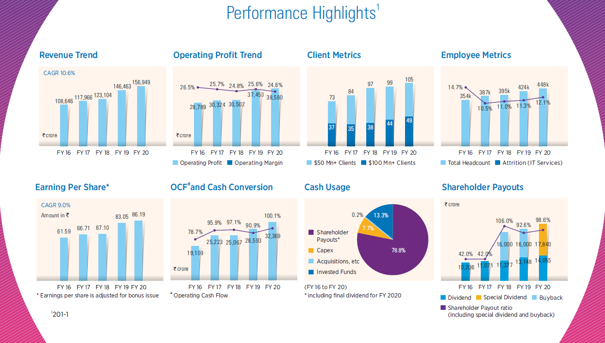
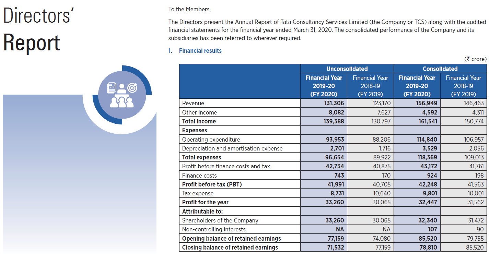
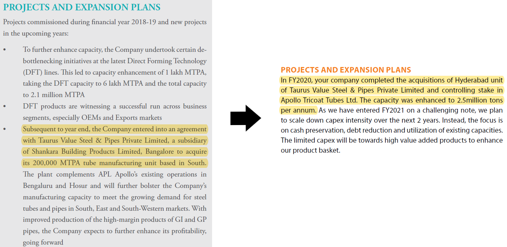
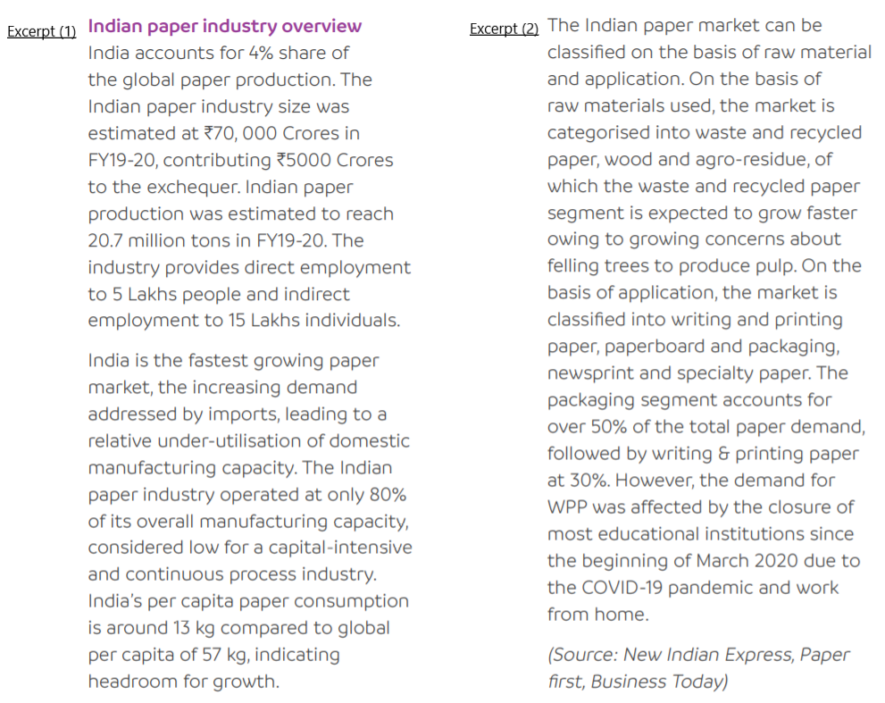
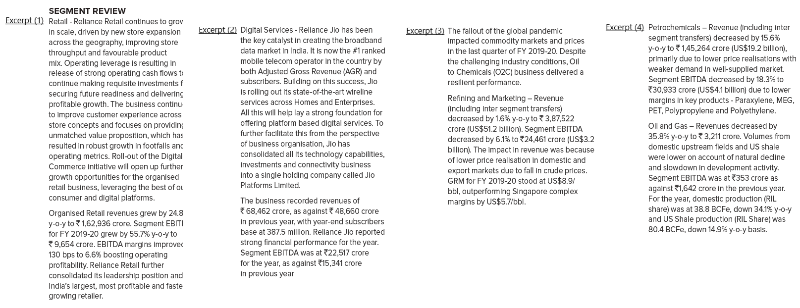
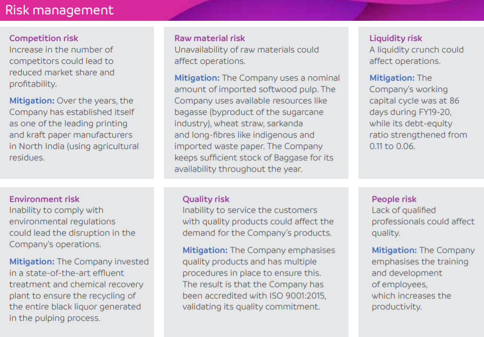
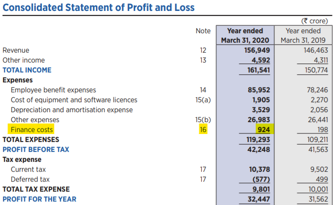

# Reading an Annual Report

#### Disclaimer & Disclosures

* The author of this section **DOES NOT** have any long or short position for companies used in this section for illustration purposes as of the date of being published. This may or may not change in the future.
* The companies used as examples are mentioned solely for educational purposes, mention of any company is random and is certainly **NOT** an investment recommendation.
* Readers are advised to read the complete fine-print of an annual report while conducting due-diligence and avoid skipping contents that went unmentioned in this section.

## Introduction

There are various filings & documents an investor should read before making an investment decision, such as the company's annual reports, quarterly reports, transcripts of conference calls held by the company, credit rating reports, brokerage reports, and so on. Of these, **annual reports are unquestionably the most critical to study.**

### What is an Annual Report?

An annual report is a document that any listed company is required to provide to its shareholders at the end of every accounting year, containing information about the financial & operational activities undertaken for the year in review. Apart from this, the report also contains information about the management, the board of directors, and the products sold by the company. **For an investor, it serves as the primary document to gather information about a company.** In general, we want to see an attempt made by a company to make its business understandable to its shareholders.

### Where can an investor access annual reports of a company?

As per the Securities and Exchange Board of India \(SEBI\) listing obligations and disclosure requirements[^1](https://www.sebi.gov.in/legal/regulations/sep-2015/securities-and-exchange-board-of-india-listing-obligations-and-disclosure-requirements-regulations-2015-last-amended-on-january-08-2021-_37269.html), a listed entity must

* submit its annual report on the stock exchanges, and
* upload it on the company's official website

Apart from the stock exchanges and the company's website, annual reports can also be found on various screeners and other financial data aggregators.

#### Stock Exchange Filings

* The **Bombay Stock Exchange**'s \(BSE\) website can be found at [https://www.bseindia.com/](https://www.bseindia.com/)

  Once you are on BSE's websites, you can search for the company on the search bar located at top right of the website &gt; scroll down to find _Financials_ toggle in the left sidebar &gt; and click on _Annual Reports_ to find the past ten years of annual reports of the company.

* The **National Stock Exchange of India**'s website can be found at [https://www.nseindia.com/](https://www.nseindia.com/)

  You can simply search for the company's name in corporate filings &gt; [annual reports page](https://www.notion.so/%5B%3Chttps://www.nseindia.com/companies-listing/corporate-filings-annual-reports%3E%5D%28%3Chttps://www.nseindia.com/companies-listing/corporate-filings-annual-reports%3E%29) on NSE's website.

#### Investor Relations page on Company's website

As mentioned earlier, companies must upload their annual reports on their official website to provide easy access to shareholders. These can generally be found under _Investor Relations_ page on the company's website.

For instance, Bajaj Auto's annual report can be found [here](https://www.bajajauto.com/investors/annual-reports). A screenshot is shown below as an example.

#### Screeners & Aggregators

You can also find annual reports of companies on various screener and financial data aggregator websites. Generally, they're just links to the PDFs used for company's filings on stock exchanges.

For instance, on [Screener.in](http://screener.in/), you can find annual reports of past few years under the documents section of a company's page. [Screener.in](http://screener.in/) generally links this to BSE's repository of filings.

## Contents of an Annual Report

More often than not, an annual report will begin with information about the company's product, its operational activities, management, board of directors, and ends with financial statements of the year under review.

### Financial & Product mix highlights

This section gives a brief overview of the financial performance of the company in the form of slick visual representations designed to market the prospects of the company to the reader. It is important that you ensure to judge the data for what its worth, not for how it has been shaped to woo you over.

Oftentimes, the company also showcases their portfolio of products under this section \(sometimes, a company will only showcase new additions to their product portfolio\).

![Ruchira Paper&apos;s Annual Report \(FY20\) \[Note: This screenshot doesn&apos;t capture the full page\]](../.gitbook/assets/ta1a34h-1-1-.png)

### Management's Letters to the Shareholders

Though it is not mandated by law, companies usually take the opportunity to communicate to its shareholders,

* Comments on operational activities conducted under the year in review
* Review of the financial performance achieved under the year in review
* Company's broad position in the sector in which they operate
* General economical conditions under which the sector is conducting business
* Threats that the company may face, and risk mitigation strategies
* Plans to undertake new projects, or investments
* Updates to the projects, or investments announced in the past years
* Any other key event that took place in relation to the company

You may find this section sometimes containing two letters, one from the Managing Director \(representing the board of directors\) and the other from Chief Executive Officer \(representing the management team\) of the company.

### Board of Directors Report

The directors' report comes from the perspective of representatives of the shareholders.

**You will often come across the same phrases or coverage of points used in multiple sections of the annual report.** Essentially, the directors report elaborates and sets some context for the same points found under _Management's letter to the shareholders_ section, but with further explanation and data points to support their claims, that is, this section expands on the company's operational activities, financial performance, position in the market, capital allocation policy, dividends distribution policy & dividends proposed for the year, capital expenditure plans, updates regarding the capital expenditure taken up by the company in the past, and the economic conditions under which the company is conducting its business.

You can, and should check whether the management is able to deliver on commitments made previously by comparing the operational or financial activities conducted in the year in review to plans announced in the past few year's annual reports.

#### Management Discussion & Analysis

Unlike _Management's letters to shareholders_, this section is mandated[^2](https://www.icsi.edu/media/portals/71/publications%20and%20resources/Disclosures_in_Annual_Report%20%28CS%20Balasubramanian%20R%29.pdf) to be placed in an annual report either as a part of Directors report, or as its own entity. SEBI regulations[^1](https://www.sebi.gov.in/legal/regulations/sep-2015/securities-and-exchange-board-of-india-listing-obligations-and-disclosure-requirements-regulations-2015-last-amended-on-january-08-2021-_37269.html) instruct the management of companies to include the following discussions/analysis under this section \(_We've added relevant excerpts from ARs of two different companies_\):

* Industry structure & developments

* Opportunities & threats

* Segment-wise, or product-wise performance

* Risks and concerns

Apart from these, SEBI regulations[^1](https://www.sebi.gov.in/legal/regulations/sep-2015/securities-and-exchange-board-of-india-listing-obligations-and-disclosure-requirements-regulations-2015-last-amended-on-january-08-2021-_37269.html) also make the inclusion of following points mandatory in this section:

* Outlook for the business conducted
* Internal control systems and their adequacy
* Financial performance with respect to operational performance
* Material development in Human Resources / Industrial Relations front, including number of people employed
* details of significant changes in key financial ratios with explanations: debtors turnover, inventory turnover, interest coverage ratio, current ratio, debt to equity ratio, operating profit margin, net profit margin, and sector-specific ratios
* details of any change in net-worth

### Corporate Governance report

This section explains the company's governance philosophy and the workings of governance structure, provides some details of the upcoming Annual General Meeting, and gives information about the key management personnel & the board of directors. Corporate governance refers to a structure that regulates and manages companies, encompassing the complete dynamics of its functioning. Good corporate governance practices are a _sine qua non_ that helps to create long-term value for both its shareholders and other stakeholders.

The corporate governance report includes,

* Short profiles on the directors and key management personnel
* Changes \(appointments, reappointments, and retirements\) to be undertaken in board of directors and the key management personnel team
* Remuneration, or compensation paid to the directors and key management personnel in the year in review \(this includes sitting fees\)
* Compositions and mandates of board committees
* Attendance of directors for board meetings, and
* Details of the upcoming Annual General Meeting \(AGM\)

### Corporate Social Responsibility

Corporate Social Responsibility activities refer to investments made by a company to responsibly handle the social, environmental and economic consequences of its activities. These expenditures incurred are mandatory by law[^3](https://www.mca.gov.in/Ministry/pdf/CompaniesAct2013.pdf) for companies having net worth of at least 500 crores, or turnover of at least 1000 crores, or a net profit of at least 5 crores, as a result of the obligation on the companies operating in a social environment.

* If the company doesn't spend the required minimum of 2 percent of average net profits for the past 3 years, this section contains an explanation, and mentions how it will proceed with the unspent amount.
* If the company spends more than the required minimum amount mandated by the law, you may appreciate that the company is willing to spend more on social development, or shudder at the decision of increasing CSR expenditure at the cost of decreasing shareholder value.

### Notice for the Annual General Meeting \(AGM\)

This section notifies the shareholders of the company of all relevant details regarding the upcoming Annual General Meeting, such as

* date and venue at which the meeting shall take place,
* the agendas to be discussed in the meeting, and
* information regarding shareholders voting process

Notice of the AGM can also come as a separate email, notice to the investor, or as a newspaper ad in an English and a local language publication, as mandated by SEBI.

With this, the non-financial half of an annual report concludes.

### Auditor's Report

The financial part of annual report begins with an Auditor's report, which contains an assessment done by an auditing entity evaluating the compliance of forthcoming financial statements with Indian Accounting Standards \(Ind-AS\) or International Financial Reporting Standards \(IFRS\). The auditor is expected to disclose,

* any deviations noticed from Indian account standards \(Ind-AS\) or International Financial Reporting Standards \(IFRS\)
* any fraudulent accounting observed
* **alignment and agreement with the company on the compliance and reporting of numbers**

### Financial Statements

The financial statements section includes standalone and consolidated \(where applicable\) statements of profit and loss, balance sheet, cash flow, and change in equity. The statements usually have figures from the previous year for easier comparison.

* The Profit & Loss \(P&L\) statement deals with information about revenues received by the company, expenses incurred, and profits earned by the company in the year under review.

![Tata Consultancy Services Ltd&apos;s Annual Report \(FY20\) \[Note: This screenshot doesn&apos;t capture the full P&amp;L statement\]](../.gitbook/assets/ckfj3hf.png)

* The Balance Sheet statement is essentially taken as a snapshot at any specific time, providing information about the assets, liabilities, and shareholder's equity held by the company. Since it is taken as a snapshot at the end of year and carried forward, it shows us this information as a resultant of operations of the company since its incorporation.

![Tata Consultancy Services Ltd&apos;s Annual Report \(FY20\) \[Note: This screenshot doesn&apos;t capture the full balance sheet statement\]](../.gitbook/assets/btn1t0c.png)

* The cash flow statement gives us transactional details of the cash collected / earnt by the company _\(inflows\)_ from its operational and investment activities, and cash spent _\(outflows\)_ on financial, operational, and investment activities by the company.

![Tata Consultancy Services Ltd&apos;s Annual Report \(FY20\) \[Note: This screenshot doesn&apos;t capture the full cash flow statement\]](../.gitbook/assets/7or3rdv.png)

* The statement of change in equity deals with transactions related to shareholder's equity in the year under review.

We've covered how to understand financial statement under the [_'Financial statements — How to read them & what to look for'_](https://indiainvestments.gitbook.io/content/wiki/financial-statements)  chapter of this series.

### Notes to Financial Statements

You can refer to detailed calculation or breakup of figures reported in financial statements of the company under the _Notes to Financial Statement_ section to get a better understanding of the business. For instance, you can often find the interest rates at which the company has taken up a loan under the note elaborating borrowings of a company. Figures in financial statements are accompanied by an index consisting of the serial number of the note interlinked with a specific figure. Take this screenshot taken from Tata Consulatancy Services' profit and loss statement.

Suppose you want to investigate about the finance costs reported, you simply have to check the note number in front of the heading, and look for note 16 under the _Notes to financial statements_ section. You'll find the breakup of finance costs given under the note.

Apart from calculation / breakup of figures, this section also provides information about accounting policies followed by the company in preparing the financial statements, and specifically mentions any change to the policy introduced in the year under review.

### Related Party Transactions

Companies are required by law to disclose all transactions \(transfer of resources/services/obligations\) taken up by the company with entities controlled or significantly influenced by the company's promoters, directors, key management personnel, and their family members. These disclosures can be found under the _Related Party Transactions_ section of an annual report. Often, this section is under _Notes to Financial Statements_

We have talked about understanding related party transactions under the [_'Evaluation of management of a company from an investing perspective'_](https://indiainvestments.gitbook.io/content/wiki/evaluation-of-management)  chapter of this series. 

## Some Recommendations

* **Reading order for annual reports of a company:** Personally, I prefer and recommend reading at-least past 5 years of annual report of a company before making an investment decision, ordered from oldest to newest or you may take a small, immaterial token position \(i.e. capital you can afford to lose\) and then study the company reports in detail before increasing your position. I've often encountered companies that have a listing history of nearly 5 years. In that case, I read the Red Herring Prospectus of the company as well, since it's usually more comprehensive regarding risks and threats the company may face.
* As mentioned in the disclaimer, you are advised to avoid skipping any contents of an annual report that I may have missed in this section. The contents and organization of annual reports vary from company to company, and so I've tried to include sections I've come across under most annual reports, but more importantly, all sections that are mandated to be included in an annual report[^2](https://www.icsi.edu/media/portals/71/publications%20and%20resources/Disclosures_in_Annual_Report%20%28CS%20Balasubramanian%20R%29.pdf) by Schedule V of LODR Regulations, and Section 134 and other applicable provisions of the Companies Act.
* The ability to create & export highlights helps in efficiently going through an annual report — So use a PDF viewer if you can! Personally, I use [Polar](https://getpolarized.io/) -- its online, tracks progress, and gives you the ability to export your highlights.

## Conclusion

We've previously mentioned the importance of conducting thorough due diligence while researching a company in the section [_Can you beat the market?_](https://indiainvestments.gitbook.io/content/wiki/can-you-beat-the-market)  chapter of this series. Reading an annual report is essential to get a better understanding of the business a company is engaged in, but sometimes the technical terms used in an annual report may repel the uninitiated, and so we've tried to explain most sections found in an annual report.

