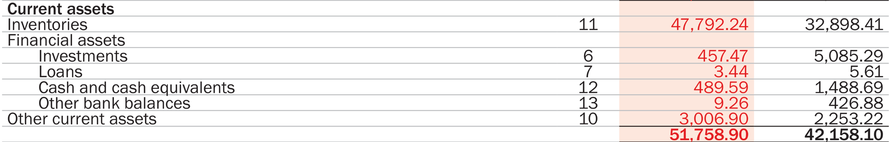
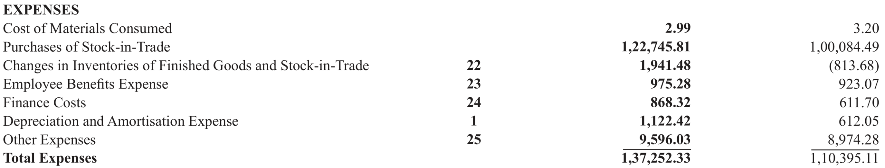

# Efficiency

### Asset Turnover Ratios

One of the most basic operational aspects of a business is generating sales using its assets. We can measure the efficiency of this operational aspect using the **asset turnover ratio** which can be defined as

```text
Asset Turnover Ratio = Total Income / Average Assets
```

We’ll consider the average of the total assets during a financial year to account for potentially abrupt changes in total assets due to unusual events like sales of fixed assets, increase in goodwill etc.

Asset Turnover Ratio is one of the components in the DuPont Identity we used to calculate the Return on Equity in the [Profitability section](https://indiainvestments.gitbook.io/content/stocks/financial-metrics-and-ratios/profitability#return-on-equity-roe-and-return-on-assets-roa).

As we’ve mentioned before, it wouldn’t make sense to compare ratios between companies in different sectors. FMCG companies usually enjoy high asset turnover while asset heavy companies and financial institutions don’t.


The total income of Hindustan Unilever Ltd for the year 2019 is `₹39,860 crores` and the average total assets are `(₹18,629 + ₹17,862)/2 = ₹18,245.5 crores`. The asset turnover ratio of Hindustan Unilever for the year 2019 is `₹39,860 / ₹18,245 = 2.18`. In contrast, the asset turnover ratio of Nestle India for the year 2019 is `1.66`. If we observe the past 5 year trend, Hindustan Unilever has had an asset turnover ratio of greater than 2 while Nestle India has had an asset turnover ratio of greater than 1 but less than 2. Using this information, we can infer that Hindustan Unilever is _possibly_ more efficient at generating revenue from its assets than Nestle India.

The asset turnover ratio of a company can get skewed due to a number of unusual events such as asset sales, issue of additional shares, investment into assets for long term growth, deliberately increasing inventory to meet demand etc. It’s best if we look at a trend of how asset turnover ratio has been in the past 5 years before jumping to conclusions. Let’s consider the financial statements of Avenue Supermarts for the year 2020.


The asset turnover ratio of Avenue Supermarts for the year 2019 is `3.16`. However, due to issue of additional shares and the investment of the capital gained into non-current financial assets, the asset turnover ratio drops to `2.61` in the financial year 2020.

Although we’ve seen what asset turnover ratio is, we can go ahead and refine it further to get a more useful metric. Instead of considering total assets, we’ll now consider only the non-current, or fixed, assets of a company to calculate the **Fixed Asset Turnover Ratio**. Why not consider the current assets? Well, most companies and sectors where asset turnover ratios are relevant often invest in long term assets to generate sales. We’ll focus on current assets in the working capital and cash conversion cycle.

We can define fixed asset turnover ratio as

```text
Fixed Asset Turnover Ratio = Total Income / Average Non Current Assets
```

The fixed asset turnover ratio of Hindustan Unilever Ltd for the year 2019 is `₹39,860 / ((₹6,715 + ₹6,202) / 2) = 6.17` while that of Nestle India for the year 2019 is `3.82`.

### Inventory Turnover and Days Sales of Inventory

The efficient management of inventory is one of the key operational aspects of a business, especially in cases where making forecasts about inventory is essential to prepare a business for seasonal effects. The sales projections of a business depend upon how efficiently inventory is managed.

One of the metrics that can help businesses make better decisions about pricing, manufacturing, and purchasing inventory is the **inventory turnover ratio**. This ratio tells us how quickly a business can replace its inventory by turning it into sales. It’s a measure of how many times a business can sell its entire inventory in a specific time period.

We can define the inventory turnover ratio as

```text
Inventory Turnover Ratio = Cost of Goods Sold / Average Inventory
```

We’ve already defined [COGS](https://indiainvestments.gitbook.io/content/stocks/financial-metrics-and-ratios/profitability#gross-profit) when we discussed gross profit in profitability ratios. The average inventory is simply the average of the inventory at the start and at the end of a financial year.

Although we could’ve used `Net Sales` in the numerator instead of `COGS`, it would’ve ended up artificially inflating the inventory turnover ratio. After all, the costs associated with the inventory in the balance sheet does not include the potential markup in prices due to profits earned.

Generally, high inventory turnover ratios indicate that a company is able to sell its inventory quickly and generate sales, which is reflected due to changes the numerator, but it can also indicate that a company is running low on inventory which might be needed to fulfill obligations and generate sales. In any case, inventory turnover ratio is extremely useful in sectors like FMCG, supermarkets, automobile etc.

Let’s compare the inventory turnover of two supermarket businesses — Avenue Supermarts and V-Mart Retail.


The COGS of Avenue Supermarts for the year 2020 is `₹21,441.68 - ₹338.75 = ₹21,102.93 crores` and its average inventory is `(₹1,947.40 + ₹1,608.65) / 2 = ₹1,778.02 crores`. This gives us an inventory turnover ratio of `₹21,102.93 / ₹1,778.02 = 11.8`.




The COGS of V-Mart Retail for the year 2020 is `₹1,275.20 - ₹148.93 + ₹11.47 = ₹1,137.74 crores` and its average inventory is `(₹477.92 + ₹328.98) / 2 = ₹403.45 crores`. This gives us an inventory turnover ratio of `₹1,137.74 / ₹403.45 = 2.82`.

Although both Avenue Supermarts and V-Mart Retail are supermarket businesses, their revenue sources are different. V-Mart Retail derives about 80% of its revenue from apparels while Avenue Supermarts gets less than 27% from apparel. How about we compare Avenue Supermarts’ inventory turnover ratio with Reliance Retail?




The COGS of Reliance Retail for the year 2020 is `₹2.99 + ₹1,22,745.81 + ₹1,941.48 + ₹135.62 = ₹1,24,825.9 crores` and its average inventory is `(₹9,583.11 + ₹11,493.53) / 2 = ₹10,538.32 crores`. This gives us an inventory turnover ratio of `₹1,24,825.9 / ₹10,538.32 = 11.8`.

Now that we know how to calculate the inventory turnover ratio, we can calculate the average time in days that it takes to turn inventory into sales. This metric is known as **Days Sales of Inventory \(DSI\)**. It is also known as Days Inventory Outstanding \(DIO\). DSI can be calculated using the following formula

```text
Days Sales of Inventory = 365 / Inventory Turnover Ratio
```

For Avenue Supermarts, the DSI turns out to be `365 / 11.8 = 30 days`. For V-Mart Retail, DSI is `365 / 2.8 = 129 days`.

Generally speaking, lower the DSI, the more efficient a company is in translating inventory to sales. However, this may not always be the case. Sometimes, companies need to pile up inventory due to seasonal effects or to take advantage of product shortage and sell the inventory at a higher price later.

### Receivables Turnover and Days Sales Outstanding

### Payables Turnover and Days Payable Outstanding

### Cash Conversion Cycle

### Working Capital

