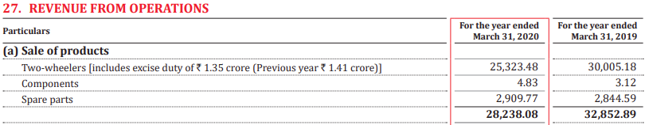
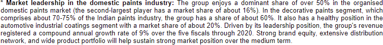

# Diving Deeper into Businesses

In the [previous chapter](../researching-a-sector.md), we noted that as individual investors, our job is to find and exploit disparities between market and intrinsic values of businesses. Further, we explored a way to build a universe of companies to study and track based on sectoral categorization.

But, a mechanical study of sectors will only take you so far. Sure, we've gathered qualitative information and numbers associated with a sector based on a generic understanding, but that doesn't cut it.

As we noted in our [introductory chapter](../can-you-beat-the-market.md#second-level-thinking-having-an-edge), we require extraordinary perspective to consistently get extraordinary returns. Of course, gaining extraordinary perspective requires an analytical \(and not mechanical\) understanding of a business. We've touched on this a fair bit whenever we've referred to the phrase circle of competence, but let us dive a bit deeper into this mental model.

The essence of it can be found in Berkshire Hathaway's 1996 edition of Letter to the Shareholders in which Warren Buffett says,

> Intelligent investing is not complex, though that is far from saying that it is easy. What an investor needs is the ability to correctly evaluate selected businesses. Note that word "selected": You don't have to be an expert on every company, or even many. You only have to be able to evaluate companies within your circle of competence. The size of that circle is not very important; knowing its boundaries, however, is vital.

Pretty straightforward - invest only in businesses you understand.

Note that Buffett has used the word businesses, not products; it's a common misconception of the mental model that Buffett was referring to understanding the value a product adds to the life of its consumer. That would have been far more inclusive, most products are simple enough to understand. Instead, it is the economics of the business that needs to be understood and reasonably predicted.

Another misinterpretation of the model is that we're stuck with what we know, and that's that. This may be due to the phrasing often associated with discussions regarding the model, the purpose of which is not to discourage one from expanding your circle, only to be cautious of staying in your circle, whatever it is during the time you're making an investment decision. Sahil Bloom, in his appearance in We Study Billionaires podcast explains this delicate balance beautifully,

> I really would impress upon people that your circle should grow, it should shrink, it should morph into different areas as you learn, and as you grow. The whole point is you need to be a continuous learner, and go down the rabbit hole on things that you’re excited about. \[...\] the reality is, life is dynamic. The world is dynamic, situations change. You need to be constantly learning and trying to grow your circle of competence over time. I think that’s point number one is the circle of competence should be dynamic, you should be striving to build it. The other point is you need to be absolutely ruthless in identifying the boundaries of it throughout. So, you can be striving to grow your circle of competence. But if you haven’t spent the time and really put in the energy and effort for it to have effectively grown, you need to be cognizant of that fact and not start reaching because you think you know everything that’s outside of it.

It all circles back / seamlessly connects with the other mental model we've talked about above, having an edge. A good enough amalgamation of this union is - _its smart to use the limited extraordinary insights we have of the businesses we economically understand than to dabble in businesses we don't economically understand._ This is because what we know of businesses we don't economically understand is probably common knowledge, and is thus probably priced in.

The reason we've explained this in a segue between the two chapters is to make sure you're not falling into an information gathering hole. Researching a sector or a business is important, but really understanding the economics of it \(in a way in which your insights are better than the market's\) is something that can't be taught. Howard Marks' in the introductory chapter of his book 'The Most Important Thing' warns of this rather bluntly,

> In basketball, they say, “You can’t coach height,” meaning all the coaching in the world won’t make a player taller. It’s almost as hard to teach insight.

If Howard Marks' can't help you learn how to find an _edge_, we certainly can't. We can only guide you in the rudimentary processes involved in due-diligence.

Anyway, let's move on and see what due-diligence is required while researching a business.

## A framework for Business Analysis

While studying a business, there are a few things you want to look at,

* Key events in the company's history
* Value proposition of the company's products
* Business model of the company
* Competition faced by the company
* Risks & Threats to the company's business

We're going to cover the questions under these broad themes that need to be covered while studying a business, with examples wherever we feel it is necessary to better illustrate our point. Like in the previous chapter, I implore you to choose a large-cap company of your preference \(because it'd be easier for you to gather information on larger companies\), and follow along.

### Key Events in the Company's History

#### What are some key events that have had material impact on the core operations & financials of the company?

Just as a sector, any company with a few years of existing in the market will have some past/forthcoming events that have had, or will have a material impact on its financials and operations. Again, this can be a major disruption, a government policy, a new player in the market behaving irrationally, a black swan event, and so on.

Though a sector-wide event is bound to have an impact on all its participants _\(after all, companies are constituents that form up a sector_\), the impact would vary in both magnitude and sometimes even polarity \(what is negative for some, can be positive for other players of an industry\).

For example, consider the dramatic decrease in _average revenue per user \(ARPU\),_ a benchmark for product pricing in some industries, in the Indian telecom sector - Reliance's Jio, a disruptor, entered the industry undercutting everyone's prices. While lower ARPU would intuitively mean lower profitability, Jio understood that it had to do this to gain customers. Net-net, it worked out as a good strategy for Jio, while many other players either shut shop, or took a serious financial hit.

Apart from such sector-wide events, there are other key-events that may relate to just one company, and not the whole sector. Consider changes in key management positions, for example.

#### What are some key events that have had material impact on the stock price?

Any occurrence with material impact on core operations or financials of a company will probably have an impact on its stock price. The inverse of this isn't always true - there can be circumstances which affect the stock price of a company even if there's no effect on its core operations or financials.

Generally, this happens in instances where there can be supply overheads in the market for a company's share. An excess of supply of shares relative to demand can drive down a company's stock price.

For example, a pledge of shares held by promoters of the company for a loan would hurt the market sentiments towards the company. This is because it's an additional market risk - if the promoters are unable to service their debt obligations, the lender can sell the shares taken as collateral, resulting in supply overhead of the company's shares in the market.

Another example of this is when investors with high shareholding in a company decide to exit their investment. Again, this would possibly mean that there may be a supply overhead. Sometimes, even the market's perception that something like this may happen, results in a feedback loop - investors think a supply overhead may come from a large investor exiting a stock investment, and exit themselves, collectively creating a supply overhead.

### Value proposition of the company's products

This refers to the value addition by a company in its products. As [Investopedia](https://www.investopedia.com/terms/v/valueproposition.asp) puts it,

> A value proposition refers to the value a company promises to deliver to customers should they choose to buy their product. \[...\] The proposition is an easy-to-understand reason why a customer should buy a product or service from that particular business. A value proposition should clearly explain how a product fills a need, communicate the specifics of its added benefit, and state the reason why it's better than similar products on the market. \[...\] A successful value proposition should be persuasive and help turn a prospect into a paying customer.

#### What is the company primarily selling?

As we noted in the last chapter, stating the obvious - what products are sold by a company - helps us answer some questions ahead.

#### What is the revenue/earnings mix?

Revenue mix refers to a break-up of the revenue generated, based on different business segments a company is engaged in. Similarly, earnings mix refers to the break-up of the Operating Profit, or Earnings before Interest and Tax \(EBIT\) earned by a company based on its business segments.

Similarly, geography mix connotes the break-up of revenues and operating profits based on different geographies a company operates in.

In compliance with [Indian Accounting Standards \(Ind AS\) 108](http://www.mca.gov.in/Ministry/pdf/IndAS108_2019.pdf), companies are required to disclose these break-ups. They can generally be found in a company's annual report under the heading '_Segment Revenue'_ and _'Segment Results'_ respectively in Notes to the Financial Statements. 

As an example, earning mix and revenue mix of Hindustan Unilever, can be computed from the following figures taken from the company's [FY20 annual report](https://www.bseindia.com/bseplus/AnnualReport/500696/5006960320.pdf#page=109).

Studying revenue and earning mix helps us gain a few important insights. One, by bifurcating the total revenue/operating profits into different businesses, we can analyze each business individually.

For example, if one of the segments is growing faster than the other segments, we can identify it as a potential growth avenue for the company in the future.

We can also find out the operating margins of each segment, and identify which business is more profitable in relative terms, and thus should be focused on \(assuming scalability is not an issue\). Or, we can pinpoint to the segments that have zero, or low profitability, and analyze what can turn these businesses around \(or otherwise be divested\).

After all, a segment that is growing in double digits, but has close to zero margins will only lift the company's bottom line so much, whereas a high-margins business growing in double digits will do wonders to the company's bottom-line.

On a product level, this referred to as _product mix._ When someone says the company had a _favorable product mix_ this year, they're implying that the contribution of high-margin products to the revenues of the company were higher than expected.

#### What product segment is the company catering to?

As we noted in the previous chapter, most sectors can be divided into different segments, and different segments can have varied economic dynamics. So, identifying which product segments the company is operating is in helpful.

For example, while Maruti Suzuki India Ltd operates in the automobile sector, roughly 69% of its domestic volumes come from compact and mini four-wheelers, and the rest comes from mid-sized vehicles, utility vehicles, light commercial vehicles, and vans as per its [Q3FY21 Investors Presentation](https://marutistoragenew.blob.core.windows.net/msilintiwebpdf/Investor_Presentation_Q3FY21_and_9MFY21.pdf#page=15). The company, however, is not engaged in selling two-wheeler, or three-wheeler vehicles.

Alternatively, Hero MotoCorp Ltd, also operates in the automobile sector, but only sells two-wheeler vehicles, and does not operate in three-wheeler, or four-wheeler vehicles, as per its [FY20 annual report](https://www.bseindia.com/bseplus/AnnualReport/500182/5001820320.pdf#page=246).

Both of the companies, however, are more focused on selling vehicles in the domestic market, instead of selling internationally.

Maruti Suzuki earns just [~7%](https://www.bseindia.com/bseplus/AnnualReport/532500/5325000320.pdf) of their revenues from exports, whereas Hero MotoCorp earns a similar [~4.3%](https://www.bseindia.com/bseplus/AnnualReport/500182/5001820320.pdf#page=254) of their revenues from their exports business.

On the other hand, Tata Motors Ltd, another automobile manufacturer, relies on exports for [~82%](https://www.bseindia.com/bseplus/AnnualReport/500570/5005700320.pdf#page=114) of their revenues.

#### Where does the product fit in the market? What are the target markets?

Two companies in the same sector, operating in the same segments, can still coexist and have distinct customer bases. This can be based on the price range of the products, the age group that the product is marketed towards, niche products, etc.

For example, let's extend the two-wheeler example we used above. Eicher Motors Ltd, the company behind the famous Royal Enfield brand, markets its motorcycles for higher paying customers, versus that of Hero MotoCorp Ltd, which targets the economical price range. Bajaj Auto, with a wider portfolio range, has a more blended approach.

Another example of this is with chocolates, with companies like Ferrero Rocher, and Lindt catering to premium, more expensive chocolates whereas Mondelez's Cadbury caters to more economical market.

In clothing, a company like Louis Vuitton targets luxury segment, whereas Levi's, targets premium, and a company like V-mart sells affordable apparel.

Based on targeted age groups, take Monster Energy's beverages as an example, which strictly markets for younger populations, against that of Red Bull, which appeals all age groups.

Similarly, Bira 91, a craft beer brand, considers millennials as their key consumers, whereas peer brands don't necessarily target a particular age group.

#### What is the _addressable_ market size for the product?

In the previous chapter, we explained the generalized definition of market size as _the potential revenue / volume a company can attain if it had 100 percent of estimated market share in the sector_. 

Similarly, _addressable_ market size refers to the potential revenue / volume a company can attain if it had 100 percent of estimated market share of the market segment the products target.

Determining market size helps us perceive the growth potential of a company.

#### What is the product's market share, or position in the market?

While market size refers to the _potential_ revenue / volume a company can attain if it had 100 percent of estimated market share, market share refers to the real, actual percentage of estimated sector-wide revenue / volume a company has captured.

You'll often find these figures reported in a company's annual report, investor presentations, credit reports, and conference calls.

For example, in CRISIL's [credit report](https://www.crisil.com/mnt/winshare/Ratings/RatingList/RatingDocs/Asian_Paints_Limited_June_30_2020_RR.html) of Asian Paints Ltd dated June 30, 2020, the credit rating agency reported Asian Paints having _'a dominant share of over 50% in the organized domestic paints market'._

Note the words _**organised and domestic**_ used in the report while describing the market they've used to benchmark the company's share. It is essential that attention is paid to the adverbs describing the market, to get a complete understanding of company's share in the market.

