# Using Screeners

#### Disclaimer & Disclosures

* The author\(s\) of this section does not hold any position \(long or short\) in any of the companies used in this section at the time of writing this. The purpose of using these companies is purely illustrative and educational in nature. Mention of any company in this section is **NOT** financial advice.
* The screens run in this section are purely for educational and illustrative purposes. The results of queries run in this section are **NOT** stock recommendations. The screens themselves are **NOT** financial advice.
* The watchlists in the screenshot of this section are **NOT** the author\(s\) actual watchlist. They are just resultants of arbitrary screens run for illustration and educational purposes. Stocks under these screenshots are **NOT** stock recommendations.
* The author\(s\) of this section did not get incentivised for recommending or not recommending any websites/tools/products mentioned in this section.


Don't trust numbers reported on any screener at their face value, always verify the numbers shown. Since calculations are done based on one-size-fits-all formulaes, factoring in nuances in input values is not possible. **The methods of calculating these numbers may vary between different websites. Sometimes, the numbers can even be absurd and the methods used in calculating them can differ from generally accepted definitions.** Making investment decisions solely based on the reported idea can be extremely risky.


## Introduction

As of December 2020, the number of actively traded listed companies are nearly 4200 on the Bombay Stock Exchange \(BSE\)[^1](https://www.bseindia.com/corporates/List_Scrips.aspx), and nearly 1800 on the National Stock Exchange of India \(NSE\)[^2](https://www.nseindia.com/regulations/listing-compliance/nse-market-capitalisation-all-companies). This absolute abundance of companies to choose from makes the task of creating a watchlist challenging.

Fortunately, there are tons of screeners available, that can filter through these listed securities to build a universe of companies based on constraints set by an investor. These constraints can be,

* based on financial criteria set by an investor
* based on _alternate market data_ based criteria set by an investor
* based on _circle of competence_ of an investor

## Using different screeners to your benefit

In India, there are many screeners available to you for free. Some of these screeners stand out with distinct use cases, so it makes sense to use different screeners as per the need of the hour. These are,

* [Tijori](https://www.tijorifinance.com/) differentiates itself from other screeners by providing company's alternate data \(financial or operational information that is typically beyond the scope of a company's stock exchange filings\), such as market share of its products, or number of stores the company operates. It also has some neat features, such as a [macro page](https://www.tijorifinance.com/macro) to track economic indicators, sector indices, and sector-based market data. However, the platform has moved to a paid subscription-based model. Whether it's worth for you is going to be a personal call.
* [Tickertape](https://www.tickertape.in/) has a friendly interface for beginners, and explains relevance of figures presented in financial data. However, this is a double-edged sword, a screener's commentary on figures can eliminate its neutrality as a tool, and induce bias.
* [Screener](https://www.screener.in/)'s interface/feature set is **mostly** neutral and thus doesn't introduce a lot of bias. The screening itself is more flexible/comprehensive than most other screeners \(maybe barring Tijori\), and allows exporting financial data to an excel sheet \(you can customize the sheet's template!\). However, the interface can be slightly overwhelming for beginners, and some data that is freely available in annual reports, or other screeners is behind a paywall.
* [Trendlyne](https://trendlyne.com/stock-screeners/) aggregates research reports for a company, and you can usually find audio files of conference calls held by a company about a day after being conducted. However, the actual screening is limiting, and the interface is not the most intuitive of the bunch.

## Screener.in

The two primary reasons we chose Screener \(capital S will refer to [screener.in](http://screener.in/) subsequently\) for illustration purposes of this section are,

* Screener doesn't induce simplification, nudges, or potential biases.
* We would recommend you to start building your own excel sheet for financial data once you're comfortable. Screener's _Export to excel_ feature and the ability to customize the sheet's template helps as a transitional step towards that.

### Outline of a company's page

You can land to a company's page on Screener by using the search bar located on the top right of any page. Once you are on a company's page, you will find,

#### Overview section

You can find quick access to frequently sought information here such as,

* links to company's official website, NSE page, and BSE page,
* market information \(market cap, current price, shares outstanding\), and key ratios \(you can customize this to your liking!\),
* a short outline/history about the company,
* an option to export the company's financial data to an excel sheet, and
* the ability to add the company to your watchlist \(more on this later\)

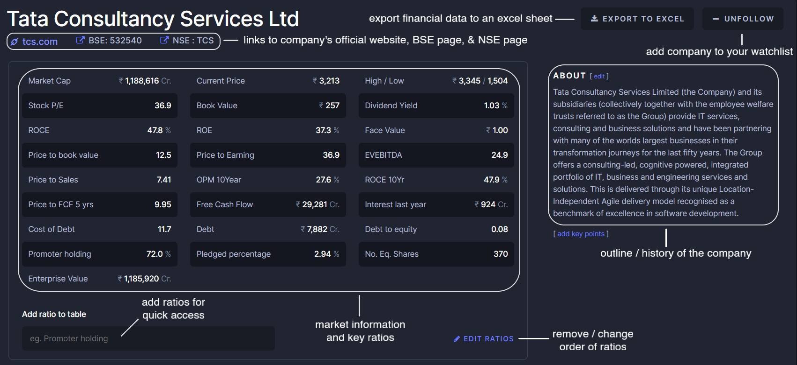

#### Chart section

You can check financial graphs for a company under different timeframes in this section. There are a few options,

* Price line chart with volume and a couple of daily moving averages.

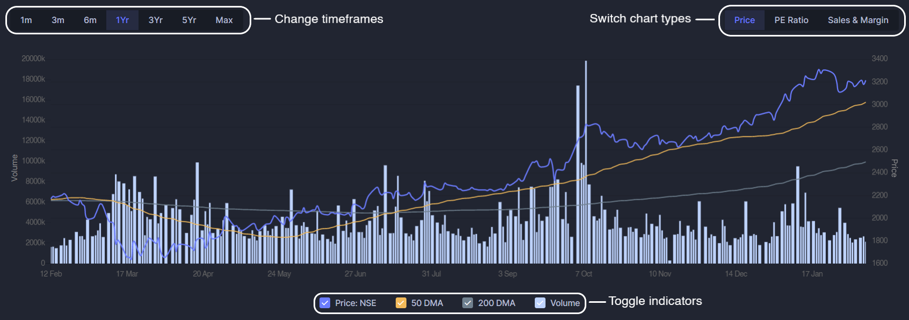

* Price to Earnings \(P/E\) line chart with trailing twelve months \(TTM\) Earnings per share \(EPS\), and a line indicating the median P/E for the selected timeframe.

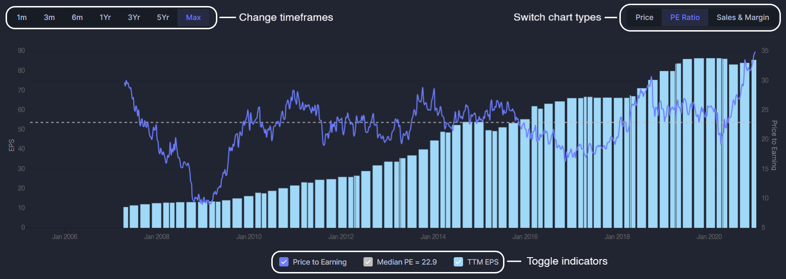

* Quarterly sales chart with gross profit margins \(GPM\), operating margins \(OPM\), and net profit margins \(NPM\) for the respective quarters.

Though the charts here are good enough to serve their purpose, they are not as customizable, or comprehensive compared to other tools available, such as [TradingView](https://in.tradingview.com/).

#### Analysis section

This section can safely be ignored, as it lists pros and cons of a company based on some ratios. You might find your unbiased conclusion to be different from conclusions listed here, so shortcuts such as this section in a screener can induce potential bias in your investment decisions.

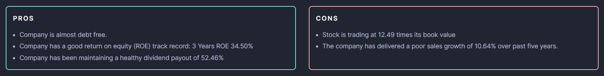

#### Peers section

This is where things start to get interesting! You can compare a company to its listed competitors in this section, on the basis of financial data selected by you --- say you want to check how a company's operating margins stack up against that of its peers to determine if its products have pricing power, or say you want to check if the company's quarterly results are in line with the sector --- you can do this here.

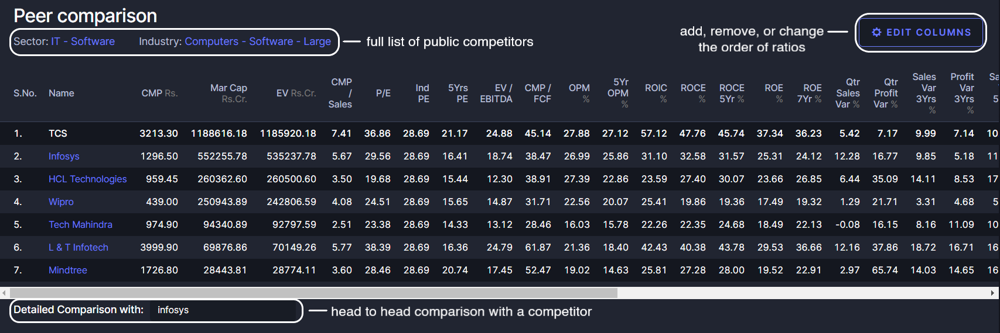

Don't let the ratios used in the screenshot above overwhelm you. We've covered tons of them under our _Financial Ratios_ section if you haven't checked it out already. You can add, remove, or change the order of ratios shown here by clicking on the _'edit columns'_ button.

If you click on either the company's _Sector_ or _Industry_, you can look at the complete directory of the company's listed competitors \(in the peers section, screener only shows you a few\).

You can also use the _'Detailed comparison with'_  option to get a head to head comparison of the company with one of its peer if you have a paid subscription.

If you're unsure what to look for, don't worry! We've covered how to compare a company to its peer in _'_[_Researching a sector'_ ](https://indiainvestments.gitbook.io/content/wiki/researching-a-sector) and _'_[_Understanding a business'_ ](https://indiainvestments.gitbook.io/content/wiki/understanding-a-business) chapter of this series.

#### Quarterly Results section

You can find the past few quarters' standalone & consolidated profit and loss \(P&L\) data in this section.

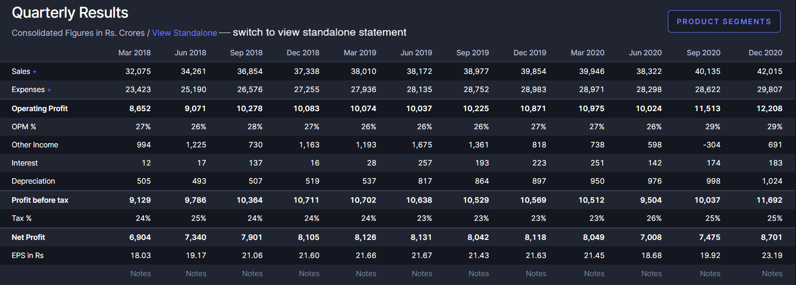

There's an option to view the revenue, profit, and return on capital breakup based on product segments and geographical segments for paid users, but you can get this data free of cost from the company's quarterly earnings reports.

#### Profit & Loss section

This section gives you past ten years & trailing twelve months \(ttm\) financial data from profit & loss \(P&L\) statements of the company, in both standalone and consolidated figures, for easy comparison --- for instance, to check the trend of operating margins \(OMP\) over the past few years, or to check interest on the company's debt it pays each year.

Again, there is an option for paid subscribers to view the revenue, profit, and return on capital breakup based on product or geographical segments, but you can get this data free of cost from the company's annual reports.

Below the P&L data table, this section shows you compounded sales, profit, & stock price growth, and average return on equity over the past 3, 5, & 10 years, and the trailing twelve months \(TTM\).

We've covered how to read a profit & loss \(P&L\) statement and related financial data under our [_Financial statements_](https://indiainvestments.gitbook.io/content/wiki/financial-statements) chapter of this series.

#### Balance Sheet section

This section gives you the past ten years of financial data from the balance sheets of the company, in both consolidated and standalone figures, for easy comparison --- for instance, you can compare the company's debt over the past few years, or check how much cash the company holds.

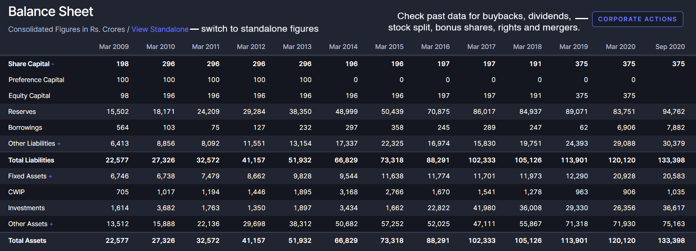

There's also a handy option to check details of past corporate actions \(this data goes back up to 2005\) taken by the company, such as buybacks, distribution of dividends, allotment of bonus shares, stock splits, mergers, and rights.

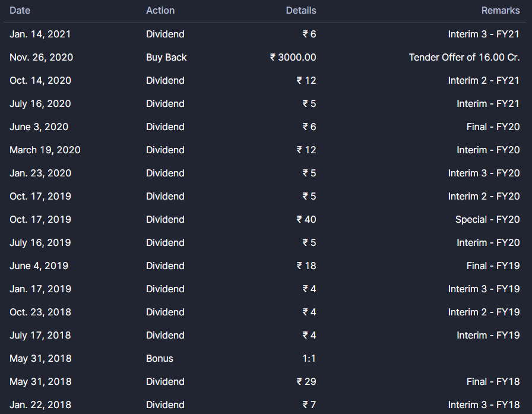

#### Cash Flow section

This section gives you past ten years of financial data for cash flows of the company, in both consolidated and standalone figures, for easy comparison --- for instance, you can check cash outflows due to distribution of dividends by the company to its shareholders, or compare changes in working capital the past few years.

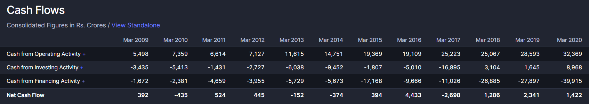

Figures for Free Cash Flows \(est.\) are unfortunately missing here, but can be calculated as shown in [_Financial statements_](https://indiainvestments.gitbook.io/content/wiki/financial-statements) chapter of this series.

#### Ratios section

You can find return on capital employed \(in %\), debtor days, and inventory turnover of the company for the past few years in this section. This section could be ignored, as it is recommended you calculate these and many other ratios yourself while conducting due diligence for company, as explained in [_Financial ratios_](https://indiainvestments.gitbook.io/content/wiki/financial-ratios) chapter of this series.

#### Investors section

You can find the shareholding pattern of a company's promoter entity, and distribution of its shareholders between promoters, foreign institutional investors \(FII\), domestic institutional investors \(DII\), government entities, and retail shareholders for the past few quarters here.

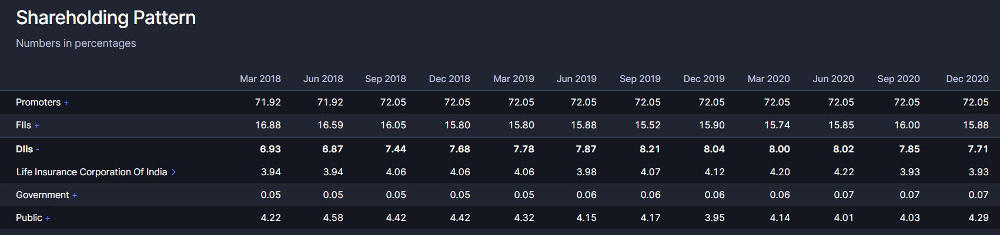

Screener also allows you to view other listed companies held a shareholders of the company. For example, if you click on _Life Insurance Corporation of India_ in the screenshot above, you'll find a list of other public companies held by LIC.

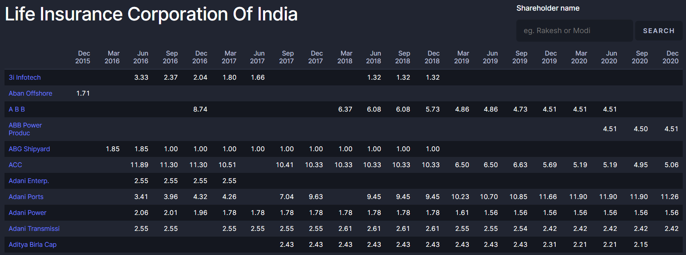

#### Documents section

This section gives you quick access to recent stock exchange filings and annual report of a company. As far as I've observed, they are usually linked to BSE's repository. Apart from stock exchange filings, Screener also provides links to credit rating reports of a company here.

Now that we have some understanding of a company's Screener page, let's move on to more interesting things.

### Creating a screen

As remarked earlier, there are thousands of companies listed on the Bombay Stock Exchange, and the National Stock Exchange of India. We use screeners to make sense of this abundance of companies to choose from, based on criterias set by us. Primarily, Screener allows us to screen companies based only on financial data \(you can however filter companies based on industries, so there is some form of a screening option to confine companies based on your circle of competence\).

* To screen companies on Screener, click on screens page at the top. You can find your previously saved, and some popular screens here.

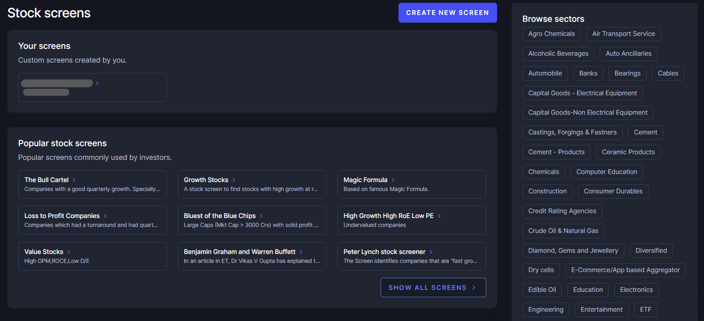

* Click on the _Create new screen_ button. Here, you want to start adding your constraints, with the keyword `AND` separating them.  

  Suppose you want to get a list of companies with fairly large market cap, decent growth in revenue and earnings in the past few years, consistently good return on capital, and low debt. _Syntax_ for this query would look something like this,

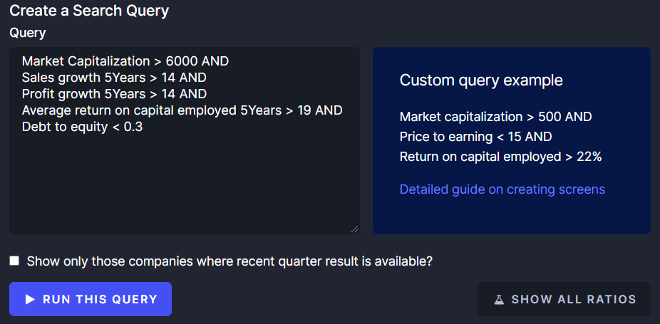

* This query gives us a list of public companies and some ratios \(customizable using the _edit columns_ button\) that match the financial constraints we've put. You have the option to save a query for conveniently running it again \(it can be located at the screens page from the top\).

### Building custom ratios

If you find a financial ratio missing from the set available by default, Screener allows you to manually create your own [here](https://www.screener.in/ratios/new/). For example, to create a ratio for P/FCF, you can fill in the following information ---

The ratios you create can be added to _Peers comparison_ section of a company's page, or on results returned by a query.

### Building a watchlist & tracking them

You can add a company to your watchlist by _following_ it from the company's page. There are a couple things you can do with your watchlist. One, you can view it as a query and manage it [here](https://www.screener.in/watchlist/), and two, keep track of the company's filings on Screener's home \(feed\) page. On the left part of this page, you can see latest filings submitted to stock exchanges by the companies you have in your watchlist. On the right, you can check when the upcoming results of companies you have followed are expected.

### Exporting financial data to an excel sheet

You can export a company's financial data to a spreadsheet using the _'Export to excel'_ option available on the top of any company's Screener page.

More importantly, you can set up a custom template for excel sheets downloaded by the _'Export to excel'_ option. To do this,

* First use the _'Export to excel'_ option for **any** company -- it doesn't matter which one. Then, open the excel sheet and go to the _'Customization'_ tab. It should look something like this.

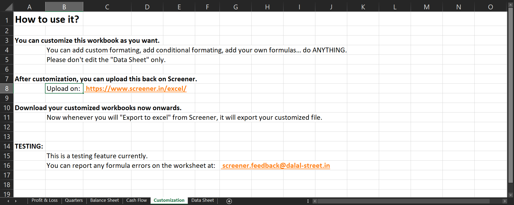

* Delete everything on this tab. This is now a blank slate to put everything you want to see in your custom template. Use the financial data from other tabs of this excel sheet for calculations done in this tab. For ideas, you can refer to [_Financial statements_](https://indiainvestments.gitbook.io/content/wiki/financial-statements) and [_Financial ratios_](https://indiainvestments.gitbook.io/content/wiki/financial-ratios) chapters in this series and see what is missing on Screener by default. 
* For illustration purposes, I've used this tab to find estimated free cash flows of a company over the past few years. Free cash flows are calculated as `FCF = Cash flows from Operations - Capital expenditure`. I've used `cash flow from operations` data from the cash-flows tab of this sheet, and calculated `capex` using `fixed assets` and `capital work in progress` from the balance sheet tab & using `depreciation` from the profit and loss \(P&L\) tab of this sheet.

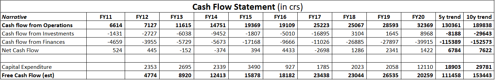

* Now, save this excel sheet, and upload it [here](https://www.screener.in/excel/). You can always upload an updated sheet with more customization done later using the same page.

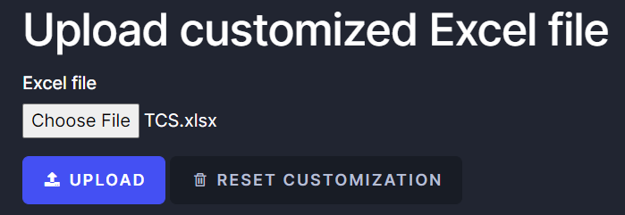

* All done! Try using the _'Export to excel'_ option for a different company -- you will find your custom ratios for this company added in the customization tab automatically.

## Popular screens & further reading

If you're up for it, try running various stock picking strategies as a screen! Here are a few you can try,

* Joel Greenblatt's Magic Formula, an investment technique explained in his book -- _The Little Book that Beats The Market_[^3](https://www.amazon.in/Little-Still-Market-Books-Profits-ebook/dp/B003VWCQB0).
* Benjamin Graham's net-net investing, in which a security is valued solely on the basis of its current assets[^4](https://www.investopedia.com/terms/n/net-net.asp).
* Rob Kirby's Coffee Can investing, popularized by Saurabh Mukherjea's book on the subject[^5](https://www.amazon.in/Coffee-Can-Investing-Stupendous-Wealth/dp/067009045X)
* Dividend Yield Investing, popularized by investment newsletter publisher Investment Quality Trends, known as IQT[^6](https://simplysafedividends.com/intelligent-income/posts/1104-dividend-yield-theory-explained)

